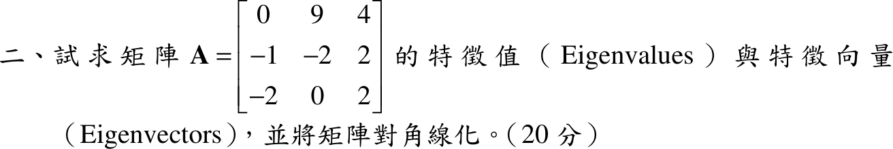

# 107 年第 2 題｜特徵值、特徵向量與對角化

## 已知與所求

\(\mathbf A=\begin{bmatrix}0&9&4\\-1&-2&2\\-2&0&2\end{bmatrix}\)（20 分），求特徵值、特徵向量並對角化。

## 考場標準作答

### 特徵值

沿第 3 列展開 \(\det(\mathbf A-\lambda I)\)：
\[
-2(26+4\lambda)+(2-\lambda)(\lambda^2+2\lambda+9)=-(\lambda^3+13\lambda+34)=-(\lambda+2)(\lambda^2-2\lambda+17)
\]
\[
\boxed{\lambda_1=-2,\quad \lambda_{2,3}=1\pm4i}
\]

### 特徵向量

- \(\lambda=-2\)：\((\mathbf A+2I)v=0\) 的第 2、3 列給 \(v_1=2v_3\)，第 1 列給 \(9v_2=-8v_3\)，取 \(\boxed{v_1=(18,-8,9)^T}\)。
- \(\lambda=1+4i\)：第 3 列 \(-2v_1+(1-4i)v_3=0\)，取 \(v_3=2\)，\(v_1=1-4i\)；第 2 列得 \(v_2=1\)：\(\boxed{v_2=(1-4i,\ 1,\ 2)^T}\)。
- \(\lambda=1-4i\)：取共軛，\(\boxed{v_3=(1+4i,\ 1,\ 2)^T}\)。

### 對角化

三個特徵值相異，\(P=[v_1\ v_2\ v_3]\)、\(D=\operatorname{diag}(-2,\,1+4i,\,1-4i)\)：
\[
\boxed{\mathbf A=PDP^{-1}}
\]
（實數域內只能化為分塊形式，需在複數域對角化。）

## 驗算

\(\operatorname{tr}\mathbf A=0=-2+(1+4i)+(1-4i)\)；\(\det\mathbf A=-34=(-2)(1+4i)(1-4i)=-2\cdot17\)。
回代 \(\lambda=1+4i\)：第 1 列 \(9\cdot1+4\cdot2=17=(1+4i)(1-4i)\)；第 3 列 \(-2(1-4i)+4=2+8i=(1+4i)\cdot2\)。

## 失分點

- 特徵多項式展開易錯符號；用 \(\operatorname{tr}\mathbf A=0\)（根和為 \(0\)）與 \(\det\mathbf A=-34\)（根積）可立即檢出。
- \(\lambda^2-2\lambda+17\) 的判別式為負，根為 \(1\pm4i\)，向量也是複數，不可只寫實根 \(-2\)。
