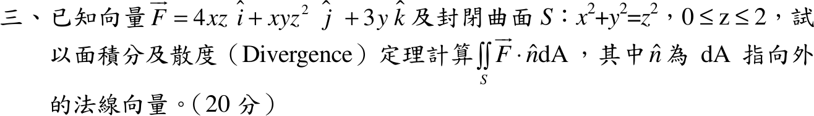

# 107 年第 3 題｜圓錐閉曲面通量

## 已知與所求

\(\vec F=4xz\,\hat i+xyz^2\,\hat j+3y\,\hat k\)；\(S:x^2+y^2=z^2,\ 0\le z\le2\)（20 分）。以面積分及散度定理求 \(\iint_S\vec F\cdot\hat n\,dA\)（\(\hat n\) 指向外）。

## 考場標準作答

題稱封閉曲面，而 \(0\le z\le2\) 的圓錐面無頂蓋：讀成「只算側面」或「補上 \(z=2\) 頂蓋的封閉面」答案相同（頂蓋通量為 \(0\)，見（二））。

### （一）面積分（側面）

\(\vec r=(r\cos\theta,\ r\sin\theta,\ r)\)，\(0\le r\le2\)，外向面積元 \(d\vec A=(r\cos\theta,\ r\sin\theta,\ -r)\,dr\,d\theta\)：
\[
\vec F\cdot d\vec A=\bigl(4r^3\cos^2\theta+r^5\cos\theta\sin^2\theta-3r^2\sin\theta\bigr)dr\,d\theta
\]
對 \(\theta\) 積分只剩 \(4\pi r^3\)：
\[
\boxed{\iint_S\vec F\cdot\hat n\,dA=\int_0^24\pi r^3\,dr=16\pi}
\]

### （二）散度定理

\(\nabla\cdot\vec F=4z+xz^2\)。補頂蓋 \(D:\ z=2\)（\(\hat n=\hat k\)）成封閉面，實心圓錐 \(V:\ r\le z\le2\)，\(dV=r\,dz\,dr\,d\theta\)：
\[
\iiint_V(4z+r\cos\theta\,z^2)\,r\,dz\,dr\,d\theta
=2\pi\int_0^2r\cdot2(4-r^2)\,dr=\boxed{\iiint_V\nabla\cdot\vec F\,dV=16\pi}
\]
（\(xz^2\) 項對 \(\theta\) 積分為 \(0\)。）頂蓋 \(\vec F\cdot\hat k=3y\)，在圓盤上積分為 \(0\)，所以側面通量 \(=16\pi-0=16\pi\)，與（一）相同。

## 驗算

\(\iiint_V4z\,dV=4\bar z\,V\)：圓錐 \(V=\tfrac13\pi(2^2)(2)=\tfrac{8\pi}3\)，形心 \(\bar z=\tfrac34\cdot2=\tfrac32\)（自頂點量起），得 \(4\cdot\tfrac32\cdot\tfrac{8\pi}3=16\pi\)；\(xz^2\) 項對 \(x\) 奇對稱為 \(0\)。

## 失分點

- 頂蓋外法向是 \(+\hat k\)，\(\vec F\cdot\hat k=3y\)（不是 \(4xz\) 或 \(xyz^2\)）。
- 側面外向面積元的 \(z\) 分量為 \(-r\)（向外且向下）；誤取向內法向會得 \(-16\pi\)。
