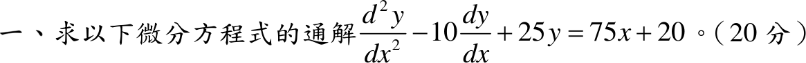

# 109 年第 1 題｜常係數非齊次 ODE

## 考場標準作答

特徵方程 \(r^2-10r+25=(r-5)^2=0\)，重根 \(r=5\)：\(y_h=(C_1+C_2x)e^{5x}\)。

右側為一次式且 0 不是特徵根，設 \(y_p=Ax+B\)：
\[
-10A+25(Ax+B)=75x+20\;\Rightarrow\;25A=75,\ 25B-10A=20\;\Rightarrow\;A=3,\ B=2
\]
\[
\boxed{y=(C_1+C_2x)e^{5x}+3x+2}
\]

## 驗算

\(y_p=3x+2\)：\(y_p''-10y_p'+25y_p=0-30+75x+50=75x+20\)。重根的兩解 \(e^{5x}\)、\(xe^{5x}\) 的 Wronskian 為 \(e^{10x}\ne0\)，線性獨立。
