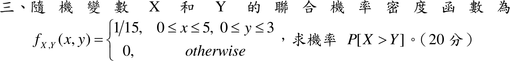

# 109 年第 3 題｜均勻聯合密度下的機率

## 考場標準作答

\(f_{X,Y}=\frac1{15}\)（\(0\le x\le5,\ 0\le y\le3\)）。對每個 \(y\in[0,3]\)，\(X>Y\) 即 \(y<x\le5\)：
\[
P(X>Y)=\int_0^3\int_y^5\frac1{15}\,dx\,dy=\frac1{15}\int_0^3(5-y)\,dy=\frac{15-\frac92}{15}
\]
\[
\boxed{P(X>Y)=0.7}
\]

## 驗算

均勻分布下機率 = 面積比。矩形內 \(x\le y\) 的部分是頂點 \((0,0),(0,3),(3,3)\) 的直角三角形，面積 \(\frac92\)，故 \(1-\frac{4.5}{15}=0.7\)。
