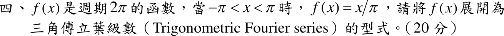

# 109 年第 4 題｜週期函數的傅立葉級數

## 考場標準作答

\(f(x)=x/\pi\) 在 \((-\pi,\pi)\) 為奇函數，\(a_0=a_n=0\)：
\[
b_n=\frac2\pi\int_0^\pi\frac x\pi\sin nx\,dx=\frac{2}{\pi^2}\left[-\frac{x\cos nx}{n}+\frac{\sin nx}{n^2}\right]_0^\pi=\frac{2(-1)^{n+1}}{\pi n}
\]
\[
\boxed{f(x)=\sum_{n=1}^{\infty}\frac{2(-1)^{n+1}}{\pi n}\sin nx=\frac2\pi\left(\sin x-\frac{\sin2x}{2}+\frac{\sin3x}{3}-\cdots\right)}
\]

## 驗算

\(x=\frac\pi2\)：級數為 \(\frac2\pi\left(1-\frac13+\frac15-\cdots\right)=\frac2\pi\cdot\frac\pi4=\frac12=f\!\left(\frac\pi2\right)\)。\(x=\pm\pi\) 處級數為 0，等於跳躍 \(\pm1\) 的平均。
