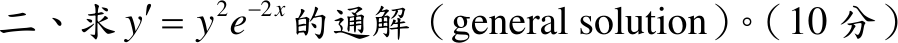

# 110 年第 2 題｜可分離變數微分方程

## 考場標準作答

\(y\ne0\) 時分離變數：
\[
y^{-2}\,dy=e^{-2x}\,dx\;\Longrightarrow\;-\frac1y=-\frac12e^{-2x}-C
\]
\[
\boxed{y(x)=\frac{1}{C+\frac12e^{-2x}}},\qquad\text{另有奇異解 }\boxed{y\equiv0}
\]

## 驗算

視為 Bernoulli 方程，令 \(u=1/y\)：\(u'=-y'/y^2=-e^{-2x}\)，積分 \(u=\frac12e^{-2x}+C\)，與上式相同。\(y\equiv0\) 代入兩邊皆為 0。

## 失分點

- 除以 \(y^2\) 時遺失 \(y\equiv0\)，且它不屬於任何有限 \(C\) 的通解族。
