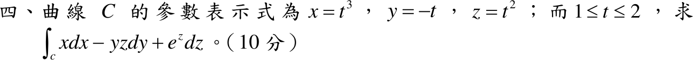

# 110 年第 4 題｜參數曲線線積分

## 考場標準作答

\(x=t^3,\ y=-t,\ z=t^2\)，\(dx=3t^2dt,\ dy=-dt,\ dz=2t\,dt\)，\(1\le t\le2\)：
\[
I=\int_1^2\left[t^3(3t^2)-(-t)(t^2)(-1)+e^{t^2}(2t)\right]dt
=\int_1^2\left(3t^5-t^3+2te^{t^2}\right)dt
\]
\[
=\left[\frac{t^6}{2}-\frac{t^4}{4}+e^{t^2}\right]_1^2=\frac{63}{2}-\frac{15}{4}+e^4-e
=\boxed{\frac{111}{4}+e^4-e\approx79.63}
\]

## 驗算

拆場：\(x\,dx+e^z\,dz=d\left(\frac{x^2}{2}+e^z\right)\) 為全微分，由 \((1,-1,1)\) 到 \((8,-2,4)\) 得 \(\frac{64-1}{2}+e^4-e\)；剩下 \(-yz\,dy\) 沿曲線為 \(\int_1^2(-t^3)dt=-\frac{15}{4}\)。合計相同。
