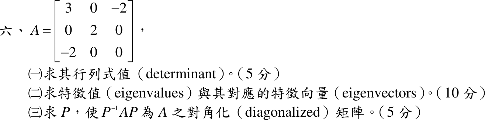

# 110 年第 6 題｜對稱矩陣對角化

## 已知與所求

\(A=\begin{bmatrix}3&0&-2\\0&2&0\\-2&0&0\end{bmatrix}\)。（一）行列式（5 分）；（二）特徵值與特徵向量（10 分）；（三）求 \(P\) 使 \(P^{-1}AP\) 為對角矩陣（5 分）。

## 考場標準作答

### （一）行列式

沿第二列展開：
\[
\det A=2\det\begin{bmatrix}3&-2\\-2&0\end{bmatrix}=2(0-4)=\boxed{\det A=-8}
\]

### （二）特徵值與特徵向量

\[
\det(A-\lambda I)=(2-\lambda)\left[(3-\lambda)(-\lambda)-4\right]=(2-\lambda)(\lambda-4)(\lambda+1)=0
\]
- \(\lambda=4\)：\(-x-2z=0\Rightarrow\mathbf v_1=(-2,0,1)^T\)
- \(\lambda=2\)：\(x=z=0\Rightarrow\mathbf v_2=(0,1,0)^T\)
- \(\lambda=-1\)：\(4x-2z=0\Rightarrow\mathbf v_3=(1,0,2)^T\)

\[
\boxed{\lambda=4,\ 2,\ -1;\quad \mathbf v=(-2,0,1)^T,\ (0,1,0)^T,\ (1,0,2)^T}
\]

### （三）對角化矩陣

\[
\boxed{P=\begin{bmatrix}-2&0&1\\0&1&0\\1&0&2\end{bmatrix},\quad P^{-1}AP=\begin{bmatrix}4&0&0\\0&2&0\\0&0&-1\end{bmatrix}}
\]
（各特徵向量互相正交，欄向量正規化後亦可得正交矩陣 \(P\)。）

## 驗算

- \(\operatorname{tr}A=5=4+2-1\)；\(\lambda_1\lambda_2\lambda_3=-8=\det A\)，與（一）餘因子展開一致。
- \(A\mathbf v_1=(-8,0,4)^T=4\mathbf v_1\)，\(A\mathbf v_3=(-1,0,-2)^T=-\mathbf v_3\)。

## 失分點

- \(P\) 的欄順序必須與對角矩陣中特徵值順序一致。
- 特徵向量要寫成三維（含 \(y\) 分量 0），不能只寫 \(x,z\) 子區塊的二維向量。
