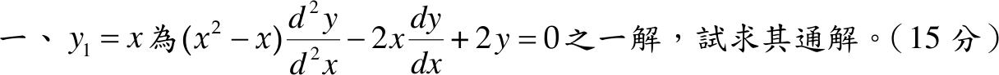

# 111 年第 1 題｜已知一解的二階 ODE

## 考場標準作答

題中 \(\frac{d^2y}{d^2x}\) 即 \(y''\)。除以 \(x^2-x\)（\(x\ne0,1\)）化為標準式：
\[
y''-\frac{2}{x-1}\,y'+\frac{2}{x(x-1)}\,y=0,\qquad P(x)=-\frac{2}{x-1}.
\]
降階公式：
\[
y_2=y_1\int\frac{e^{-\int P\,dx}}{y_1^2}\,dx=x\int\frac{(x-1)^2}{x^2}\,dx
=x\left(x-2\ln|x|-\frac1x\right)=x^2-2x\ln|x|-1.
\]
\[
\boxed{y=C_1x+C_2\left(x^2-2x\ln|x|-1\right)}
\]

## 驗算

Abel 公式：\(W=Ce^{-\int P\,dx}=C(x-1)^2\)。直接算 \(W(x,y_2)=xy_2'-y_2=x(2x-2\ln|x|-2)-(x^2-2x\ln|x|-1)=(x-1)^2\)，相符且不恆為零，兩解線性獨立。

## 失分點

- 未先除以 \(x^2-x\)，把 \(P\) 誤取為 \(-2x\)，積分因子就錯。
