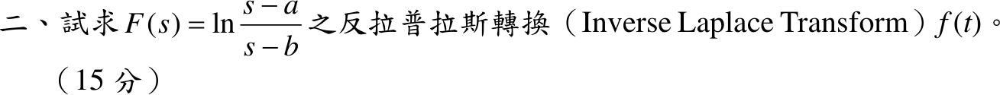

# 111 年第 2 題

## 考場標準作答

\(F(s)=\ln(s-a)-\ln(s-b)\) 無法直接查表，利用 \(\mathcal L\{tf(t)\}=-F'(s)\)：
\[
-F'(s)=-\frac{1}{s-a}+\frac{1}{s-b}
\quad\Longrightarrow\quad
tf(t)=e^{bt}-e^{at}
\]
\[
\boxed{f(t)=\frac{e^{bt}-e^{at}}{t}}
\]

## 驗算

用頻域積分 \(\mathcal L\{g(t)/t\}=\int_s^\infty G(\sigma)\,d\sigma\)，\(g=e^{bt}-e^{at}\)：
\[
\int_s^\infty\left(\frac{1}{\sigma-b}-\frac{1}{\sigma-a}\right)d\sigma
=\left[\ln\frac{\sigma-b}{\sigma-a}\right]_s^\infty=\ln\frac{s-a}{s-b}
\]
與 \(F(s)\) 相同；且 \(t\to0\) 時 \(f(t)\to b-a\)，函數有界。

## 失分點

- 由 \(-F'(s)\) 反轉換得到的是 \(tf(t)\)，忘記再除以 \(t\)。
