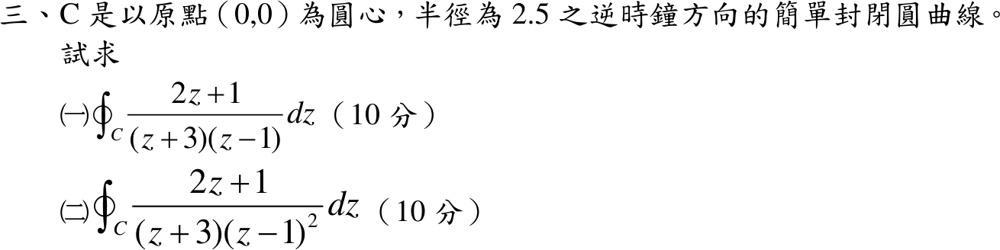

# 111 年第 3 題｜兩個圓周留數積分

## 已知與所求

\(C\)：圓心原點、半徑 2.5、逆時針。求（一）\(\oint_C\frac{2z+1}{(z+3)(z-1)}dz\)；（二）\(\oint_C\frac{2z+1}{(z+3)(z-1)^2}dz\)。

## 考場標準作答

極點 \(z=1\)（\(|1|<2.5\)）在 \(C\) 內，\(z=-3\)（\(|-3|=3>2.5\)）在 \(C\) 外，兩小題都只取 \(z=1\) 的留數。

### （一）一階極點

\[
\operatorname{Res}_{z=1}=\left.\frac{2z+1}{z+3}\right|_{z=1}=\frac34
\quad\Longrightarrow\quad
\boxed{I_1=2\pi i\cdot\frac34=\frac{3\pi i}{2}}
\]

### （二）二階極點

令 \(g(z)=\frac{2z+1}{z+3}\)，\(g'(z)=\frac{2(z+3)-(2z+1)}{(z+3)^2}=\frac{5}{(z+3)^2}\)：
\[
\operatorname{Res}_{z=1}=g'(1)=\frac5{16}
\quad\Longrightarrow\quad
\boxed{I_2=2\pi i\cdot\frac5{16}=\frac{5\pi i}{8}}
\]

## 驗算

用「全部有限留數和 = 無窮遠處 \(1/z\) 係數」：
- （一）被積函數 \(\sim 2/z\)，留數總和為 2；\(\operatorname{Res}_{z=-3}=\frac{-5}{-4}=\frac54\)，故圓內為 \(2-\frac54=\frac34\)。
- （二）被積函數 \(\sim 2/z^2\)，留數總和為 0；\(\operatorname{Res}_{z=-3}=\frac{-5}{16}\)，故圓內為 \(\frac5{16}\)。

## 失分點

- 把圓外的 \(z=-3\) 也計入留數和。
- （二）的 \(z=1\) 是二階極點，仍用一階公式 \(\lim(z-1)f\) 會發散。
