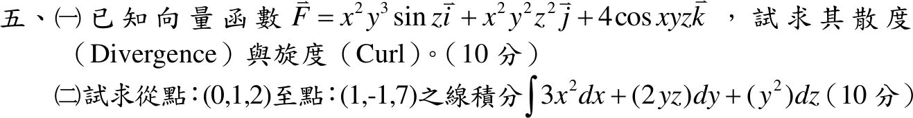

# 111 年第 5 題

## 已知與所求

（一）\(\vec F=x^2y^3\sin z\,\vec i+x^2y^2z^2\,\vec j+4\cos(xyz)\,\vec k\)，求散度與旋度（10 分）。（二）求由點 \((0,1,2)\) 至點 \((1,-1,7)\) 的 \(\int 3x^2dx+(2yz)dy+(y^2)dz\)（10 分）。

## 考場標準作答

### （一）散度與旋度

\[
\boxed{\nabla\cdot\vec F=2xy^3\sin z+2x^2yz^2-4xy\sin(xyz)}
\]
\[
\nabla\times\vec F=
\left(\frac{\partial F_3}{\partial y}-\frac{\partial F_2}{\partial z}\right)\vec i
+\left(\frac{\partial F_1}{\partial z}-\frac{\partial F_3}{\partial x}\right)\vec j
+\left(\frac{\partial F_2}{\partial x}-\frac{\partial F_1}{\partial y}\right)\vec k
\]
\[
\boxed{\nabla\times\vec F=-\left[4xz\sin(xyz)+2x^2y^2z\right]\vec i+\left[x^2y^3\cos z+4yz\sin(xyz)\right]\vec j+\left(2xy^2z^2-3x^2y^2\sin z\right)\vec k}
\]

### （二）線積分

\(\vec G=(3x^2,\,2yz,\,y^2)\) 的旋度為 \((2y-2y,\,0-0,\,0-0)=\vec 0\)，為保守場；位勢 \(\phi=x^3+y^2z\)（\(\nabla\phi=\vec G\)），與路徑無關：
\[
\int_{(0,1,2)}^{(1,-1,7)}=\phi(1,-1,7)-\phi(0,1,2)=(1+7)-(0+2)=\boxed{6}
\]

## 驗算

- （一）\(\nabla\cdot(\nabla\times\vec F)\) 應恆為 0：\(\partial_x\) 項 \(-4z\sin(xyz)-4xyz^2\cos(xyz)-4xy^2z\)，\(\partial_y\) 項 \(3x^2y^2\cos z+4z\sin(xyz)+4xyz^2\cos(xyz)\)，\(\partial_z\) 項 \(4xy^2z-3x^2y^2\cos z\)，三者相加為 0。
- （二）沿直線 \((t,\,1-2t,\,2+5t)\)，\(0\le t\le1\)：被積式 \(3t^2-2(1-2t)(2+5t)\cdot2+5(1-2t)^2\)，積分得 \(1-10+\frac{40}{3}+\frac53=6\)。

## 失分點

- 旋度 \(\vec j\) 分量是 \(\partial_zF_1-\partial_xF_3\)，順序寫反會整項變號。
- \(4\cos(xyz)\) 對 \(x\) 偏微分要乘鏈鎖因子 \(yz\)，得 \(-4yz\sin(xyz)\)。
- （二）未先驗證保守場就直接用端點相減，論據不完整。
