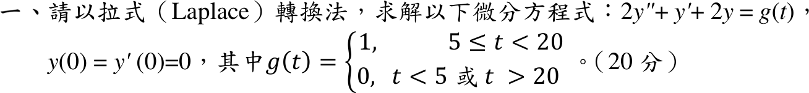

# 112 年第 1 題｜矩形脈衝

## 已知與所求

\(2y''+y'+2y=g(t)\)，\(y(0)=y'(0)=0\)，\(g(t)=1\)（\(5\le t<20\)）、\(g(t)=0\)（\(t<5\) 或 \(t>20\)）。以拉氏轉換求 \(y(t)\)。

## 考場標準作答

\(g(t)=u(t-5)-u(t-20)\Rightarrow G(s)=\dfrac{e^{-5s}-e^{-20s}}{s}\)。零初值下
\[
(2s^2+s+2)Y(s)=G(s)\ \Rightarrow\ Y(s)=\left(e^{-5s}-e^{-20s}\right)\frac{1}{s(2s^2+s+2)}.
\]
部分分式（\(2s^2+s+2=2[(s+\tfrac14)^2+\tfrac{15}{16}]\)）：
\[
\frac{1}{s(2s^2+s+2)}=\frac12\left[\frac1s-\frac{(s+\frac14)+\frac14}{(s+\frac14)^2+\frac{15}{16}}\right],
\]
\[
\Phi(t)=\mathcal L^{-1}\!\left\{\frac{1}{s(2s^2+s+2)}\right\}
=\frac12-\frac12e^{-t/4}\left[\cos\frac{\sqrt{15}\,t}{4}+\frac{1}{\sqrt{15}}\sin\frac{\sqrt{15}\,t}{4}\right].
\]
由第二平移定理：
\[
\boxed{y(t)=u(t-5)\,\Phi(t-5)-u(t-20)\,\Phi(t-20)}
\]
即 \(t<5\) 時 \(y=0\)；\(5\le t<20\) 時 \(y=\Phi(t-5)\)；\(t\ge20\) 時 \(y=\Phi(t-5)-\Phi(t-20)\)。

## 驗算

- \(\Phi\) 回代：常數 \(\tfrac12\) 滿足 \(2(0)+0+2\cdot\tfrac12=1\)，其餘為特徵根 \(-\tfrac14\pm i\tfrac{\sqrt{15}}4\) 的齊次解；\(\Phi(0)=\tfrac12-\tfrac12=0\)，\(\Phi'(0)=\tfrac12\bigl(\tfrac14-\tfrac{\sqrt{15}}4\cdot\tfrac1{\sqrt{15}}\bigr)=0\)。
- 極限檢查：脈衝期間 \(y\to g/2=\tfrac12\)（直流增益 \(1/2\)）；\(t\to\infty\) 時 \(\Phi(t-5)-\Phi(t-20)\to\tfrac12-\tfrac12=0\)，與終值定理 \(\lim_{s\to0}sY(s)=0\) 一致。

## 失分點

- 二次式未先提出 2，誤寫 \((s+\tfrac12)^2+\cdots\)，阻尼與頻率都錯（正確 \(e^{-t/4}\)、\(\omega=\sqrt{15}/4\)）。
- 平移後只寫 \(\Phi(t-5)-\Phi(t-20)\)，漏掉 \(u(t-5)\)、\(u(t-20)\) 使 \(t<5\) 時不為 0。
