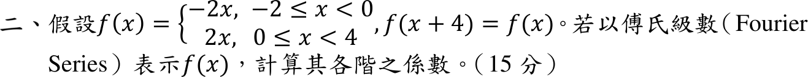

# 112 年第 2 題｜傅立葉級數

## 已知與所求

\(f(x)=-2x\)（\(-2\le x<0\)）、\(f(x)=2x\)（\(0\le x<4\)），\(f(x+4)=f(x)\)。求傅立葉級數各係數。

## 考場標準作答

取週期 \(4\)（\(L=2\)）的基本區間 \([-2,2)\)，此時 \(f(x)=2|x|\) 為偶函數（三角波），故 \(b_n=0\)。採 \(f(x)\sim a_0+\sum_{n\ge1}\bigl[a_n\cos\frac{n\pi x}{2}+b_n\sin\frac{n\pi x}{2}\bigr]\)：
\[
a_0=\frac{1}{4}\int_{-2}^{2}2|x|\,dx=\frac14\cdot8=2,
\]
\[
a_n=\frac{2}{2}\int_0^2 2x\cos\frac{n\pi x}{2}\,dx
=2\left[\frac{2x}{n\pi}\sin\frac{n\pi x}{2}+\frac{4}{n^2\pi^2}\cos\frac{n\pi x}{2}\right]_0^2
=\frac{8\bigl((-1)^n-1\bigr)}{n^2\pi^2}.
\]
\[
\boxed{a_0=2,\quad a_n=\frac{8\bigl((-1)^n-1\bigr)}{n^2\pi^2}=\begin{cases}-\dfrac{16}{n^2\pi^2},&n\text{ 奇}\\[4pt]0,&n\text{ 偶}\end{cases},\quad b_n=0}
\]
\[
\boxed{f(x)=2-\frac{16}{\pi^2}\sum_{m=0}^{\infty}
\frac{1}{(2m+1)^2}\cos\frac{(2m+1)\pi x}{2}}
\]

## 驗算

- \(x=0\)：\(2-\frac{16}{\pi^2}\cdot\frac{\pi^2}{8}=0=f(0)\)；\(x=2\)：\(\cos\bigl((2m+1)\pi\bigr)=-1\)，得 \(2+2=4=f(\pm2)\)，三角波連續，級數處處等於 \(f\)。
- 常數項 2 即三角波（0 到 4 線性往返）的平均值。

## 失分點

- 常數項慣例混用：寫成 \(a_0/2\) 時 \(a_0\) 應為 4，不可同時寫 \(a_0=2\) 又除以 2。
- 偶函數仍去算 \(b_n\) 或 \(a_n\) 少乘 2（半區間積分要乘 \(2/L\)）。

## 條件與疑義

題面兩段定義合計 \([-2,4)\) 長 6，與 \(f(x+4)=f(x)\) 的週期 4 衝突：在 \([-2,0)\) 上 \(-2x\) 與週期延拓的 \(2(x+4)\) 不同。上解假設第二段應為 \(0\le x<2\)（基本區間 \([-2,2)\)）。若改取完整一週期的 \(f=2x\)（\(0\le x<4\)）鋸齒波，則 \(a_0=4\)、\(a_n=0\)、\(b_n=-\dfrac{8}{n\pi}\)，即 \(f\sim4-\dfrac8\pi\sum_{n\ge1}\dfrac{1}{n}\sin\dfrac{n\pi x}{2}\)。作答時應寫明所採的基本區間。
