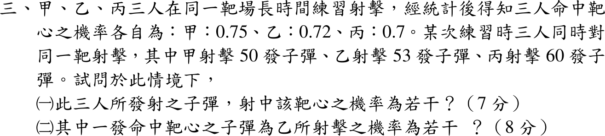

# 112 年第 3 題｜三人射擊命中率

## 已知與所求

\(p_A=0.75,\ p_B=0.72,\ p_C=0.70\)；本次射擊 \(n_A=50,\ n_B=53,\ n_C=60\) 發。求（一）隨機一發子彈命中靶心的機率；（二）已知一發命中，為乙所射之機率。

## 考場標準作答

### （一）一發子彈命中的機率

共 \(N=163\) 發，抽中某人子彈的機率為 \(n_i/N\)，全機率公式：
\[
P(H)=\frac{50(0.75)+53(0.72)+60(0.70)}{163}=\frac{37.50+38.16+42.00}{163}=\frac{117.66}{163}
=\boxed{\frac{5883}{8150}\approx0.7218}
\]
此為「隨機一發」的命中率；若問「163 發中至少一發命中」才是 \(1-(1-p_A)^{50}(1-p_B)^{53}(1-p_C)^{60}\)，屬不同事件。

### （二）命中子彈為乙所射

貝氏定理：
\[
P(B\mid H)=\frac{n_Bp_B}{n_Ap_A+n_Bp_B+n_Cp_C}=\frac{38.16}{117.66}=\boxed{\frac{12}{37}\approx0.3243}
\]

## 驗算

- 三人後驗機率 \(\frac{37.50}{117.66}+\frac{38.16}{117.66}+\frac{42.00}{117.66}=1\)，且 \(38.16/117.66\) 約分（同除 \(3.18\)）為 \(12/37\)。
- \(0.7218\) 落在 \(0.70\)–\(0.75\) 之間，符合加權平均的範圍。

## 失分點

- 三人命中率直接平均 \((0.75+0.72+0.70)/3=0.7233\)，未依發數加權。
- （二）分母只用乙的發數或寫成 \(53/163\)，忽略需以命中數 \(n_ip_i\) 加權。
