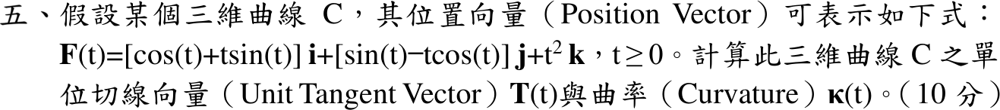

# 112 年第 5 題｜單位切線與曲率

## 考場標準作答

\(\mathbf F'(t)=(t\cos t,\ t\sin t,\ 2t)=t(\cos t,\sin t,2)\)，\(\lVert\mathbf F'\rVert=\sqrt5\,t\)。對 \(t>0\)：
\[
\boxed{\mathbf T(t)=\frac{1}{\sqrt5}(\cos t,\ \sin t,\ 2)}
\]
\(\mathbf T'(t)=\frac{1}{\sqrt5}(-\sin t,\cos t,0)\)，\(\lVert\mathbf T'\rVert=\frac1{\sqrt5}\)：
\[
\boxed{\kappa(t)=\frac{\lVert\mathbf T'\rVert}{\lVert\mathbf F'\rVert}=\frac{1}{5t}},\quad t>0
\]
\(t=0\) 時 \(\mathbf F'=0\)，\(\mathbf T,\kappa\) 無定義。

## 驗算

\(\mathbf F''=(\cos t-t\sin t,\ \sin t+t\cos t,\ 2)\)，\(\mathbf F'\times\mathbf F''=(-2t^2\cos t,-2t^2\sin t,t^2)\)，範數 \(\sqrt5\,t^2\)；\(\kappa=\frac{\sqrt5\,t^2}{(\sqrt5\,t)^3}=\frac1{5t}\)。
