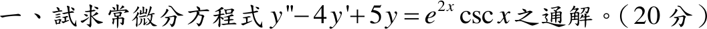

# 113 年第 1 題｜變係數法

## 已知與所求

\(y''-4y'+5y=e^{2x}\csc x\)，求通解。

## 考場標準作答

特徵方程 \(r^2-4r+5=0\Rightarrow r=2\pm i\)，齊次解 \(y_h=e^{2x}(C_1\cos x+C_2\sin x)\)。

取 \(y_1=e^{2x}\cos x,\ y_2=e^{2x}\sin x\)，Wronskian \(W=y_1y_2'-y_2y_1'=e^{4x}\)，\(g=e^{2x}\csc x\)。參數變異法：
\[
u_1=-\int\frac{y_2g}{W}dx=-\int\sin x\csc x\,dx=-x,\qquad
u_2=\int\frac{y_1g}{W}dx=\int\cot x\,dx=\ln|\sin x|,
\]
\[
y_p=u_1y_1+u_2y_2=e^{2x}\bigl(-x\cos x+\sin x\ln|\sin x|\bigr).
\]
通解（在不含 \(\sin x=0\) 的區間上）：
\[
\boxed{y=e^{2x}\bigl[C_1\cos x+C_2\sin x-x\cos x+\sin x\ln|\sin x|\bigr]}
\]

## 驗算

令 \(y=e^{2x}u\)，則 \(y'=e^{2x}(u'+2u)\)、\(y''=e^{2x}(u''+4u'+4u)\)，代入得 \(y''-4y'+5y=e^{2x}(u''+u)\)，原式化為 \(u''+u=\csc x\)。以 \(u_p=-x\cos x+\sin x\ln|\sin x|\) 檢查：
\[
u_p'=x\sin x+\cos x\ln|\sin x|,\qquad
u_p''=\sin x+x\cos x-\sin x\ln|\sin x|+\frac{\cos^2x}{\sin x},
\]
\[
u_p''+u_p=\sin x+\frac{\cos^2x}{\sin x}=\frac{1}{\sin x}=\csc x.
\]

## 失分點

- 特徵方程 \(r^2-4r+5=0\) 的根是 \(2\pm i\)；正負號弄反成 \(-2\pm i\) 會使齊次解與 \(e^{2x}\csc x\) 無法配合。
- Wronskian 是 \(e^{4x}\) 而非 1；漏掉時 \(u_1',u_2'\) 會殘留 \(e^{-2x}\) 因子而無法積分。
