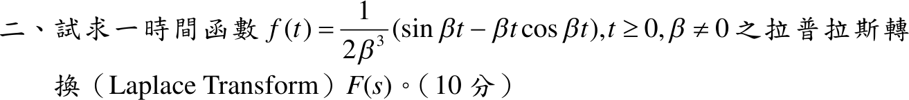

# 113 年第 2 題｜拉普拉斯轉換

## 考場標準作答

由 \(\mathcal L\{\sin\beta t\}=\dfrac{\beta}{s^2+\beta^2}\) 與 \(\mathcal L\{t\cos\beta t\}=-\dfrac{d}{ds}\dfrac{s}{s^2+\beta^2}=\dfrac{s^2-\beta^2}{(s^2+\beta^2)^2}\)：
\[
F(s)=\frac{1}{2\beta^3}\left[\frac{\beta}{s^2+\beta^2}-\frac{\beta(s^2-\beta^2)}{(s^2+\beta^2)^2}\right]
=\frac{1}{2\beta^3}\cdot\frac{2\beta^3}{(s^2+\beta^2)^2}
=\boxed{\frac{1}{(s^2+\beta^2)^2}}
\]

## 驗算

摺積定理：\(\mathcal L^{-1}\{\frac{1}{(s^2+\beta^2)^2}\}=\frac{1}{\beta^2}\int_0^t\sin\beta\tau\,\sin\beta(t-\tau)\,d\tau=\frac{1}{\beta^2}\cdot\frac{\sin\beta t-\beta t\cos\beta t}{2\beta}\)，正是題給 \(f(t)\)。
