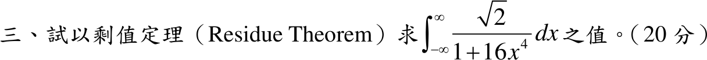

# 113 年第 3 題｜四次式實積分的留數驗算

## 已知與所求

以留數定理求 \(\displaystyle\int_{-\infty}^{\infty}\frac{\sqrt2}{1+16x^4}\,dx\)。

## 考場標準作答

令 \(u=2x\)，\(dx=du/2\)：
\[
I=\int_{-\infty}^{\infty}\frac{\sqrt2}{1+16x^4}\,dx=\frac{\sqrt2}{2}\int_{-\infty}^{\infty}\frac{du}{1+u^4}.
\]
\(h(z)=1/(1+z^4)\) 在上半平面的一階極點為 \(z_1=e^{i\pi/4},\ z_2=e^{i3\pi/4}\)，\(\operatorname{Res}(h,z_k)=\dfrac{1}{4z_k^3}\)：
\[
\sum\operatorname{Res}=\frac14\left(e^{-i3\pi/4}+e^{-i9\pi/4}\right)=\frac14\left(e^{-i3\pi/4}+e^{-i\pi/4}\right)=-\frac{i\sqrt2}{4}.
\]
分母次數比分子高 4，半圓弧積分 \(\to0\)，故
\[
\int_{-\infty}^{\infty}\frac{du}{1+u^4}=2\pi i\left(-\frac{i\sqrt2}{4}\right)=\frac{\pi}{\sqrt2},
\qquad
\boxed{I=\frac{\sqrt2}{2}\cdot\frac{\pi}{\sqrt2}=\frac\pi2}
\]

## 驗算

標準公式 \(\int_0^\infty\frac{du}{1+u^a}=\frac\pi a\csc\frac\pi a\)，\(a=4\)：\(2\cdot\frac\pi4\cdot\sqrt2=\frac{\pi}{\sqrt2}\)，乘 \(\frac{\sqrt2}{2}\) 得 \(\frac\pi2\approx1.5708\)。

## 失分點

- 換元後漏乘 \(dx=du/2\)，答案變成 \(\pi\)。
- 把四個極點的留數全加（總和為 0），上半平面只含 \(e^{i\pi/4},e^{i3\pi/4}\)。
