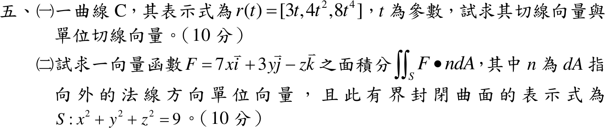

# 113 年第 5 題｜切線向量與球面通量

## 已知與所求

（一）\(r(t)=[3t,\ 4t^2,\ 8t^4]\)，求切線向量與單位切線向量。（二）\(F=7x\,\mathbf i+3y\,\mathbf j-z\,\mathbf k\)，\(S:x^2+y^2+z^2=9\)，求外向通量 \(\iint_SF\cdot n\,dA\)。

## 考場標準作答

### （一）切線向量

\[
\boxed{r'(t)=[3,\ 8t,\ 32t^3]},\qquad \lVert r'(t)\rVert=\sqrt{9+64t^2+1024t^6}>0,
\]
\[
\boxed{T(t)=\frac{[3,\ 8t,\ 32t^3]}{\sqrt{9+64t^2+1024t^6}}}
\]

### （二）球面通量

\(\nabla\cdot F=7+3-1=9\)。由散度定理（半徑 3 的實心球）：
\[
\iint_SF\cdot n\,dA=\iiint_V9\,dV=9\cdot\frac43\pi(3)^3=\boxed{324\pi}
\]

## 驗算

- （一）\(t=1\)：\(r'(1)=[3,8,32]\)，\(\lVert r'\rVert=\sqrt{1097}\)，\(T\cdot T=1097/1097=1\)。
- （二）直接面積分：\(n=(x,y,z)/3\)，\(F\cdot n=(7x^2+3y^2-z^2)/3\)；球面對稱給 \(\iint x^2dA=\iint y^2dA=\iint z^2dA=\frac13\cdot9\cdot4\pi\cdot9=108\pi\)，故通量 \(=(7+3-1)\cdot108\pi/3=324\pi\)。

## 失分點

- \(\|r'\|^2=9+64t^2+1024t^6\) 須逐項平方；把 \((8t)^2\) 寫成 \(8t^2\) 會使 \(\mathbf T\) 不是單位向量。
- \(-z\,\mathbf k\) 的散度貢獻是 \(-1\)，漏掉負號得 \(11\cdot36\pi=396\pi\)。
