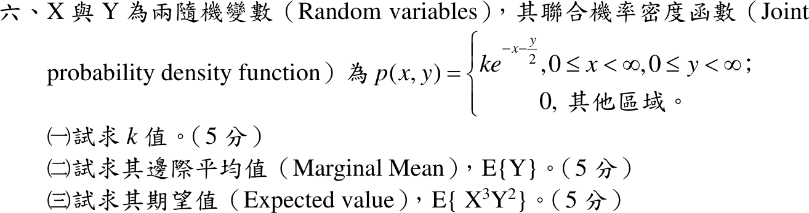

# 113 年第 6 題｜聯合機率密度

## 已知與所求

\(p(x,y)=ke^{-x-y/2}\)（\(x\ge0,\ y\ge0\)），其他區域為 0。求（一）\(k\)；（二）邊際平均 \(E\{Y\}\)；（三）\(E\{X^3Y^2\}\)。

## 考場標準作答

### （一）\(k\)

\[
1=k\int_0^\infty e^{-x}\,dx\int_0^\infty e^{-y/2}\,dy=k(1)(2)
\quad\Longrightarrow\quad
\boxed{k=\frac12}
\]

### （二）\(E\{Y\}\)

\[
p_Y(y)=\int_0^\infty \frac12e^{-x-y/2}\,dx=\frac12e^{-y/2},\qquad y\ge0,
\]
即 \(Y\sim\operatorname{Exp}(\text{rate}=1/2)\)：
\[
E[Y]=\int_0^\infty y\cdot\frac12e^{-y/2}\,dy=\boxed{E[Y]=2}
\]

### （三）\(E\{X^3Y^2\}\)

\(p_X(x)=\int_0^\infty \frac12e^{-x-y/2}\,dy=e^{-x}\)（\(x\ge0\)），故在 \(x,y\ge0\) 上 \(p(x,y)=p_X(x)p_Y(y)\)，\(X,Y\) 獨立。由 \(\operatorname{Exp}(\lambda)\) 的 \(E[X^n]=n!/\lambda^n\)：
\[
E[X^3Y^2]=E[X^3]E[Y^2]=\frac{3!}{1^3}\cdot\frac{2!}{(1/2)^2}=6\cdot8=\boxed{48}
\]

## 驗算

直接對聯合密度積分（不用獨立性）：
\[
\frac12\int_0^\infty x^3e^{-x}dx\int_0^\infty y^2e^{-y/2}dy=\frac12\,\Gamma(4)\cdot\frac{\Gamma(3)}{(1/2)^3}=\frac12(6)(16)=48;
\]
同法 \(E[Y]=\frac12(1)\cdot\frac{\Gamma(2)}{(1/2)^2}=2\)。

## 失分點

- 把指數 \(e^{-x-y/2}\) 誤讀成 \(e^{-x-2y}\)，會得 \(k=2\)、\(E[Y]=1/2\)。
- 未先說明 \(p(x,y)=p_X(x)p_Y(y)\) 就把 \(E[X^3Y^2]\) 拆成乘積。
- \(Y\) 的 rate 是 \(1/2\)：\(E[Y^2]=2/(1/2)^2=8\)，誤用 rate 2 得 \(1/2\)。
