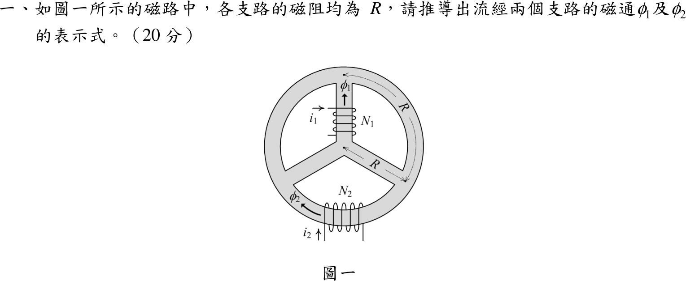
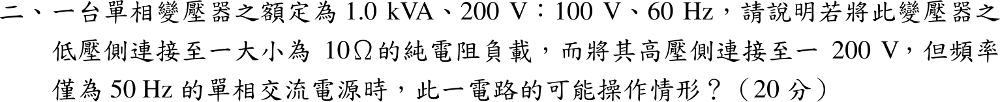
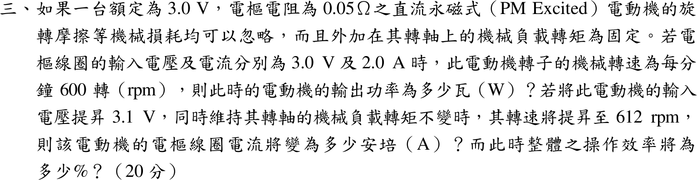

# 📝 104 年電機工程技師｜電機機械逐題詳解

> 本頁由題級 canonical 筆記組合；每題保留官方裁切圖、校驗狀態與可追溯的推導。

## 題目導覽
- [[#一、104 年電機機械第 1 題|第 1 題：104 年電機機械第 1 題]]
- [[#二、104 年電機機械第 2 題｜60 Hz 變壓器接 50 Hz 電源|第 2 題：60 Hz 變壓器接 50 Hz 電源]]
- [[#三、104 年電機機械第 3 題|第 3 題：104 年電機機械第 3 題]]
- [[#四、104 年電機機械第 4 題｜三相感應電動機起動電流|第 4 題：三相感應電動機起動電流]]
- [[#五、104 年電機機械第 5 題|第 5 題：104 年電機機械第 5 題]]

---

## 一、104 年電機機械第 1 題

> 題級識別：EE-104-04-1
> canonical 來源：[[canonical/EE-104-04-1.md]]
> 題級校驗狀態：verified

### 已知與所求

圖一為外環加 Y 形三輻條的鐵心：中心節點 \(C\)，環上三點 \(T\)（上）、\(B\)（右下）、\(A\)（左下）。\(N_1\) 線圈在上輻條 \(C\!-\!T\)（電流 \(i_1\)，磁通 \(\phi_1\) 向上），\(N_2\) 線圈在下方圓弧 \(B\!-\!A\)（電流 \(i_2\)，磁通 \(\phi_2\) 自 \(B\) 向 \(A\)）。題目說各支路磁阻均為 \(R\)。求 \(\phi_1,\phi_2\) 的表示式。磁動勢 \(\mathcal F_1=N_1i_1\)、\(\mathcal F_2=N_2i_2\)，由圖示繞向，正向與 \(\phi\) 一致。

### 考場標準作答

磁路類比電路（磁通＝電流、磁動勢＝電壓、磁阻＝電阻）。六段支路（三輻條 \(CT,CB,CA\)；三圓弧 \(TB,BA,AT\)）皆為 \(R\)，構成四節點完全圖。含 \(\mathcal F_1\) 的支路為 \(CT\)，含 \(\mathcal F_2\) 的支路為 \(BA\)，兩者為相對的兩邊。

以疊加：

**只有 \(\mathcal F_1\)**：\(B\)、\(A\) 對 \(C,T\) 對稱，電橋平衡，\(BA\) 支路磁通為 0。除源支路外，\(C\) 至 \(T\) 另有兩條各 \(2R\) 的並聯路徑（\(C\!-\!B\!-\!T\)、\(C\!-\!A\!-\!T\)），等效 \(R\)：
\[
\phi_1=\frac{\mathcal F_1}{R+R}=\frac{\mathcal F_1}{2R}
\]

**只有 \(\mathcal F_2\)**：同理 \(C,T\) 對 \(B,A\) 對稱，\(CT\) 支路磁通為 0，\(\phi_2=\dfrac{\mathcal F_2}{2R}\)。

疊加後兩線圈互不耦合：
\[
\boxed{\phi_1=\frac{N_1i_1}{2R}},\qquad \boxed{\phi_2=\frac{N_2i_2}{2R}}
\]

### 驗算

節點電位法（\(U_C=0\)）：僅 \(\mathcal F_1\) 時 \(U_T=\mathcal F_1/2\)、\(U_B=U_A=\mathcal F_1/4\)。節點 \(B\)：\(C\to B\) 磁通 \(-\mathcal F_1/4R\)，\(T\to B\) 磁通 \(+\mathcal F_1/4R\)，淨流入 0 且 \(BA\) 無磁通；\(\phi_1=(\mathcal F_1-U_T)/R=\mathcal F_1/2R\)。\(\mathcal F_2\) 同理。數值（\(\mathcal F_1=3,\ \mathcal F_2=5,\ R=1\)）以四節點矩陣直接聯立解得 \(\phi_1=1.5,\ \phi_2=2.5\)，與公式一致。

### 失分點

- 磁通連續：每個節點流入等於流出（非單一迴路 KVL）；只列單一迴路會漏掉其他並聯路徑。
- 極性依右手定則：\(i_1\) 由上方引線向右、在上輻條前方繞過，磁動勢向上，與 \(\phi_1\) 同向；\(i_2\) 由左側引線向上、在下弧前方繞過，磁動勢向左（\(B\to A\)），與 \(\phi_2\) 同向，故兩式皆取正號。

---

## 二、104 年電機機械第 2 題｜60 Hz 變壓器接 50 Hz 電源

> 題級識別：EE-104-04-2
> canonical 來源：[[canonical/EE-104-04-2.md]]
> 題級校驗狀態：verified

### 已知與所求

單相變壓器額定 \(1.0\ \mathrm{kVA}\)、\(200\ \mathrm V:100\ \mathrm V\)、\(60\ \mathrm{Hz}\)；低壓側接 \(10\ \Omega\) 純電阻，高壓側接 \(200\ \mathrm V\)、\(50\ \mathrm{Hz}\) 電源。說明可能的操作情形。

### 考場標準作答

#### 鐵心磁通

\(V_1=4.44fN_1\Phi_m\Rightarrow\Phi_m\propto V_1/f\)：
\[
\boxed{\frac{\Phi_{m,50}}{\Phi_{m,60}}=\frac{200/50}{200/60}=1.2}
\]
磁通增加 20%，鐵心易進入飽和：激磁電流大增且成為含高次諧波的尖峰波形，倍數須由磁化曲線決定（題目未給）。

#### 負載電流

匝比 \(a=2\) 不變，低壓端約 100 V：
\[
\boxed{I_2=\frac{100}{10}=10\ \mathrm A}=\frac{1000}{100}\ (\text{額定}),\qquad I_1\approx5\ \mathrm A
\]
負載恰為 1.0 kVA，繞組銅損已達額定；再加上飽和激磁電流，一次側電流與銅損超過額定。

#### 損耗與漏抗

渦流損 \(P_e\propto f^2B_m^2\propto V^2\)，電壓不變故不變；磁滯損 \(P_h\propto fB_m^{n}\)（\(n\approx1.6\text{–}2\)）變為 \(\frac{5}{6}(1.2)^n\approx1.12\text{–}1.2\) 倍，鐵損上升。漏抗 \(X\propto f\) 降為 \(5/6\)，電壓調整率略減。

#### 結論

可以運轉並供出約 10 A、1 kW，但鐵心飽和、激磁電流與鐵損增加，加上繞組已滿載，溫升將超過設計值，不宜長時間滿載運轉。長期使用應把電源電壓降至
\[
\boxed{V_1=200\times\frac{50}{60}=166.7\ \mathrm V}
\]
以維持額定伏赫比（此時二次 \(83.3\ \mathrm V\)、負載 \(694\ \mathrm W\)），或依製造商資料降額。

### 驗算

一次側反映電阻 \(a^2R_L=40\ \Omega\)，\(I_1=200/40=5\ \mathrm A=1000/200\)（額定），\(200\times5=100\times10=1000\ \mathrm W\)，與二次側計算一致。

### 失分點

- 只看 \(I_2=10\ \mathrm A\) 等於額定就判定「正常滿載」，忽略磁通升為 1.2 倍造成的飽和與激磁電流。
- 以 \(P_e\propto f^2\) 推論渦流損降為 \(0.69\) 倍；\(B_m\) 同時升為 1.2 倍，電壓不變時渦流損實際不變。

---

## 三、104 年電機機械第 3 題

> 題級識別：EE-104-04-3
> canonical 來源：[[canonical/EE-104-04-3.md]]
> 題級校驗狀態：needs_manual_review
> [!WARNING] 本題仍有官方資料缺口或事件定義歧義；請以 canonical 條件式解答為準。

### 已知與所求

永磁直流電動機額定 3.0 V，\(R_a=0.05\ \Omega\)，摩擦等機械損忽略，負載轉矩固定。(\(V_t,I_a\))=(3.0 V, 2.0 A) 時 600 rpm。求（一）輸出功率；電壓升至 3.1 V、轉矩不變、轉速「升至 612 rpm」時，求（二）電樞電流；（三）整體效率。

### 考場標準作答

#### （一）輸出功率

\(E_{a1}=3.0-2.0(0.05)=2.90\ \mathrm V\)，機械損忽略，輸出功率等於電磁功率：
\[
\boxed{P_{out}=E_{a1}I_a=2.90(2.0)=5.80\ \mathrm W}
\]

#### （二）電樞電流

永磁磁通 \(\Phi\) 固定，\(T=K_\phi I_a\)；轉矩不變故電流不變：
\[
\boxed{I_{a2}=2.0\ \mathrm A}
\]

#### （三）效率

\(E_{a2}=3.1-2.0(0.05)=3.00\ \mathrm V\)，
\[
\boxed{\eta=\frac{E_{a2}I_{a2}}{V_{t2}I_{a2}}=\frac{3.00}{3.1}=96.77\%}
\]

### 驗算

\(P_{in}=3.1(2.0)=6.20\ \mathrm W=P_{out}+I_a^2R_a=6.00+0.20\)。

### 失分點

- 由 \(T\) 固定直接得 \(I_a\) 不變，不可由 612 rpm 反推電流（與轉矩不變矛盾，見條件與疑義）。
- 效率為 \(P_{out}/P_{in}\)，輸入功率 \(V_tI_a\) 含銅損 0.2 W，不是 \(E_aI_a\)。

### 條件與疑義

題幹給的 612 rpm 與「轉矩不變且無機械損」互不相容：\(I_a=2\ \mathrm A\) 時 \(E_{a2}=3.00\ \mathrm V\)，\(n_2=600(3.00/2.90)=620.7\ \mathrm{rpm}\)。本解依「轉矩不變」取 \(I_a=2.0\ \mathrm A\)、\(\eta=96.77\%\)。若改以 612 rpm 為準（\(E_{a2}=2.958\ \mathrm V\)），則 \(I_a=(3.1-2.958)/0.05=2.84\ \mathrm A\)、\(\eta=2.958/3.1=95.42\%\)，但此時轉矩已增加，與題設衝突。

---

## 四、104 年電機機械第 4 題｜三相感應電動機起動電流

> 題級識別：EE-104-04-4
> canonical 來源：[[canonical/EE-104-04-4.md]]
> 題級校驗狀態：verified

### 已知與所求

Y 接三相四極感應電動機，系統基準 \(S_b=2.2\ \mathrm{kVA}\)、\(V_b=380\ \mathrm V\)；標么值 \(r_s=r_r=0.05\)、\(x_s=x_r=0.15\)、\(R_c=30\)、\(X_m=40\)，\(V_s=1.0\ \mathrm{pu}\)。求起動電流 \(i_s\)（A）。

### 考場標準作答

圖中轉子支路為 \(jx_r\)、\(r_r\) 與負載電阻 \((1-s)r_r/s\) 三者串聯，激磁支路 \(R_c\parallel jX_m\) 位於定子阻抗之後。起動 \(s=1\)：$(1-s)r_r/s=0$，但串聯的 \(r_r\) 仍在：
\[
Z_r=r_r+jx_r=0.05+j0.15,\qquad
Z_m=R_c\parallel jX_m=\frac{j1200}{30+j40}=19.2+j14.4
\]
\[
Z_p=Z_r\parallel Z_m=0.05029+j0.14900,\qquad
Z_{in}=0.05+j0.15+Z_p=0.10029+j0.29900\ \mathrm{pu}
\]
\[
|Z_{in}|=0.31537,\quad i_{s,pu}=\frac{1}{0.31537}=3.171\ \mathrm{pu}
\]
\[
I_b=\frac{2200}{\sqrt3(380)}=3.3426\ \mathrm A,\qquad
\boxed{i_s=3.171(3.3426)=10.60\ \mathrm A}
\]

### 驗算

網目法：以 \(V_s=1\) 對兩網目列 \(2\times2\) 方程，\(\begin{bmatrix}Z_s+Z_m&-Z_m\\-Z_m&Z_m+Z_r\end{bmatrix}\begin{bmatrix}I_1\\I_2\end{bmatrix}=\begin{bmatrix}1\\0\end{bmatrix}\)（\(Z_s=0.05+j0.15\)），解得 \(I_1=3.171\angle-71.46^\circ\ \mathrm{pu}\)、\(|I_2|=3.154\ \mathrm{pu}\)；功率平衡：\(\mathrm{Re}(V_sI_1^*)=1.0083\)，等於 \(|I_1|^2r_s+|I_2|^2r_r+|V_p|^2/R_c=0.5027+0.4973+0.0083=1.0083\)（\(V_p=Z_m(I_1-I_2)\)）。

### 失分點

- 起動時只有 $(1-s)r_r/s$ 為零，串聯的 \(r_r\) 不能省；寫成 \(Z_r=jx_r\) 會得約 11 A，偏高。
- Y 接線電流為 \(I_b=S_b/(\sqrt3V_b)\)，不是 \(S_b/V_b\)。

---

## 五、104 年電機機械第 5 題

> 題級識別：EE-104-04-5
> canonical 來源：[[canonical/EE-104-04-5.md]]
> 題級校驗狀態：verified

### 已知與所求

三相四極同步發電機：6.6 kVA、380 V、60 Hz，\(R_a\approx0\)、\(X_s=1.0\ \Omega\)/相，機械與鐵損忽略。先調激磁使 6.6 kW 三相純電阻負載下端電壓為額定 380 V；之後激磁與轉速不變，改接 6.6 kVA、功因 0.8 滯後的電感性負載。求此時輸出（線）電壓。

### 考場標準作答

#### 步驟一：由電阻負載決定 \(E_f\)

\(V_\phi=380/\sqrt3=219.39\ \mathrm V\)，\(I_a=\dfrac{6600}{\sqrt3(380)}=10.028\ \mathrm A\)（與 \(V_\phi\) 同相）：
\[
E_f=|V_\phi+jX_sI_a|=\sqrt{219.39^2+10.028^2}=219.62\ \mathrm V/\text{相}
\]

#### 步驟二：改接 0.8 滯後負載

負載以額定 380 V 下 6.6 kVA 定義，阻抗：
\[
Z_L=\frac{380^2}{6600}\angle36.87^\circ=21.88\angle36.87^\circ=17.50+j13.13\ \Omega
\]
電壓分壓：
\[
V_\phi'=E_f\frac{|Z_L|}{|Z_L+jX_s|}=219.62\frac{21.88}{|17.50+j14.13|}=219.62\frac{21.88}{22.49}=213.66\ \mathrm V
\]
\[
\boxed{V_L=\sqrt3(213.66)\approx370\ \mathrm V}
\]

### 驗算

回代：\(I=V_\phi'/|Z_L|=213.66/21.88=9.765\ \mathrm A\)，落後 \(36.87^\circ\)，\(jX_s\mathbf I=5.859+j7.812\ \mathrm V\)，\(|V_\phi'+jX_s\mathbf I|=|219.52+j7.812|=219.6\ \mathrm V\approx E_f\)。

### 失分點

- 滯後負載使電樞反應去磁，端電壓低於額定；若沿用 \(E_f=V_\phi+jX_sI\) 而 \(I\) 與 \(V\) 同相，會得 380 V。
- \(E_f\) 由「電阻負載、額定電壓」得出，不是由 0.8 滯後條件得出。

### 條件與疑義

「6.6 kVA 0.8 滯後負載」可有三種讀法，皆與 370 V 差 0.2% 以內：恆定阻抗（上式）370.0 V；負載恆定取 6.6 kVA（電流隨電壓 \(I=6600/3V_\phi\) 變化）369.4 V；電流固定為額定 10.028 A 369.7 V。

---
