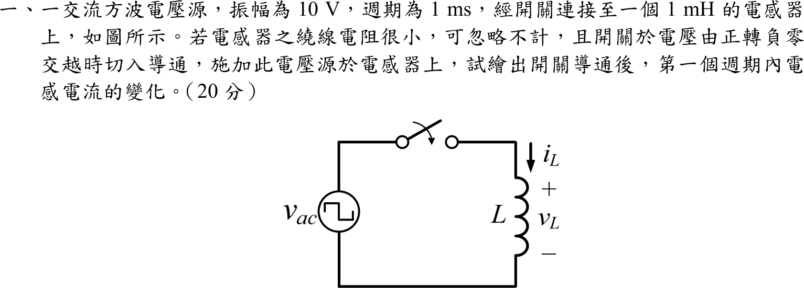
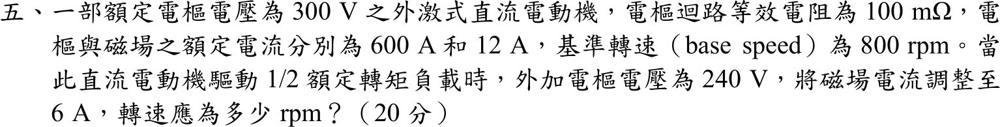

# 105 年電機工程技師｜電機機械逐題詳解

> 本頁由題級 canonical 筆記組合；每題保留官方裁切圖、校驗狀態與可追溯的推導。

## 題目導覽
- [[#一、105 年電機機械第 1 題|第 1 題：105 年電機機械第 1 題]]
- [[#二、105 年電機機械第 2 題|第 2 題：105 年電機機械第 2 題]]
- [[#三、105 年電機機械第 3 題|第 3 題：105 年電機機械第 3 題]]
- [[#四、105 年電機機械第 4 題|第 4 題：105 年電機機械第 4 題]]
- [[#五、105 年電機機械第 5 題（條件式校驗）|第 5 題：105 年電機機械第 5 題（條件式校驗）]]

---

## 一、105 年電機機械第 1 題

> 題級識別：EE-105-04-1
> canonical 來源：[[canonical/EE-105-04-1.md]]
> 題級校驗狀態：verified



### 已知與所求

方波電壓源振幅 \(\pm10\ \mathrm V\)、\(T=1\ \mathrm{ms}\)，接電感 \(L=1\ \mathrm{mH}\)（電阻忽略），開關於電壓由正轉負的零交越切入。繪出導通後第一個週期的 \(i_L(t)\)。

### 考場標準作答

開關於電壓由正轉負的零交越（\(t=0\)）閉合，故 \(i_L(0)=0\)，且 \(0<t<0.5\ \mathrm{ms}\) 電壓為 \(-10\ \mathrm V\)、\(0.5<t<1\ \mathrm{ms}\) 為 \(+10\ \mathrm V\)。電感 \(v_L=L\,di_L/dt\)，斜率 \(\left|\dfrac{di_L}{dt}\right|=\dfrac{10}{10^{-3}}=10^{4}\ \mathrm{A/s}\)：

\[
i_L(t)=\begin{cases}
-10^{4}\,t, & 0\le t\le 0.5\ \mathrm{ms}\\[2pt]
-5+10^{4}\,(t-0.5\times10^{-3}), & 0.5\ \mathrm{ms}\le t\le 1\ \mathrm{ms}
\end{cases}
\]

\[
\boxed{i_L:\ 0\ \mathrm A\ \xrightarrow{\text{直線下降}}\ -5\ \mathrm A\ (t=0.5\ \mathrm{ms})\ \xrightarrow{\text{直線上升}}\ 0\ \mathrm A\ (t=1\ \mathrm{ms})}
\]

波形為三角波，平均值為 \(-2.5\ \mathrm A\)（理想電感無電阻，此直流偏移不衰減）：

```
 i_L (A)
  0 +*-----------+-----------*-> t (ms)
    |  \                   /
    |      \           /
 -5 +          *
    0         0.5          1
 (頂點 * 與 -5 同列，位於 t = 0.5 ms)
```

### 驗算

伏秒平衡：每半週期 \(\int v\,dt=\pm10(0.5\ \mathrm{ms})=\pm5\ \mathrm{mV\cdot s}\)，除以 \(L\) 得 \(\Delta i=\pm5\ \mathrm A\)；整週期 \(\Delta i=0\)，故 \(t=1\ \mathrm{ms}\) 回到 \(0\)。

### 失分點

- 零交越為「正轉負」，第一段電壓為 \(-10\ \mathrm V\)，電流先往負方向；畫成先上升即符號錯。
- 電流是三角波（電壓積分），不是方波，也不是正弦。

---

## 二、105 年電機機械第 2 題

> 題級識別：EE-105-04-2
> canonical 來源：[[canonical/EE-105-04-2.md]]
> 題級校驗狀態：verified


### 考場標準作答

匝數比 \(a=240/120=2\)。高壓側（240 V 繞組）接 110 V：
\[
\boxed{V_{L}=\frac{110}{2}=55\ \mathrm V}
\]
繞組容量受額定電流（溫升）限制，額定電流 \(I_H=\dfrac{12000}{240}=50\ \mathrm A\)、\(I_L=\dfrac{12000}{120}=100\ \mathrm A\) 不變：
\[
\boxed{S_{\max}=110(50)=55(100)=5500\ \mathrm{VA}=5.5\ \mathrm{kVA}}
\]
（電壓降為 \(110/240=45.8\%\)，容量按比例降為額定的 \(45.8\%\)。）

### 驗算

磁通 \(\propto V/f\)：\(110/240=55/120=0.4583\)，兩側一致且未飽和（\(f\) 仍 60 Hz）。\(5.5/12=0.4583\)，與電壓比相同。

### 失分點

- 容量不可仍答 12 kVA；電壓降低但電流上限不變，\(S=VI\) 隨電壓降低。
- 高壓側是 240 V 繞組，輸出為降壓 55 V，不是升壓到 220 V。

---

## 三、105 年電機機械第 3 題

> 題級識別：EE-105-04-3
> canonical 來源：[[canonical/EE-105-04-3.md]]
> 題級校驗狀態：verified


### 已知與所求

三相繞線式轉子感應機，轉子外接電阻 \(R_{ext}\)（經滑環）。利用等效電路說明為何可同時提高起動轉矩並降低起動電流。（本題為論述題，無數值給定。）

### 考場標準作答

#### 等效電路與起動條件

將定子側以戴維寧等效（\(V_{th},R_{th},X_{th}\)），轉子折算至定子側，\(R_2'\) 為轉子電阻折算值、\(R_{ext}'\) 為外接電阻折算值，\(X=X_{th}+X_2'\)。起動時 \(s=1\)，轉子支路為 \(R_{th}+R_2'+R_{ext}'+jX\)。令 \(r=R_2'+R_{ext}'\)：
\[
I_{2,st}'=\frac{V_{th}}{\sqrt{(R_{th}+r)^2+X^2}},\qquad
T_{st}=\frac{3}{\omega_s}\,\frac{V_{th}^2\,r}{(R_{th}+r)^2+X^2}
\]

#### （一）降低起動電流

\(r\) 增加使分母 \((R_{th}+r)^2+X^2\) 增大，\(I_2'\)（亦即定子起動電流）單調減小。

#### （二）提高起動轉矩

\(T_{st}\) 對 \(r\) 微分：
\[
\frac{dT_{st}}{dr}\propto (R_{th}+r)^2+X^2-2r(R_{th}+r)=X^2+R_{th}^2-r^2
\]
當 \(r<\sqrt{R_{th}^2+X^2}\) 時 \(dT_{st}/dr>0\)，加 \(R_{ext}\) 使 \(T_{st}\) 上升；\(r=\sqrt{R_{th}^2+X^2}\) 時起動轉矩達最大值 \(T_{max}\)。此時最大轉矩滑差 \(s_{max}=r/\sqrt{R_{th}^2+X^2}=1\)，即最大轉矩點被移到 \(s=1\)：
\[
\boxed{R_{ext}'=\sqrt{R_{th}^2+X^2}-R_2'\ \Rightarrow\ T_{st}=T_{max},\ \ I_{st}\ \text{下降}}
\]
\(r\) 再增加則 \(T_{st}\) 反而下降。\(T_{max}\) 的值與 \(r\) 無關，外接電阻只移動 \(s_{max}\)，不改變最大轉矩。起動後可將外接電阻切除以降低運轉銅損。

### 驗算

取示範值（非題目給定）\(R_{th}=0.3,\ X=1,\ R_2'=0.2\)，\(V_{th}=\omega_s=1\)：\(r=0.2\) 時 \(T_{st}=0.2/(0.5^2+1)=0.160\)、\(I=1/\sqrt{1.25}=0.894\)；\(r=\sqrt{0.09+1}=1.044\) 時 \(T_{st}=1.044/(1.344^2+1)=0.372\)、\(I=1/\sqrt{2.806}=0.597\)。轉矩上升、電流下降，與上式一致。

### 失分點

- 外接電阻只改變 \(s_{max}\)，\(T_{max}\) 不變；寫成「電阻愈大轉矩愈大」會漏掉 \(r>\sqrt{R_{th}^2+X^2}\) 時轉矩反降。
- 兩個效果須分別由 \(I\) 與 \(T\) 的式子說明：電流下降靠阻抗增加，轉矩上升靠 \(dT_{st}/dr>0\) 的條件 \(r<\sqrt{R_{th}^2+X^2}\)。

---

## 四、105 年電機機械第 4 題

> 題級識別：EE-105-04-4
> canonical 來源：[[canonical/EE-105-04-4.md]]
> 題級校驗狀態：verified


### 已知與所求

三相同步電動機原操作於功率因數 0.8 超前，欲以調整激磁電流（\(I_f\)）使功因為 1.0。以等效電路與相量圖說明。（論述題，無數值給定。）

### 考場標準作答

每相等效電路為內生電勢 \(\mathbf E_f\) 串同步電抗 \(jX_s\)（電樞電阻忽略），電動機慣例電流流入：
\[
\mathbf V_\phi=\mathbf E_f+jX_s\mathbf I_a\quad\Rightarrow\quad \mathbf E_f=\mathbf V_\phi-jX_s\mathbf I_a
\]
以 \(\mathbf V_\phi\) 為參考，\(\mathbf I_a=I_a(\cos\varphi+j\sin\varphi)\)（超前 \(\varphi=\cos^{-1}0.8=36.87^\circ\)）：
\[
\mathbf E_f=(V_\phi+X_sI_a\sin\varphi)-jX_sI_a\cos\varphi
\]
超前時 \(|\mathbf E_f|>V_\phi\)，為過激磁。\(I_f\) 與 \(|\mathbf E_f|\) 成正比（未飽和），而負載功率固定時 \(P\propto E_f\sin\delta\)（\(E_f\sin\delta\) 為常數，即 \(jX_s\mathbf I_a\) 的水平分量 \(X_sI_a\cos\varphi\) 為常數）。調整方式：

\[
\boxed{\text{減小 }I_f\ \Rightarrow\ |\mathbf E_f|\downarrow,\ \delta\uparrow,\ \mathbf I_a\ \text{由超前轉為與 }\mathbf V_\phi\text{ 同相（PF}=1\text{）}}
\]

相量圖（水平為 \(\mathbf V_\phi\)，\(\mathbf E_f\) 端點沿 \(E_f\sin\delta=\) 常數的水平線向 \(\mathbf V_\phi\) 方向移動）：

```
 超前 0.8 (過激磁)                 PF = 1.0 (減小 If 後)
 V ==============> (參考)         V ==============>
   \  -jXsIa                          \  -jXsIa (垂直向下)
    \  (含水平分量)                    \
     Ef (較長, δ 小)                    Ef (較短, δ 大)
```

\(I_f\) 繼續減小則 \(\mathbf I_a\) 轉為落後（欠激磁）；\(I_a\) 在 PF=1 時最小，即 V 形曲線最低點。

### 驗算

示範值（非題目給定）：\(V_\phi=1,\ X_s=1,\ P=0.8\ \mathrm{pu}\)。超前 0.8：\(I_a=1.0\angle36.87^\circ\)，\(\mathbf E_f=1-j(0.8+j0.6)=1.6-j0.8\)，\(|\mathbf E_f|=1.789\)；PF=1：\(I_a=0.8\)，\(\mathbf E_f=1-j0.8\)，\(|\mathbf E_f|=1.281\)。\(|\mathbf E_f|\) 下降、\(I_a\) 由 1.0 降為 0.8，且 \(E_f\sin\delta\) 同為 0.8，符合上述結論。

### 失分點

- 電動機與發電機的相量式符號相反：電動機 \(\mathbf E_f=\mathbf V-jX_s\mathbf I\)，若用 \(+\) 號會把超前判成欠激磁而得到「增加 \(I_f\)」。
- 調整時有功功率不變，須說明 \(E_f\sin\delta\) 為定值，\(\delta\) 隨 \(E_f\) 減小而增大，不可畫成 \(\delta\) 不變。

---

## 五、105 年電機機械第 5 題（條件式校驗）

> 題級識別：EE-105-04-5
> canonical 來源：[[canonical/EE-105-04-5.md]]
> 題級校驗狀態：needs_manual_review
> [!WARNING] 本題仍有官方資料缺口或事件定義歧義；請以 canonical 條件式解答為準。



### 已知與所求

外激式直流電動機：額定電樞電壓 \(V_{t1}=300\ \mathrm V\)、\(R_a=100\ \mathrm{m\Omega}=0.1\ \Omega\)、額定 \(I_{a1}=600\ \mathrm A\)、\(I_{f1}=12\ \mathrm A\)、基準轉速 \(n_1=800\ \mathrm{rpm}\)。負載為額定轉矩的 \(1/2\)，\(V_{t2}=240\ \mathrm V\)，\(I_{f2}=6\ \mathrm A\)。求轉速 \(n_2\)。題目未給磁化曲線，磁通比 \(r=\Phi_2/\Phi_1\) 為假設量。

### 考場標準作答

額定反電勢：\(E_{a1}=300-600(0.1)=240\ \mathrm V\)（對應 \(n_1=800\ \mathrm{rpm}\)）。

轉矩 \(T\propto\Phi I_a\)，半載：
\[
r\,I_{a2}=0.5\,I_{a1}\ \Rightarrow\ I_{a2}=\frac{300}{r}\ \mathrm{A},\qquad
E_{a2}=240-0.1\,I_{a2}=240-\frac{30}{r}\ \mathrm V
\]
\(E_a\propto\Phi n\)：\(\dfrac{E_{a2}}{E_{a1}}=r\dfrac{n_2}{n_1}\)，得
\[
n_2=800\,\frac{240-30/r}{240\,r}=\frac{800}{r}-\frac{100}{r^2}\ \mathrm{rpm}
\]
採線性未飽和（\(\Phi\propto I_f\)，\(r=6/12=0.5\)）：\(I_{a2}=600\ \mathrm A\)（未超過額定）、\(E_{a2}=180\ \mathrm V\)：
\[
\boxed{n_2=800\times\frac{180}{240}\times\frac{1}{0.5}=1200\ \mathrm{rpm}}
\]

### 驗算

\(P_{em}=E_{a2}I_{a2}=180(600)=108\ \mathrm{kW}\)，\(\omega=2\pi(1200)/60=125.66\ \mathrm{rad/s}\)，\(T_2=859.4\ \mathrm{N\cdot m}\)；額定 \(T_1=240(600)/(2\pi\cdot800/60)=1718.9\ \mathrm{N\cdot m}\)，\(T_2/T_1=0.5\)。

### 失分點

- 減磁後電樞電流不是「半載就減半」：磁通減半時 \(I_a\) 須為 600 A 才得半額定轉矩；若仍用 300 A 則 \(E_{a2}=210\ \mathrm V\)，轉速誤為 \(1400\ \mathrm{rpm}\)。
- 磁通比隨飽和而偏離 0.5 時結果改變，見下表。

### 條件與疑義

題幹未給磁化曲線也未註明未飽和，\(r\) 無法由 \(I_f=6\ \mathrm A\) 唯一決定；上式 \(r=0.5\) 為明示假設。

| \(r=\Phi_2/\Phi_1\) | \(I_{a2}\) (A) | \(E_{a2}\) (V) | \(n_2\) (rpm) |
|---:|---:|---:|---:|
| 0.45 | 666.667 | 173.333 | 1283.951 |
| 0.50 | 600.000 | 180.000 | 1200.000 |
| 0.55 | 545.455 | 185.455 | 1123.967 |
| 0.60 | 500.000 | 190.000 | 1055.556 |

每列皆滿足 \(rI_{a2}=300\ \mathrm A\) 與 \(E_{a2}=240-0.1I_{a2}\)。

---
