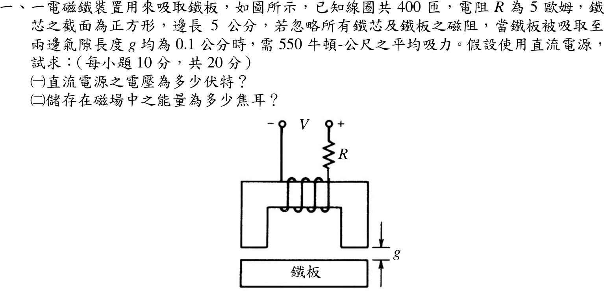
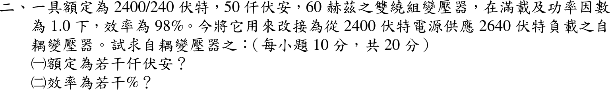
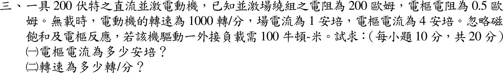
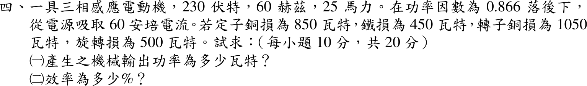
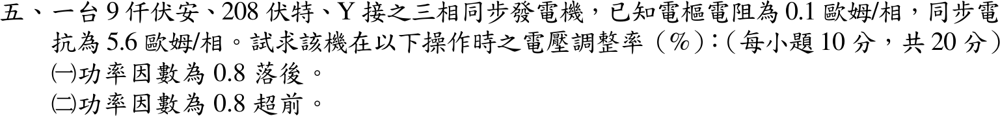

# 📝 106 年電機工程技師｜電機機械逐題詳解

> 本頁由題級 canonical 筆記組合；每題保留官方裁切圖、校驗狀態與可追溯的推導。

## 題目導覽
- [[#一、106 年電機機械第 1 題|第 1 題：106 年電機機械第 1 題]]
- [[#二、106 年電機機械第 2 題｜雙繞組變壓器改接自耦變壓器容量與效率|第 2 題：雙繞組變壓器改接自耦變壓器容量與效率]]
- [[#三、106 年電機機械第 3 題|第 3 題：106 年電機機械第 3 題]]
- [[#四、106 年電機機械第 4 題|第 4 題：106 年電機機械第 4 題]]
- [[#五、106 年電機機械第 5 題|第 5 題：106 年電機機械第 5 題]]

---

## 一、106 年電機機械第 1 題

> 題級識別：EE-106-04-1
> canonical 來源：[[canonical/EE-106-04-1.md]]
> 題級校驗狀態：verified

### 已知與所求

線圈 \(N=400\) 匝、\(R=5\ \Omega\)，鐵心截面為邊長 5 cm 的正方形（\(A=25\ \mathrm{cm^2}=2.5\times10^{-3}\ \mathrm{m^2}\)），兩邊氣隙均為 \(g=0.1\ \mathrm{cm}=10^{-3}\ \mathrm m\)，鐵心與鐵板磁阻忽略，鐵板吸到兩氣隙 0.1 cm 時需平均吸力 550（原題印「牛頓-公尺」，吸力單位應為 N，本解取 \(F=550\ \mathrm N\)）。直流電源，求（一）電源電壓；（二）磁場儲能。

### 考場標準作答

#### （一）電源電壓

兩氣隙各受 \(B^2A/(2\mu_0)\) 的吸力：
\[
F=2\cdot\frac{B^2A}{2\mu_0}=\frac{B^2A}{\mu_0}\ \Rightarrow\ B=\sqrt{\frac{F\mu_0}{A}}=\sqrt{\frac{550(4\pi\times10^{-7})}{2.5\times10^{-3}}}=0.5258\ \mathrm T
\]
鐵心磁阻忽略，安培定律只含兩氣隙：
\[
NI=\frac{B}{\mu_0}(2g)\ \Rightarrow\ I=\frac{0.5258(2\times10^{-3})}{4\pi\times10^{-7}(400)}=2.092\ \mathrm A
\]
直流穩態只有電阻壓降：
\[
\boxed{V=IR=2.092(5)=10.46\ \mathrm V}
\]

#### （二）磁場儲能

\[
W=2\cdot\frac{B^2}{2\mu_0}(Ag)=\frac{B^2A}{\mu_0}g=Fg
\]
\[
\boxed{W=550(10^{-3})=0.550\ \mathrm J}
\]

### 驗算

電感法：\(L=\dfrac{\mu_0N^2A}{2g}=0.2513\ \mathrm H\)，\(\tfrac12LI^2=\tfrac12(0.2513)(2.092)^2=0.550\ \mathrm J\)；吸力 \(F=\tfrac12I^2\left|\dfrac{dL}{dg}\right|=\dfrac{I^2L}{2g}=550\ \mathrm N\)，與題給吸力一致；磁鏈 \(LI=0.5258=NBA\) Wb·匝。

### 失分點

- 只算一個氣隙的吸力（\(F=B^2A/2\mu_0\)），\(B\) 變成 0.7436 T，電壓變成 14.8 V。
- 安培定律的磁路長是兩個氣隙，共 \(2g=2\times10^{-3}\ \mathrm m\)；只用 \(g\) 會讓電流與電壓少一半（5.23 V）。
- 儲能誤用 \(\tfrac12Fg=0.275\ \mathrm J\)；兩氣隙總場能等於 \(Fg\)。

---

## 二、106 年電機機械第 2 題｜雙繞組變壓器改接自耦變壓器容量與效率

> 題級識別：EE-106-04-2
> canonical 來源：[[canonical/EE-106-04-2.md]]
> 題級校驗狀態：verified

### 已知與所求

2400/240 V、50 kVA、60 Hz 雙繞組變壓器，滿載 PF 1.0 時效率 98%。改接為由 2400 V 電源供應 2640 V 負載的自耦變壓器。求自耦變壓器（一）額定 kVA；（二）效率。

### 考場標準作答

#### （一）額定容量

2640 = 2400 + 240：2400 V 繞組為公共繞組，240 V 繞組與其電壓相加作串聯繞組，負載跨兩者。串聯繞組額定電流
\[
I_{se}=\frac{50\,000}{240}=208.33\ \mathrm A=I_{out}
\]
\[
\boxed{S_{auto}=V_{out}I_{out}=2640(208.33)=550.0\text{ kVA}}
\]

#### （二）效率

雙繞組滿載損耗（輸出 50 kW，PF 1.0）：
\[
P_{loss}=\frac{50}{0.98}-50=1.0204\ \mathrm{kW}
\]
改接後各繞組電壓、電流仍為額定，損耗不變；自耦輸出 \(550\ \mathrm{kW}\)（PF 1.0）：
\[
\boxed{\eta_{auto}=\frac{550}{550+1.0204}=99.81\%}
\]

### 驗算

輸入電流 \(I_{in}=550\,000/2400=229.17\ \mathrm A\)，公共繞組電流 \(229.17-208.33=20.83\ \mathrm A=50\,000/2400\)，兩繞組都恰為額定；容量比 \(S_{auto}/S_{2w}=V_{out}/(V_{out}-V_{in})=2640/240=11\)，\(50\times11=550\ \mathrm{kVA}\)。

### 失分點

- 以 2400 V 繞組電流 20.83 A 乘 2640 V，得 55 kVA（限制電流是串聯 240 V 繞組的 208.33 A）。
- 把 98% 直接當成自耦效率；損耗不變、輸出變 11 倍，效率提高到 99.81%。
- 損耗用 \(50(1-0.98)=1.0\ \mathrm{kW}\)：98% 效率是輸出對輸入，損耗為 \(50/0.98-50\)。

---

## 三、106 年電機機械第 3 題

> 題級識別：EE-106-04-3
> canonical 來源：[[canonical/EE-106-04-3.md]]
> 題級校驗狀態：needs_manual_review
> [!WARNING] 本題仍有官方資料缺口或事件定義歧義；請以 canonical 條件式解答為準。

### 已知與所求

200 V 直流並激電動機，\(R_f=200\ \Omega\)、\(R_a=0.5\ \Omega\)；無載時轉速 1000 rpm、場電流 1 A、電樞電流 4 A；忽略磁飽和與電樞反應。驅動一外接負載需 100 N·m。求（一）電樞電流；（二）轉速。

### 考場標準作答

題目給的是外接軸負載轉矩，並另給無載電樞電流 4 A（代表無載時仍有旋轉損失）；損失模型未給，主解採「空載損失轉矩近似不變」，忽略旋轉損失（\(T_e=100\ \mathrm{N\cdot m}\)，\(I_a=52.89\ \mathrm A\)）等其他模型列於條件與疑義，彼此不可混用。

無載反電勢與磁通常數（\(I_f=200/200=1\ \mathrm A\)，磁通固定）：
\[
E_{a0}=200-4(0.5)=198\ \mathrm V,\qquad
\omega_0=\frac{2\pi(1000)}{60}=104.72\ \mathrm{rad/s},\qquad
K\Phi=\frac{198}{104.72}=1.8907607\ \mathrm{V\cdot s/rad}
\]
無載電磁轉矩 \(K\Phi(4)=7.563\ \mathrm{N\cdot m}\) 用來克服旋轉損失；損失轉矩不變時，電磁轉矩為外接負載加損失轉矩：

#### （一）電樞電流

\[
K\Phi I_a=100+K\Phi(4)\ \Rightarrow\
\boxed{I_a=4+\frac{100}{1.8907607}=56.89\ \mathrm A}
\]

#### （二）轉速

\[
E_a=200-56.89(0.5)=171.56\ \mathrm V,\qquad
\boxed{n=1000\frac{171.56}{198}=866.4\ \mathrm{rpm}}
\]

### 驗算

由轉矩–轉速直線 \(\omega=(V_t-R_aT_e/K\Phi)/K\Phi\) 回算：\(T_e=100+7.563=107.563\ \mathrm{N\cdot m}\) 給 \(n=866.44\ \mathrm{rpm}\)；\(T_e=100\ \mathrm{N\cdot m}\) 給 \(876.54\ \mathrm{rpm}\)。同一直線代 \(T_e=7.563\ \mathrm{N\cdot m}\) 得 1000 rpm，吻合無載點。

### 失分點

- 直接用 200 V 除以無載角速度求 \(K\Phi\)，漏掉無載電樞壓降 \(4(0.5)=2\ \mathrm V\)（正確 \(E_{a0}=198\ \mathrm V\)）。
- 求得 \(I_a\) 後仍用 198 V 算轉速，沒有重算負載反電勢。
- 把外接負載轉矩直接當電磁轉矩，卻又承認無載有 4 A 損失電流；要先寫明採用哪一種損失模型。

### 條件與疑義

題面只說忽略磁飽和與電樞反應，沒有說忽略旋轉損失，也沒有給損失轉矩隨轉速的關係；無載點只能固定該點的損失，不能單獨推出其在所有轉速的函數，因此沒有唯一數值解；與無載點相容的模型不只一種。

| 模型 | 電樞電流 | 轉速 |
| --- | --- | --- |
| 空載損失轉矩近似不變（主解） | 56.89 A | 866.4 rpm |
| 旋轉損失忽略（\(T_e=100\ \mathrm{N\cdot m}\)） | 52.89 A | 876.5 rpm |
| 旋轉損失功率 792 W 不變 | 57.51 A | 864.9 rpm |

---

## 四、106 年電機機械第 4 題

> 題級識別：EE-106-04-4
> canonical 來源：[[canonical/EE-106-04-4.md]]
> 題級校驗狀態：verified

### 已知與所求

三相感應電動機 230 V、60 Hz、25 hp；PF 0.866 落後時線電流 60 A。定子銅損 850 W、鐵損 450 W、轉子銅損 1050 W、旋轉損 500 W。求（一）機械輸出功率；（二）效率。

### 考場標準作答

#### （一）機械輸出功率

\[
P_{in}=\sqrt3V_LI_L\cos\theta=\sqrt3(230)(60)(0.866)=20\,699\ \mathrm W
\]
依序扣除：
\[
P_{ag}=P_{in}-850-450=19\,399\ \mathrm W,\quad
P_{conv}=P_{ag}-1050=18\,349\ \mathrm W
\]
\[
\boxed{P_{out}=P_{conv}-500=17\,849\ \mathrm W=\frac{17\,849}{746}=23.93\ \mathrm{hp}}
\]

#### （二）效率

\[
\boxed{\eta=\frac{P_{out}}{P_{in}}=\frac{17\,849}{20\,699}=86.23\%}
\]

### 驗算

總損耗法：\(850+450+1050+500=2850\ \mathrm W\)，\(P_{in}-2850=17\,849\ \mathrm W\)；\(\eta=1-2850/20\,699=86.23\%\)。滑差檢查：\(s=P_{cu2}/P_{ag}=1050/19\,399=5.41\%\)，\(P_{conv}=(1-s)P_{ag}=18\,349\ \mathrm W\)；輸出 23.93 hp 與銘牌 25 hp 同量級。

### 失分點

- 把 \(P_{conv}=18\,349\ \mathrm W\) 當輸出，沒有再扣旋轉損 500 W；它是電磁轉換功率，不是軸輸出。
- 輸入功率漏乘 \(\sqrt3\) 或用 \(\sin\theta\)（0.5）取代功因 0.866。
- 將 25 hp 銘牌（18.65 kW）當作實際輸出；本題實際負載 23.93 hp。

---

## 五、106 年電機機械第 5 題

> 題級識別：EE-106-04-5
> canonical 來源：[[canonical/EE-106-04-5.md]]
> 題級校驗狀態：verified

### 已知與所求

9 kVA、208 V、Y 接三相同步發電機，\(R_a=0.1\ \Omega\)/相、\(X_s=5.6\ \Omega\)/相。滿載、端電壓為額定值時，求（一）PF 0.8 落後；（二）PF 0.8 超前的電壓調整率。

### 考場標準作答

\[
V_\phi=\frac{208}{\sqrt3}=120.09\ \mathrm V,\qquad
I_a=\frac{9000}{\sqrt3(208)}=24.98\ \mathrm A,\qquad
Z_s=0.1+j5.6\ \Omega
\]
發電機方程 \(\underline E_f=\underline V_\phi+\underline I_aZ_s\)，\(VR=(|E_f|-V_\phi)/V_\phi\)。

#### （一）PF 0.8 落後

\(\underline I_a=24.98\angle-36.87^\circ=19.985-j14.989\ \mathrm A\)
\[
\underline E_f=120.09+(19.985-j14.989)(0.1+j5.6)=206.03+j110.42\ \mathrm V,\qquad |E_f|=233.75\ \mathrm V
\]
\[
\boxed{VR=\frac{233.75-120.09}{120.09}=94.65\%}
\]

#### （二）PF 0.8 超前

\(\underline I_a=24.98\angle+36.87^\circ=19.985+j14.989\ \mathrm A\)
\[
\underline E_f=120.09+(19.985+j14.989)(0.1+j5.6)=38.15+j113.42\ \mathrm V,\qquad |E_f|=119.660\ \mathrm V
\]
\[
\boxed{VR=\frac{119.660-120.09}{120.09}=-0.357\%}
\]

### 驗算

標么值法：\(Z_{base}=208^2/9000=4.807\ \Omega\)，\(z_s=0.0208+j1.1649\)。落後 \(E=1+(0.8-j0.6)z_s=1.7156+j0.9195\)，\(|E|=1.9465\)，\(VR=94.65\%\)；超前 \(E=1+(0.8+j0.6)z_s=0.3177+j0.9444\)，\(|E|=0.9964\)，\(VR=-0.357\%\)。

### 失分點

- 額定電流四捨五入成 25.0 A，會把超前 VR 算成 −0.31%（與 −0.357% 差約 14%）；電流宜保留 24.98 A。
- 超前功因的 \(\sin\theta\) 取負號：電流相角 \(+36.87^\circ\)，\(jX_sI_a\) 的實部變成 −83.9 V，抵銷了電壓壓降。
- 把 \(R_a\) 漏掉或電壓調整率分母用 \(E_f\)；分母是額定端電壓 \(V_\phi\)。

---
