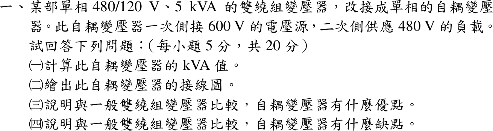
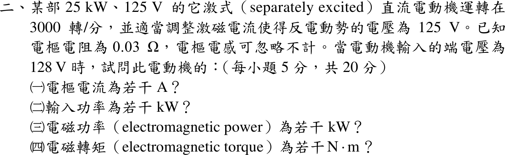
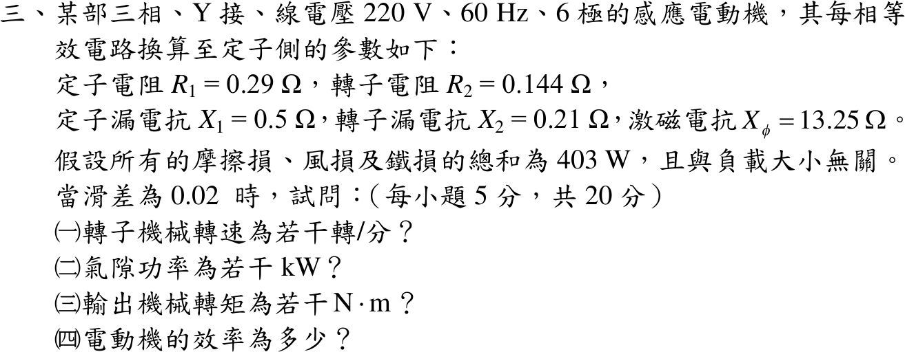
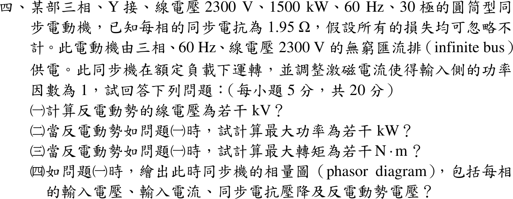
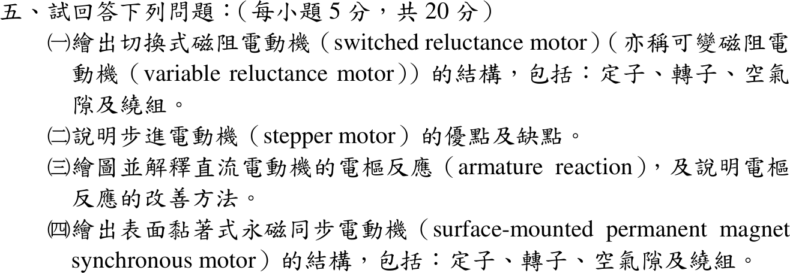

# 📝 108 年電機工程技師｜電機機械逐題詳解

> 本頁由題級 canonical 筆記組合；每題保留 QID、官方裁切、校驗狀態與完整得分型解答。

## 題目導覽
- [[#一、108 年電機機械第 1 題｜480/120 V 降壓自耦變壓器|第 1 題：480/120 V 降壓自耦變壓器]]
- [[#二、108 年電機機械第 2 題｜他激直流電動機功率平衡|第 2 題：他激直流電動機功率平衡]]
- [[#三、108 年電機機械第 3 題｜感應電動機工作點|第 3 題：感應電動機工作點]]
- [[#四、108 年電機機械第 4 題｜同步電動機功角與最大轉矩|第 4 題：同步電動機功角與最大轉矩]]
- [[#五、108 年電機機械第 5 題｜特殊電機與電樞反應|第 5 題：特殊電機與電樞反應]]

---

## 一、108 年電機機械第 1 題｜480/120 V 降壓自耦變壓器

> 題級識別：`EE-108-04-1`
> canonical 來源：`canonical/EE-108-04-1.md`
> 題級校驗狀態：`verified`

![[01_原始試題/依考科/04_電機機械/images/questions/PE_108年_電機機械_Q01.png]]

> 官方裁切來源：`01_原始試題/依考科/04_電機機械/images/questions/PE_108年_電機機械_Q01.png`



### 已知與所求

單相 480/120 V、5 kVA 雙繞組變壓器改接為自耦變壓器，一次側接 600 V 電源，二次側供 480 V 負載。求（一）自耦變壓器 kVA；（二）接線圖；（三）優點；（四）缺點。

### 考場標準作答

#### （一）額定容量

要由 480 V 與 120 V 兩繞組得到 600 V 輸入、480 V 輸出，只有一種接法：一次側接 $600\,\mathrm{V}$ 電源跨在「120 V 串聯繞組＋480 V 公共繞組」兩端（電壓相加），二次側負載跨在 480 V 公共繞組。

原繞組額定電流：
\[
I_{480}=\frac{5000}{480}=10.4167\ \mathrm A,\qquad I_{120}=\frac{5000}{120}=41.6667\ \mathrm A
\]
輸入電流流經串聯繞組，故 \(I_{in}=41.6667\ \mathrm A\)；負載電流與公共繞組電流為
\[
I_{out}=\frac{600}{480}I_{in}=52.0833\ \mathrm A,\qquad I_{c}=I_{out}-I_{in}=10.4167\ \mathrm A=I_{480}
\]
兩繞組同時達額定，故
\[
S_{auto}=600 I_{in}=480 I_{out}=25.0\,\mathrm{kVA}
\]
\[
\boxed{S_{auto}=25.0\ \mathrm{kVA}}
\]
其中感應（經磁路）容量 \(120(41.6667)=5.0\ \mathrm{kVA}\)，傳導（直接導通）容量
\[
S_{cond}=V_{load}I_{in}=480(41.6667)=20.0\,\mathrm{kVA}
\]

#### （二）接線圖

\[
\boxed{\text{120 V 串聯繞組與 480 V 公共繞組同極性串聯（電壓相加）；電源跨兩繞組，負載跨 480 V 繞組}}
\]

```text
  I_in →                    120 V 串聯繞組（· 在上）
 H1 o─────────────●┌───────┐
   600 V 電源       └───┬───┘
                        ├───────────o X1  ── I_out → ┐
                    ●┌───┴───┐                       │ 480 V
                     │ 480 V │ 公共繞組（· 在上）      │ 負載
                     └───┬───┘                       │
 H2 o────────────────────┴───────────o X2 ───────────┘
 （H2 與 X2 共用同一端；兩繞組 · 端同向，電壓相加：480 + 120 = 600 V）
```

#### （三）優點

\[
\boxed{\text{同樣鐵心與銅線可傳送 5 倍容量（25 kVA 對 5 kVA），體積、重量、成本小，損失小而效率高，電壓調整率較佳}}
\]
因為只有 20% 功率經磁路感應轉換，其餘 80% 直接導通。

#### （四）缺點

\[
\boxed{\text{一、二次側有電氣連接而無隔離，高壓側過電壓或故障可傳到負載側；短路阻抗小而短路電流大；變比愈大優勢愈小}}
\]

### 驗算

以容量比公式獨立檢查：\(S_{auto}=S_{2w}\dfrac{V_H}{V_H-V_L}=5\cdot\dfrac{600}{120}=25.0\ \mathrm{kVA}\)；公共繞組電壓 480 V、串聯繞組電壓 \(600-480=120\) V，與原繞組額定電壓一致，電流 41.67 A 與 10.42 A 均恰為額定值，沒有繞組過載。

### 失分點

- 把 480 V 與 120 V 做成相減（480−120）或把負載接在 600 V 端：此題 600 V 是 480＋120 的相加串聯。
- 直接用 5 kVA 當自耦容量，漏掉傳導部分；或用 480 V 繞組電流 10.42 A 乘 600 V，得 6.25 kVA（受限繞組是 120 V 串聯繞組）。
- 優缺點只寫「效率高」「不安全」而沒有指出本題 5 倍容量與無隔離、短路電流大的具體理由。


---

## 二、108 年電機機械第 2 題｜他激直流電動機功率平衡

> 題級識別：`EE-108-04-2`
> canonical 來源：`canonical/EE-108-04-2.md`
> 題級校驗狀態：`verified`

![[01_原始試題/依考科/04_電機機械/images/questions/PE_108年_電機機械_Q02.png]]

> 官方裁切來源：`01_原始試題/依考科/04_電機機械/images/questions/PE_108年_電機機械_Q02.png`



### 已知與所求

他激式直流電動機 25 kW、125 V，運轉在 3000 rpm 且反電勢 \(E_a=125\ \mathrm V\)；\(R_a=0.03\ \Omega\)，電樞電感忽略。端電壓 \(V_t=128\ \mathrm V\) 時求（一）電樞電流；（二）輸入功率；（三）電磁功率；（四）電磁轉矩。

### 考場標準作答

#### （一）電樞電流

電動機 KVL：\(V_t=E_a+I_aR_a\)
\[
\boxed{I_a=\frac{V_t-E_a}{R_a}=\frac{128-125}{0.03}=100\,\mathrm A}
\]

#### （二）輸入功率

以電樞端輸入計（激磁電源功率題目未給）：
\[
\boxed{P_{in}=V_tI_a=128(100)=12.8\ \mathrm{kW}}
\]

#### （三）電磁功率

\[
\boxed{P_{em}=E_aI_a=125(100)=12.5\,\mathrm{kW}}
\]

#### （四）電磁轉矩

\[
\omega_m=\frac{2\pi(3000)}{60}=314.159\ \mathrm{rad/s},\qquad
\boxed{T_{em}=\frac{P_{em}}{\omega_m}=\frac{12500}{314.159}=39.79\,\mathrm{N\cdot m}}
\]

### 驗算

功率平衡：\(V_tI_a-I_a^2R_a=12.8-0.3=12.5\ \mathrm{kW}=E_aI_a\)。轉矩常數法：\(K_\phi=E_a/\omega_m=0.3979\ \mathrm{V\cdot s/rad}\)，\(T_{em}=K_\phi I_a=39.79\ \mathrm{N\cdot m}\)。

### 失分點

- 套用發電機式 \(E_a=V_t+I_aR_a\)，得 \(I_a=-100\) 或符號錯誤。
- 以 3000 rpm 直接代入 \(T=P/\omega\)，漏 \(2\pi/60\)。
- 把 12.8 kW 當電磁功率，忘記扣電樞銅損 0.3 kW。


---

## 三、108 年電機機械第 3 題｜感應電動機工作點

> 題級識別：`EE-108-04-3`
> canonical 來源：`canonical/EE-108-04-3.md`
> 題級校驗狀態：`verified`

![[01_原始試題/依考科/04_電機機械/images/questions/PE_108年_電機機械_Q03.png]]

> 官方裁切來源：`01_原始試題/依考科/04_電機機械/images/questions/PE_108年_電機機械_Q03.png`



### 已知與所求

三相 Y 接、線電壓 220 V、60 Hz、6 極感應電動機，每相（折算至定子側）\(R_1=0.29\ \Omega\)、\(R_2=0.144\ \Omega\)、\(X_1=0.5\ \Omega\)、\(X_2=0.21\ \Omega\)、\(X_\phi=13.25\ \Omega\)；摩擦、風損與鐵損合計 403 W 且與負載無關。\(s=0.02\) 時求（一）轉子機械轉速；（二）氣隙功率；（三）輸出機械轉矩；（四）效率。

### 考場標準作答

#### （一）轉速

\[
n_s=\frac{120(60)}{6}=1200\ \mathrm{rpm},\qquad
\boxed{n_m=(1-0.02)(1200)=1176\ \mathrm{rpm}}
\]

#### （二）氣隙功率

\(V_\phi=220/\sqrt3=127.017\ \mathrm V\)。轉子支路與激磁支路並聯（激磁支路在 \(R_1+jX_1\) 之後，精確等效電路）：
\[
Z_2=\frac{0.144}{0.02}+j0.21=7.2+j0.21\ \Omega,\qquad
Z_p=Z_2\parallel j13.25=5.4248+j3.1086\ \Omega
\]
\[
Z_{in}=0.29+j0.5+Z_p=5.7148+j3.6086\ \Omega,\qquad |I_1|=\frac{127.017}{|Z_{in}|}=18.793\ \mathrm A
\]
電流分流到轉子支路：\(|I_2'|=|I_1|\dfrac{13.25}{|7.2+j13.46|}=16.3125\ \mathrm A\)，
\[
\boxed{P_{ag}=3|I_2'|^2\frac{R_2'}s=5747.72\,\mathrm W=5.748\ \mathrm{kW}}
\]

#### （三）輸出機械轉矩

\[
P_{dev}=(1-s)P_{ag}=0.98(5747.72)=5632.8\ \mathrm W,\qquad
P_{out}=5632.8-403=5229.8\ \mathrm W
\]
\[
\omega_m=\frac{2\pi(1176)}{60}=123.15\ \mathrm{rad/s},\qquad
\boxed{T_{out}=\frac{5229.8}{123.15}=42.47\,\mathrm{N\cdot m}}
\]

#### （四）效率

403 W（含鐵損）已自 \(P_{dev}\) 扣除，故 \(P_{in}\) 直接取自電路（激磁支路只有 \(X_\phi\)）：\(P_{in}=3\,\mathrm{Re}(V_\phi I_1^*)=6054.98\ \mathrm W\)，
\[
\boxed{\eta=\frac{P_{out}}{P_{in}}=\frac{5229.8}{6054.98}=0.8637=86.37\%}
\]

### 驗算

戴維寧法：\(V_{th}=V_\phi\dfrac{jX_\phi}{R_1+j(X_1+X_\phi)}\)、\(Z_{th}=(R_1+jX_1)\parallel jX_\phi\)，\(I_2'=V_{th}/(Z_{th}+Z_2)\) 同樣得 \(P_{ag}=5747.72\ \mathrm W\)。損耗相加：\(P_{out}+3I_1^2R_1+3I_2'^2R_2+403=5229.8+307.3+115.0+403=6055.1\ \mathrm W\approx P_{in}\)（四捨五入差 < 0.2 W）。

### 失分點

- Y 接把線電壓 220 V 當相電壓，電流與功率差 3 倍。
- 氣隙功率漏用 \(R_2'/s=7.2\ \Omega\)（誤用 0.144 Ω）；或把 \(P_{ag}\) 當軸輸出，未乘 \(1-s\) 再扣 403 W。
- 轉矩用 1200 rpm 同步角速度：\(P_{out}/\omega_s=41.62\ \mathrm{N\cdot m}\)，軸轉矩須用 1176 rpm。


---

## 四、108 年電機機械第 4 題｜同步電動機功角與最大轉矩

> 題級識別：`EE-108-04-4`
> canonical 來源：`canonical/EE-108-04-4.md`
> 題級校驗狀態：`verified`

![[01_原始試題/依考科/04_電機機械/images/questions/PE_108年_電機機械_Q04.png]]

> 官方裁切來源：`01_原始試題/依考科/04_電機機械/images/questions/PE_108年_電機機械_Q04.png`



### 已知與所求

三相 Y 接、2300 V、1500 kW、60 Hz、30 極圓筒型同步電動機，\(X_s=1.95\ \Omega\)/相，損失全忽略，接 2300 V 無窮匯流排，額定負載、功因 1。求（一）反電勢線電壓；（二）此反電勢下最大功率；（三）最大轉矩；（四）相量圖。

### 考場標準作答

#### （一）反電勢

\[
V_\phi=\frac{2300}{\sqrt3}=1327.91\ \mathrm V,\qquad
I_a=\frac{1.5\times10^6}{\sqrt3(2300)}=376.53\ \mathrm A,\ \text{與 }V_\phi\text{ 同相}
\]
電動機方程（電流流入）：
\[
\underline E_f=\underline V_\phi-jX_s\underline I_a=1327.91-j(1.95)(376.53)=1327.91-j734.24\ \mathrm V
\]
\[
|E_f|=1517.38\ \mathrm{V/相},\qquad \delta=-\tan^{-1}\frac{734.24}{1327.91}=-28.94^\circ,\qquad
\boxed{E_{LL}=\sqrt3|E_f|=2628.18\,\mathrm V=2.628\ \mathrm{kV}}
\]

#### （二）最大功率

\(P=\dfrac{3V_\phi E_f}{X_s}\sin|\delta|\)，在 \(|\delta|=90^\circ\)：
\[
\boxed{P_{max}=\frac{3(1327.91)(1517.38)}{1.95}=3.0999\,\mathrm{MW}=3099.9\ \mathrm{kW}}
\]

#### （三）最大轉矩

\[
n_s=\frac{120(60)}{30}=240\ \mathrm{rpm},\qquad \omega_s=25.133\ \mathrm{rad/s},\qquad
\boxed{T_{max}=\frac{P_{max}}{\omega_s}=\frac{3.0999\times10^6}{25.133}=1.2334\times10^5\ \mathrm{N\cdot m}}
\]

#### （四）相量圖

\[
\boxed{V_\phi=1327.9\angle0^\circ\ \mathrm V,\quad I_a=376.5\angle0^\circ\ \mathrm A,\quad jX_sI_a=734.2\angle90^\circ\ \mathrm V,\quad E_f=1517.4\angle-28.94^\circ\ \mathrm V}
\]

```text
  O ───────────────────────────→ V_φ = 1327.9∠0°（I_a = 376.5∠0° 與 V_φ 同方向）
   ╲                            ↑
    ╲ E_f = 1517.4∠−28.94°      │ jX_sI_a = 734.2∠90°
     ╲                          │
      ╲_________________________│   （E_f 端點加 jX_sI_a 等於 V_φ 端點）
```

### 驗算

額定點功率：\(\sqrt3(2300)(376.53)=1500\ \mathrm{kW}\)，且 \(\dfrac{3V_\phi E_f}{X_s}\sin28.94^\circ=1500\ \mathrm{kW}\)，與功率角特性一致。幾何關係：\(1517.38^2=1327.91^2+734.24^2\)。對 \(\delta\) 由 0° 到 180° 掃描功率角曲線，最大值確實在 90°。

### 失分點

- 把 2300 V 當作每相電壓（漏除 \(\sqrt3\)），\(I_a\) 與 \(E_f\) 都會錯。
- 用發電機方程 \(\underline E_f=\underline V+jX_s\underline I\)：功因 1 時 \(|E_f|\) 雖相同，但得 \(\delta=+28.94^\circ\)，相量圖的 \(E_f\) 方向畫反。
- 以 30 極算同步轉速誤成 3600 rpm 或用 \(377\ \mathrm{rad/s}\) 算機械轉矩。


---

## 五、108 年電機機械第 5 題｜特殊電機與電樞反應

> 題級識別：`EE-108-04-5`
> canonical 來源：`canonical/EE-108-04-5.md`
> 題級校驗狀態：`verified`

![[01_原始試題/依考科/04_電機機械/images/questions/PE_108年_電機機械_Q05.png]]

> 官方裁切來源：`01_原始試題/依考科/04_電機機械/images/questions/PE_108年_電機機械_Q05.png`



### 已知與所求

（一）畫出切換式磁阻電動機（SRM）結構（定子、轉子、氣隙、繞組）；（二）說明步進電動機優缺點；（三）繪圖解釋直流電動機電樞反應與改善方法；（四）畫出表面黏著式永磁同步電動機（SPMSM）結構。

### 考場標準作答

#### （一）SRM 結構

\[
\boxed{\text{定子與轉子皆為凸極疊片鐵心；只有定子極有集中線圈，轉子無繞組、無永磁體；兩者間為窄氣隙}}
\]

```text
          定子極（集中線圈 ≈）
              ┌──┐
     ┌────────┘≈≈└────────┐
     │   氣隙 ┊      ┊ 氣隙│
     │      ┌─┴──────┴─┐   │
  ≈≈ ├──┐   │ 凸極轉子  │  ┌──┤ ≈≈     相繞組對向極串聯為一相，
     │  │   │ （無繞組）│  │  │         依轉子位置輪流激磁
     └──┘   └─┬──────┬─┘  └──┘
              ┌──┐
```
激磁相使磁阻降低、電感 \(L(\theta)\) 上升，轉矩 \(T_e=\tfrac12i^2\,dL/d\theta\)，須在 \(dL/d\theta>0\) 區間通電。

#### （二）步進電動機

\[
\boxed{\text{優點：脈波數定位置、頻率定速度，開迴路即可定位，低速及停止時保持轉矩大，結構簡單；缺點：高速轉矩下降、易共振與失步，超載時控制器不知實際位置，噪音與振動較大}}
\]

#### （三）電樞反應

電樞電流產生的磁勢（交軸）與主磁極磁通垂直，使極面下一側磁通增強、另一側減弱，造成磁通畸變、磁中性面偏移；飽和時總磁通下降（去磁），換向不良而火花增加。

```text
   N 極                      S 極
 ┌───────┐   主磁通 Φf →   ┌───────┐
 │ 增強 │ 弱 │ ←電樞磁勢 Fa（交軸）│ 弱 │ 增強 │
 └───────┘                 └───────┘
 合成磁中性面由幾何中性面偏移（電動機逆旋轉方向偏移）
```
\[
\boxed{\text{改善：加換向極（接電樞串聯，位於幾何中性軸）、極面補償繞組（與電樞串聯反向）、適當移動電刷位置}}
\]

#### （四）SPMSM 結構

\[
\boxed{\text{定子為疊片鐵心加三相分布繞組；轉子表面黏貼永磁體（N、S 相間），氣隙均勻；無轉子繞組、電刷與滑環}}
\]

```text
   定子鐵心＋三相槽繞組 ≈≈≈≈≈≈≈≈≈≈
   ───────── 均勻氣隙 ─────────
   轉子鐵心表面：[N][S][N][S] 永磁體
```
\(L_d\approx L_q\)，轉矩主要由磁鐵磁通產生：\(T_e=\tfrac32p\,\psi_fi_q\)。

### 驗算

SRM：對 \(W'=\tfrac12L(\theta)i^2\) 取 \(\partial/\partial\theta\) 得 \(T_e=\tfrac12i^2\,dL/d\theta\)，符號隨 \(dL/d\theta\) 改變，負斜率區通電會產生制動轉矩。SPMSM：一般式 \(T_e=\tfrac32p[\psi_fi_q+(L_d-L_q)i_di_q]\) 令 \(L_d=L_q\)，磁阻項消失，只剩永磁轉矩，與表面黏著式結構（氣隙均勻）一致。

### 失分點

- SRM 轉子畫成有繞組或永磁體，會變成其他電機。
- 說步進電動機「不會失步」：開迴路只是不需回授，超過保持或牽入轉矩仍會失步。
- 電樞反應只寫「磁通減弱」，漏掉畸變、中性面偏移與換向火花，也沒指出換向極與補償繞組各自針對的位置。
