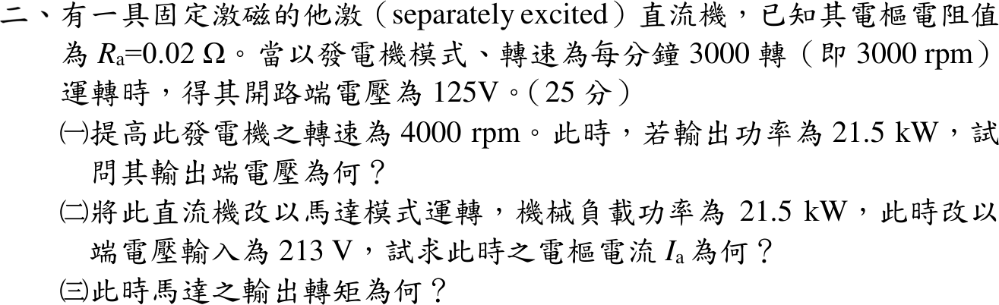
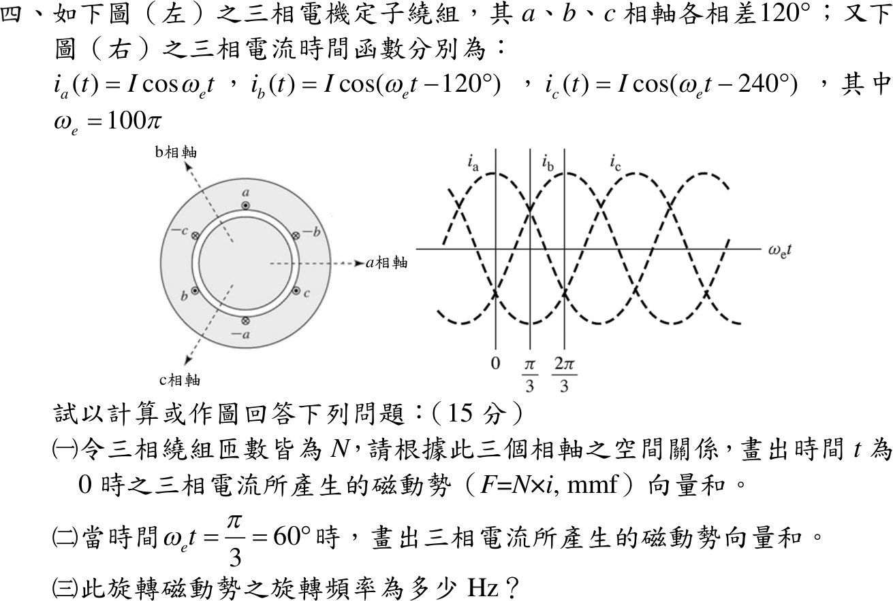
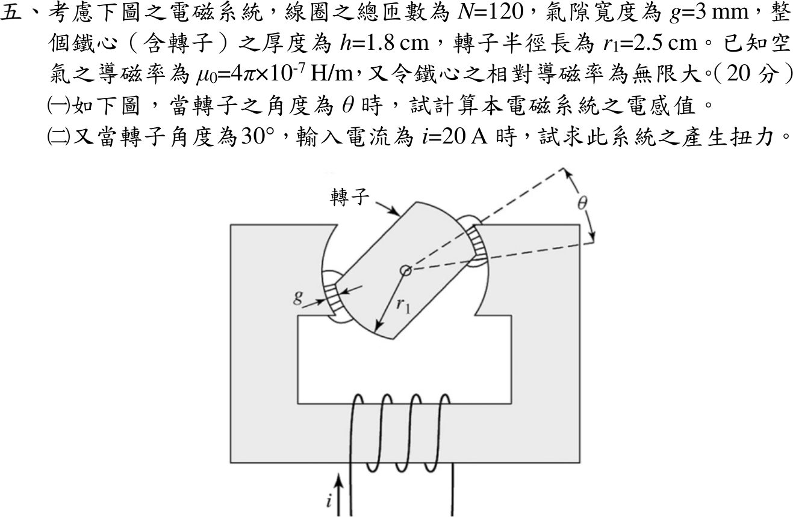

# 109 年電機工程技師｜電機機械逐題詳解

> 本頁由題級 canonical 筆記組合；每題保留官方裁切圖、校驗狀態與可追溯的推導。

## 題目導覽
- [[#一、109 年電機機械第 1 題｜磁化電流與漏磁電抗|第 1 題：磁化電流與漏磁電抗]]
- [[#二、109 年電機機械第 2 題｜他激直流機雙模式|第 2 題：他激直流機雙模式]]
- [[#三、109 年電機機械第 3 題｜滑差與感應轉矩|第 3 題：滑差與感應轉矩]]
- [[#四、109 年電機機械第 4 題｜旋轉磁動勢空間向量|第 4 題：旋轉磁動勢空間向量]]
- [[#五、109 年電機機械第 5 題｜可變磁阻電感與電磁扭力|第 5 題：可變磁阻電感與電磁扭力]]

---

## 一、109 年電機機械第 1 題｜磁化電流與漏磁電抗

> 題級識別：EE-109-04-1
> canonical 來源：[[canonical/EE-109-04-1.md]]
> 題級校驗狀態：verified


### 已知與所求

50 kVA、2400:240 V、60 Hz 雙繞組變壓器，\(N_P=1000\)、\(N_S=100\)；鐵心導磁係數趨近無限大，繞組電阻為 0，額定時鐵損 500 W；漏磁路徑磁阻 \(\mathcal R_P=4\times10^8\)、\(\mathcal R_S=5\times10^6\ \mathrm{A\cdot t/Wb}\)。求（一）參考一次側的激磁電流 \(I_\phi\)；（二）一次側漏磁電抗 \(X_P\)。

### 考場標準作答

#### （一）激磁電流

\(\mu\to\infty\) 使主磁路磁阻 \(\mathcal R_M\to0\)，\(X_M=\omega N_P^2/\mathcal R_M\to\infty\)，磁化分量 \(I_M=0\)；只剩鐵損分量：
\[
R_C=\frac{V_P^2}{P_{core}}=\frac{2400^2}{500}=11\,520\ \Omega,\qquad
I_\phi=I_C=\frac{2400}{11\,520}
\]
\[
\boxed{I_\phi=0.2083\ \mathrm A\ (\text{與 }V_P\text{ 同相})}
\]

#### （二）一次側漏磁電抗

\[
L_P=\frac{N_P^2}{\mathcal R_P}=\frac{1000^2}{4\times10^8}=2.5\ \mathrm{mH},\qquad
\boxed{X_P=\omega L_P=2\pi(60)(2.5\times10^{-3})=0.9425\ \Omega}
\]

### 驗算

功率回代：\(V_PI_\phi=2400(0.2083)=500\ \mathrm W\)，等於鐵損。二次側漏抗另算：\(X_S=377(100^2/5\times10^6)=0.754\ \Omega\)，折算一次側 \(a^2X_S=100(0.754)=75.4\ \Omega=\omega N_P^2/\mathcal R_S\)，與以一次匝數直接計算一致，可確認 \(L=N^2/\mathcal R\) 的匝數用法。

### 失分點

- 以為 \(\mu\to\infty\) 時激磁電流為 0；磁化分量為 0，但鐵損分量 0.2083 A 仍在。
- 用二次電壓 240 V 算 \(R_C\)，得 2.083 A（那是參考二次側的值）。
- 漏感寫成 \(N_P/\mathcal R_P\) 漏掉平方，或把 \(\mathcal R_S\) 配 \(N_P\) 當成一次側漏抗。

---

## 二、109 年電機機械第 2 題｜他激直流機雙模式

> 題級識別：EE-109-04-2
> canonical 來源：[[canonical/EE-109-04-2.md]]
> 題級校驗狀態：verified



### 已知與所求

固定激磁他激直流機，\(R_a=0.02\ \Omega\)；發電機 3000 rpm 開路電壓 125 V（25 分）。求（一）4000 rpm、輸出 21.5 kW 時的端電壓；（二）改作馬達、機械負載 21.5 kW、端電壓 213 V 時的 \(I_a\)；（三）此時輸出轉矩。忽略 \(R_a\) 以外的損失。

### 考場標準作答

#### （一）發電機 4000 rpm

磁通固定，\(E_a\propto n\)：\(E_a=125(4000/3000)=166.667\ \mathrm V\)。\(P_{out}=V_tI_a=(E_a-R_aI_a)I_a\)：
\[
0.02I_a^2-166.667I_a+21\,500=0\Rightarrow I_a=131.061\text{ A}\ (\text{另一根 }8202.27\text{ A})
\]
大根使 \(I_a^2R_a=1.35\ \mathrm{MW}\)、端電壓只剩 2.6 V，不是正常工作點，取小根：
\[
\boxed{V_t=\frac{21\,500}{131.061}=164.05\ \mathrm V}
\]

#### （二）馬達電樞電流

\(P_{conv}=E_aI_a=(213-0.02I_a)I_a=21\,500\)：
\[
0.02I_a^2-213I_a+21\,500=0\Rightarrow
\boxed{I_a=101.914\text{ A}}
\]
（大根 10 548 A 同理捨去。）

#### （三）輸出轉矩

\(E_a=213-0.02(101.914)=210.96\ \mathrm V\)，\(n=3000(210.96/125)=5063.1\ \mathrm{rpm}\)，\(\omega_m=530.21\ \mathrm{rad/s}\)：
\[
\boxed{T=\frac{21\,500}{530.21}=40.55\ \mathrm{N\cdot m}}
\]

### 驗算

轉矩常數法：\(K\phi=125/(3000\cdot2\pi/60)=0.39789\ \mathrm{V\cdot s}\)，\(T=K\phi I_a=0.39789(101.914)=40.55\ \mathrm{N\cdot m}\)，與功率法一致。（一）KVL：\(164.05+131.061(0.02)=166.67\ \mathrm V=E_a\)。

### 失分點

- 4000 rpm 仍用 125 V 當 \(E_a\)；他激固定磁通時 \(E_a\) 與轉速成正比。
- 發電機式寫成 \(V_t=E_a+I_aR_a\)，或馬達式寫成 \(V_t=E_a-I_aR_a\)，方向顛倒。
- （三）用輸入功率 \(213\times101.914\) 除以 \(\omega_m\)；題目的 21.5 kW 已是機械功率。

---

## 三、109 年電機機械第 3 題｜滑差與感應轉矩

> 題級識別：EE-109-04-3
> canonical 來源：[[canonical/EE-109-04-3.md]]
> 題級校驗狀態：verified


### 已知與所求

三相 Y 接、220 V、60 Hz、7.5 kW、六極感應馬達，\(R_1=0.3\)、\(X_1=0.5\)、\(R_2=0.2\)、\(X_2=0.4\ \Omega\)，不計鐵心效應（無激磁支路）。求（一）起動轉矩；（二）1188 rpm 穩態時的負載轉矩。

### 考場標準作答

\(V_\phi=220/\sqrt3=127.02\ \mathrm V\)，\(n_s=1200\ \mathrm{rpm}\)，\(\omega_s=125.66\ \mathrm{rad/s}\)；無激磁支路時 \(I_1=I_2\)，
\[
T=\frac{3I_2^2R_2/s}{\omega_s},\qquad I_2=\frac{V_\phi}{\sqrt{(R_1+R_2/s)^2+(X_1+X_2)^2}}
\]

#### （一）起動轉矩（\(s=1\)）

\[
I_2=\frac{127.02}{\sqrt{0.5^2+0.9^2}}=\frac{127.02}{1.0296}=123.37\ \mathrm A,\qquad
\boxed{T_{st}=\frac{3(123.37)^2(0.2)}{125.66}=72.67\text{ N}\cdot\text{m}}
\]

#### （二）1188 rpm 負載轉矩

\(s=(1200-1188)/1200=0.01\)，\(R_2/s=20\ \Omega\)：
\[
I_2=\frac{127.02}{\sqrt{20.3^2+0.9^2}}=6.2509\ \mathrm A,\qquad
\boxed{T_L=\frac{3(6.2509)^2(20)}{125.66}=18.66\text{ N}\cdot\text{m}}
\]
穩態且無機械損失時，負載轉矩等於電磁轉矩。

### 驗算

機械功率法：\(P_{ag}=3(6.2509)^2(20)=2344.4\ \mathrm W\)，\(P_{conv}=(1-s)P_{ag}=2320.9\ \mathrm W\)，\(\omega_m=2\pi(1188)/60=124.41\ \mathrm{rad/s}\)，\(T=2320.9/124.41=18.66\ \mathrm{N\cdot m}\)，與氣隙功率法相同。量級：2.32 kW 低於 7.5 kW 額定，屬輕載。

### 失分點

- 轉矩除以轉子機械角速度 \(\omega_m\) 卻用 \(P_{ag}\)（或除以 \(\omega_s\) 卻用 \(P_{conv}\)），兩者混用。
- 用線電壓 220 V 當相電壓，轉矩多出 3 倍。
- 六極 60 Hz 同步轉速誤為 1800 rpm，使 \(s=0.34\)。

---

## 四、109 年電機機械第 4 題｜旋轉磁動勢空間向量

> 題級識別：EE-109-04-4
> canonical 來源：[[canonical/EE-109-04-4.md]]
> 題級校驗狀態：verified



### 已知與所求

定子 a、b、c 相軸分別在 \(0^\circ\)（向右）、\(120^\circ\)、\(240^\circ\)；\(i_a=I\cos\omega_et\)、\(i_b=I\cos(\omega_et-120^\circ)\)、\(i_c=I\cos(\omega_et-240^\circ)\)，\(\omega_e=100\pi\)；每相 \(N\) 匝，\(F=Ni\) 沿各相軸。求（一）\(t=0\) 的合成磁動勢；（二）\(\omega_et=60^\circ\) 的合成磁動勢；（三）旋轉頻率。

### 考場標準作答

#### （一）\(t=0\)

\(i_a=I\)、\(i_b=i_c=-I/2\)。負電流的磁動勢指向相軸反方向：
\[
\vec F=NI\angle0^\circ+\tfrac{NI}{2}\angle(120^\circ-180^\circ)+\tfrac{NI}{2}\angle(240^\circ-180^\circ)
=NI\angle0^\circ+\tfrac{NI}{2}\angle-60^\circ+\tfrac{NI}{2}\angle60^\circ
\]
\[
\boxed{\vec F(0)=1.5 N I \angle 0^\circ\ \text{（沿 a 相軸）}}
\]

```text
          ↗ 0.5NI (−c 方向，60°)
   O ────────────→ NI (a 軸)        合成 ═════════► 1.5NI ∠0°
          ↘ 0.5NI (−b 方向，−60°)
```

#### （二）\(\omega_et=60^\circ\)

\(i_a=I/2\)、\(i_b=I\cos(-60^\circ)=I/2\)、\(i_c=I\cos(-180^\circ)=-I\)：
\[
\vec F=\tfrac{NI}{2}\angle0^\circ+\tfrac{NI}{2}\angle120^\circ+NI\angle60^\circ
=NI(0.75+j1.299)
\]
\[
\boxed{\vec F(60^\circ)=1.5 N I \angle 60^\circ}
\]

```text
        0.5NI (b 軸,120°) ↖   ↗ NI (−c 方向, 60°)
                            O ──→ 0.5NI (a 軸, 0°)
        合成：1.5NI ∠60°（由 0° 逆時針轉到 60°）
```

#### （三）旋轉頻率

一般式 \(\vec F(t)=1.5NI\angle\omega_et\)，大小固定、角度隨 \(\omega_et\) 增加（a→b→c，逆時針）：
\[
\boxed{f=\frac{\omega_e}{2\pi}=\frac{100\pi}{2\pi}=50\text{ Hz}}
\]
即每秒 50 轉（圖為兩極繞組，3000 rpm）。

### 驗算

直角分量通式：\(F_x=N[i_a-\tfrac12(i_b+i_c)]=\tfrac32NI\cos\omega_et\)，\(F_y=\tfrac{\sqrt3}{2}N(i_b-i_c)=\tfrac32NI\sin\omega_et\)。代 \(\omega_et=0\)：\((1.5NI,0)\)；代 \(60^\circ\)：\((0.75NI,1.299NI)\)，\(\tan^{-1}(1.299/0.75)=60^\circ\)，兩點皆符合。

### 失分點

- 合成大小寫成 \(3NI\) 或 \(NI\)；三相平衡的合成磁動勢為單相峰值的 1.5 倍。
- 負電流仍畫在正相軸方向，導致 \(t=0\) 合成為 0 或方向錯。
- 旋轉頻率寫成 \(100\pi\ \mathrm{Hz}\) 或 \(100\ \mathrm{Hz}\)；\(\omega_e=2\pi f\)。

---

## 五、109 年電機機械第 5 題｜可變磁阻電感與電磁扭力

> 題級識別：EE-109-04-5
> canonical 來源：[[canonical/EE-109-04-5.md]]
> 題級校驗狀態：verified



### 已知與所求

線圈 \(N=120\)，氣隙 \(g=3\ \mathrm{mm}\)（轉子兩端各一），鐵心厚度 \(h=1.8\ \mathrm{cm}\)，轉子半徑 \(r_1=2.5\ \mathrm{cm}\)，\(\mu_0=4\pi\times10^{-7}\ \mathrm{H/m}\)，鐵心 \(\mu_r\to\infty\)；\(\theta\) 為轉子極面與定子極面的重疊角。求（一）\(L(\theta)\)；（二）\(\theta=30^\circ\)、\(i=20\ \mathrm A\) 的扭力。

### 考場標準作答

#### （一）電感

每個氣隙的有效面積為重疊弧長乘厚度 \(A=r_1\theta h\)；磁通經兩個氣隙串聯：
\[
\mathcal R(\theta)=\frac{2g}{\mu_0r_1h\theta},\qquad
L(\theta)=\frac{N^2}{\mathcal R}=\frac{\mu_0N^2r_1h}{2g}\theta
=\frac{4\pi\times10^{-7}(14\,400)(0.025)(0.018)}{0.006}\theta
\]
\[
\boxed{L(\theta)=1.3572 \times 10^{-3}\,\theta\ \mathrm H\quad(\theta\text{ 以 rad 計})}
\]

#### （二）扭力

線性磁路，共能 \(W'=\tfrac12L(\theta)i^2\)：
\[
T=\frac{\partial W'}{\partial\theta}=\frac12i^2\frac{dL}{d\theta}=\frac12(20)^2(1.3572\times10^{-3})
\]
\[
\boxed{T=0.2714\text{ N}\cdot\text{m}\ \text{（使重疊角增大的方向）}}
\]
\(L\) 對 \(\theta\) 為線性，扭力與 \(30^\circ\) 無關；此時 \(L(\pi/6)=0.7106\ \mathrm{mH}\)。

### 驗算

定磁鏈能量法：\(W=\lambda^2/2L(\theta)\)，\(T=-\partial W/\partial\theta|_\lambda=\dfrac{\lambda^2}{2L^2}\dfrac{dL}{d\theta}\)，代 \(\lambda=Li\) 得 \(\tfrac12i^2\,dL/d\theta=0.2714\ \mathrm{N\cdot m}\)，與共能法相同。單位：\(\mathrm{H/rad\cdot A^2}=\mathrm{J/rad}=\mathrm{N\cdot m}\)。

### 失分點

- 只算一個氣隙（\(\mathcal R=g/\mu_0A\)），\(L\) 與 \(T\) 都多 2 倍。
- \(\theta\) 用度代入 \(L(\theta)\)，得 \(L(30)=40.7\ \mathrm{mH}\)；必須用弧度。
- 用 \(T=\tfrac12Li^2\) 或 \(L(30^\circ)\) 直接算扭力；扭力取決於 \(dL/d\theta\)。

### 條件與疑義

題目只給轉子半徑 \(r_1\)，本解以 \(r_1\theta h\) 為氣隙面積。若改用氣隙平均半徑 \(r_1+g/2=2.65\ \mathrm{cm}\)，係數為 \(1.4386\times10^{-3}\ \mathrm{H/rad}\)、\(T=0.2877\ \mathrm{N\cdot m}\)（約大 6%）；邊緣效應另忽略。

---
