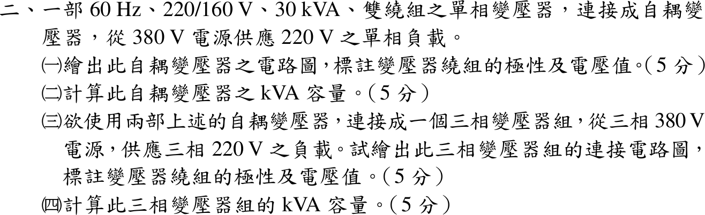
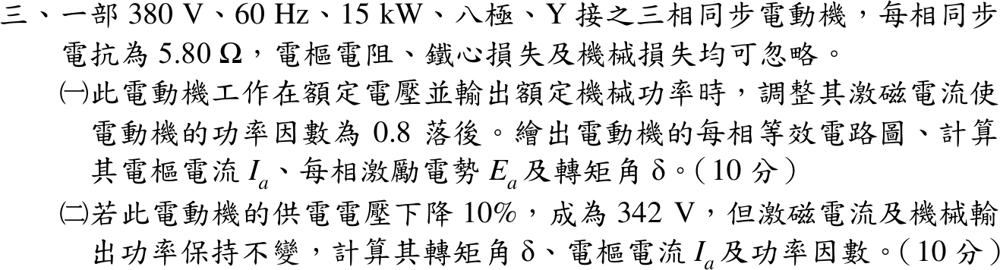
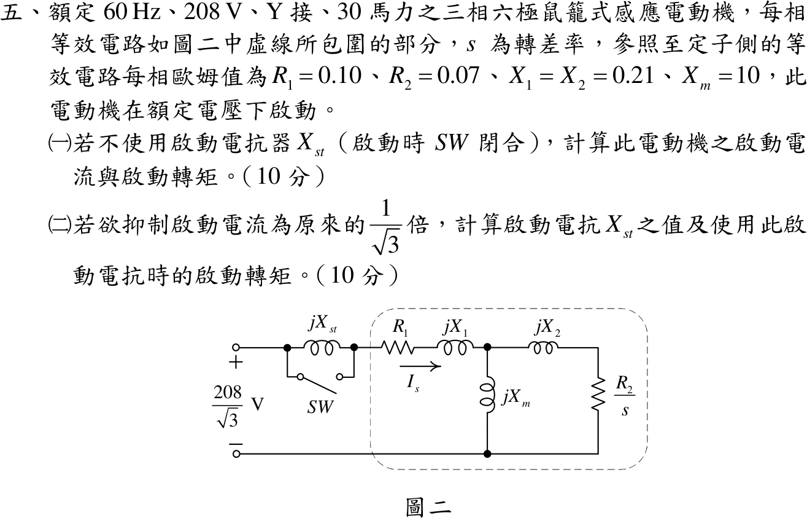

# 110 年電機工程技師｜電機機械逐題詳解

> 本頁由題級 canonical 筆記組合；每題保留官方裁切圖、校驗狀態與可追溯的推導。

## 題目導覽
- [[#一、110 年電機機械第 1 題｜差動串聯磁路|第 1 題：差動串聯磁路]]
- [[#二、110 年電機機械第 2 題｜自耦變壓器與 V–V 容量|第 2 題：自耦變壓器與 V–V 容量]]
- [[#三、110 年電機機械第 3 題｜同步電動機相量與轉矩角|第 3 題：同步電動機相量與轉矩角]]
- [[#四、110 年電機機械第 4 題｜永磁式直流電動機額定工作點|第 4 題：永磁式直流電動機額定工作點]]
- [[#五、110 年電機機械第 5 題｜感應電動機啟動電抗器|第 5 題：感應電動機啟動電抗器]]

---

## 一、110 年電機機械第 1 題｜差動串聯磁路

> 題級識別：EE-110-04-1
> canonical 來源：[[canonical/EE-110-04-1.md]]
> 題級校驗狀態：verified


### 已知與所求

\(l_c=45\ \mathrm{cm}\)、\(A_c=15\ \mathrm{cm^2}\)、\(\mu_r=3300\)；左柱 \(N_1=100\)、右柱 \(N_2=85\)，兩繞組依圖串聯，通直流 \(I=550\ \mathrm{mA}\)，忽略漏磁。求鐵心磁通密度與儲能。

### 考場標準作答

**繞向判定**（依圖逐段追線）：電流由 \(+\) 端進入 \(N_1\) 上端、往下繞出；\(N_1\) 下端引線經底部接到 \(N_2\) **下端**，電流在 \(N_2\) 中往上繞，再由上端引出回到 \(-\) 端。兩線圈畫法相同（前側直線段、柱緣弧線），但 \(N_1\) 前側直線段電流向右、\(N_2\) 前側直線段電流向左。以紙面朝外為前側，右手定則（四指沿前側電流繞柱）：\(N_1\) 磁通向上、\(N_2\) 磁通向下。若改以直線段為背側，兩者同時反向，相對關係不變。

```text
        ┌──────────→──────────┐
        │                     │
   N1   ↑  左柱磁通向上        ↓  右柱磁通向下   N2
 (I 向下繞)                     (I 向上繞)
        │                     │
        └──────────←──────────┘
     兩者同為順時針 → 磁動勢相加（和動串聯）
```

\[
\mathcal F=(N_1+N_2)I=185(0.55)=101.75\ \mathrm{A\cdot t}
\]
\[
\mathcal R_c=\frac{l_c}{\mu_r\mu_0A_c}=\frac{0.45}{3300(4\pi\times10^{-7})(1.5\times10^{-3})}=7.2343\times10^4\ \mathrm{A\cdot t/Wb}
\]
\[
\Phi=\frac{\mathcal F}{\mathcal R_c}=1.4065\times10^{-3}\ \mathrm{Wb},\qquad
\boxed{B=\frac{\Phi}{A_c}=0.9377\ \mathrm T}
\]
\[
\boxed{W_m=\tfrac12\mathcal F\Phi=\tfrac12(101.75)(1.4065\times10^{-3})=71.56\ \mathrm{mJ}}
\]

### 驗算

能量密度法：\(W_m=\dfrac{B^2}{2\mu}A_cl_c=\dfrac{0.9377^2}{2(4.1469\times10^{-3})}(6.75\times10^{-4})=71.56\ \mathrm{mJ}\)。電感法：\(L=(N_1+N_2)^2/\mathcal R_c=0.4731\ \mathrm H\)，\(\tfrac12LI^2=\tfrac12(0.4731)(0.55)^2=71.56\ \mathrm{mJ}\)。量級：\(H=226.1\ \mathrm{A/m}\)，\(B\approx0.94\ \mathrm T\) 在矽鋼未飽和範圍內。

### 失分點

- 誤以為 \(N_1\) 下端接 \(N_2\) 上端而判成差動串聯：\(\mathcal F=(100-85)(0.55)=8.25\ \mathrm{A\cdot t}\)，得 \(B=0.07603\ \mathrm T\)、\(W_m=0.4704\ \mathrm{mJ}\)。
- 只比較兩線圈「同在柱上向上／向下」而忘了兩柱位於磁路迴圈的對邊：左柱向上與右柱向下才是同一環繞方向。
- 截面積換算 \(15\ \mathrm{cm^2}=1.5\times10^{-3}\ \mathrm{m^2}\) 錯成 \(1.5\times10^{-4}\)。

---

## 二、110 年電機機械第 2 題｜自耦變壓器與 V–V 容量

> 題級識別：EE-110-04-2
> canonical 來源：[[canonical/EE-110-04-2.md]]
> 題級校驗狀態：verified



### 已知與所求

60 Hz、220/160 V、30 kVA 雙繞組單相變壓器改接為自耦變壓器，由 380 V 供 220 V 單相負載。求（一）電路圖（極性、電壓）；（二）kVA 容量；（三）兩台組成 380 V → 220 V 三相組的接線圖；（四）三相組容量。

### 考場標準作答

#### （一）單相自耦接線

\(380=160+220\)：160 V 繞組為串聯繞組、220 V 繞組為公共繞組，兩者加極性串聯（一繞組的非打點端接另一繞組的打點端）：

```text
  H ●───────────┐
                ● 串聯繞組 160 V（打點端在上）
                │
  380 V         ├──────────────● X
                ● 公共繞組 220 V（打點端在上）    220 V 負載
                │
  N ●───────────┴──────────────● N
  V(H→N)=160+220=380 V      V(X→N)=220 V
```

\[
\boxed{\text{160 V 串聯繞組與 220 V 公共繞組加極性串接，380 V 跨 H–N、220 V 取自 X–N}}
\]

#### （二）單相自耦容量

繞組額定電流：串聯繞組 \(30\,000/160=187.5\ \mathrm A\)，公共繞組 \(30\,000/220=136.36\ \mathrm A\)。輸入電流 \(I_H\) 流過串聯繞組，\(I_H=187.5\ \mathrm A\)；負載電流 \(I_L=187.5+136.36=323.86\ \mathrm A\)。
\[
\boxed{S_{auto}=380(187.5)=71.25\ \mathrm{kVA}}
\]
公共繞組電流 \(I_L-I_H=323.86-187.50=136.36\ \mathrm A\)，恰為其額定值。

#### （三）三相 V–V（開放三角）自耦接線

兩台分別跨 A–B、C–B 線，公共端共接 B 線，分接點引出 a、c：

```text
 A ●──[串 160 V]──●── a
                  │
              [公 220 V]          ← 第 1 台（跨 A–B）
                  │
 B ●──────────────●── b
                  │
              [公 220 V]          ← 第 2 台（跨 C–B）
                  │
 C ●──[串 160 V]──●── c
 各台打點端：串聯繞組朝 A（或 C）端，公共繞組朝分接點 a（或 c）
 V_AB = V_CB = 380 V      V_ab = V_bc = V_ca = 220 V
```

\(\underline V_{ab}=\tfrac{220}{380}\underline V_{AB}\)、\(\underline V_{cb}=\tfrac{220}{380}\underline V_{CB}\)，故 \(\underline V_{ac}=\tfrac{220}{380}\underline V_{AC}\)，三線間皆 220 V 平衡。
\[
\boxed{\text{兩台自耦變壓器 V–V 接於 A–B、C–B，共用 B 線，380 V 降為三相 220 V}}
\]

#### （四）三相組容量

每台輸出電流上限 323.86 A 即負載線電流：
\[
\boxed{S_{3\phi}=\sqrt3(220)(323.86)=\sqrt3\times71.25=123.41\ \mathrm{kVA}}
\]

### 驗算

功率守恆：\(220\times323.86=71\,249\ \mathrm{VA}\approx380\times187.5\)；其中變壓器感應傳送 30 kVA、傳導 \(220\times187.5=41.25\ \mathrm{kVA}\)，合計 71.25 kVA。相量：以 \(\underline V_B\) 為參考，\(\underline V_a=\underline V_B+0.5789(\underline V_A-\underline V_B)\)、\(\underline V_c=\underline V_B+0.5789(\underline V_C-\underline V_B)\)，\(|\underline V_a-\underline V_c|=0.5789\times380=220\ \mathrm V\)。

### 失分點

- 以雙繞組 30 kVA 當自耦容量，或用公共繞組電流算成 \(380\times136.36=51.8\ \mathrm{kVA}\)；限制輸入電流的是 160 V 串聯繞組的 187.5 A。
- 兩繞組減極性串接只得 60 V，不是 380 V。
- V–V 容量寫成 \(2\times71.25=142.5\ \mathrm{kVA}\)；開放三角只有 \(\sqrt3\) 倍單台容量。

---

## 三、110 年電機機械第 3 題｜同步電動機相量與轉矩角

> 題級識別：EE-110-04-3
> canonical 來源：[[canonical/EE-110-04-3.md]]
> 題級校驗狀態：verified



### 已知與所求

380 V、60 Hz、15 kW、八極、Y 接三相同步電動機，\(X_s=5.80\ \Omega\)，\(R_a\)、鐵損、機械損忽略。求（一）額定電壓、額定輸出、PF 0.8 落後時的每相等效電路、\(I_a\)、\(E_a\)、\(\delta\)；（二）電壓降為 342 V、激磁與輸出不變時的 \(\delta\)、\(I_a\)、PF。

### 考場標準作答

#### （一）額定運轉

每相等效電路（電動機慣例，電流由電源流入）：

```text
     I_a →
  ●────────[ jX_s = j5.8 Ω ]────────┐
  +                                 +
 V_φ = 219.39∠0° V                (E_a)  內生電勢
  −                                 −
  ●─────────────────────────────────┘
        V_φ = E_a + jX_s I_a
```

\(V_\phi=380/\sqrt3=219.39\ \mathrm V\)，輸出即輸入（無損）：
\[
I_a=\frac{15\,000}{\sqrt3(380)(0.8)}=28.49\ \mathrm A,\quad \underline I_a=28.49\angle-36.87^\circ=22.79-j17.09\ \mathrm A
\]
\[
\underline E_a=\underline V_\phi-jX_s\underline I_a=219.39-j5.8(22.79-j17.09)=120.26-j132.18\ \mathrm V
\]
\[
\boxed{I_a=28.49\ \mathrm A,\quad E_a=178.70\text{ V/相},\quad \delta=-47.71^\circ}
\]
（負號表示 \(E_a\) 落後 \(V_\phi\)，電動機運轉。）

#### （二）電壓降至 342 V

\(V_\phi'=342/\sqrt3=197.45\ \mathrm V\)，\(|E_a|=178.70\ \mathrm V\) 與 \(P=15\ \mathrm{kW}\) 不變：
\[
\sin|\delta'|=\frac{PX_s}{3V_\phi'E_a}=\frac{15\,000(5.8)}{3(197.45)(178.70)}=0.8219\Rightarrow\delta'=-55.27^\circ
\]
\[
\underline I_a'=\frac{\underline V_\phi'-\underline E_a'}{jX_s}=\frac{197.45-178.70\angle-55.27^\circ}{j5.8}=25.32-j16.49=30.22\angle-33.08^\circ\ \mathrm A
\]
\[
\boxed{\delta'=-55.27^\circ,\quad I_a'=30.22\ \mathrm A,\quad \mathrm{PF}=0.8379\text{ 落後}}
\]

### 驗算

功率回代：\(3V_\phi\,\mathrm{Re}(\underline I_a)=3(219.39)(22.79)=15.000\,\mathrm{kW}\)；\(3V_\phi'\,\mathrm{Re}(\underline I_a')=3(197.45)(25.32)=15.00\ \mathrm{kW}\)。功率角式回查（一）：\(3V_\phi E_a\sin47.71^\circ/X_s=3(219.39)(178.70)(0.7397)/5.8=15.00\ \mathrm{kW}\)。八極同步轉速 900 rpm，轉矩 \(15\,000/94.25=159.2\ \mathrm{N\cdot m}\) 前後不變。

### 失分點

- 電動機誤用發電機式 \(\underline E=\underline V+jX_s\underline I\)，得 \(|E_a|=344.9\ \mathrm V\)、\(\delta\) 為正。
- （二）沿用原電流 28.49 A 或原功因；應固定 \(|E_a|\) 與 \(P\) 先解 \(\delta'\)，再求 \(\underline I_a'\)。
- \(\sin\delta\) 式中誤用線電壓而漏乘 3，或用 \(V_{LL}\) 搭配相電壓 \(E_a\)。

---

## 四、110 年電機機械第 4 題｜永磁式直流電動機額定工作點

> 題級識別：EE-110-04-4
> canonical 來源：[[canonical/EE-110-04-4.md]]
> 題級校驗狀態：verified


### 已知與所求

3 hp、180 V 永磁式直流電動機，\(R_a=2.01\ \Omega\)，無載轉速 4200 rpm；機械損、鐵損及無載電樞電流忽略。180 V 供電、輸出額定機械功率時，求（一）等效電路、\(E_a\)、\(I_a\)；（二）轉速與轉矩。

### 考場標準作答

#### （一）等效電路、\(E_a\) 與 \(I_a\)

```text
      I_a →
  ●──────[ R_a = 2.01 Ω ]──────┐
  +                            +
 V_t = 180 V                 ( E_a )   永磁場：kφ 固定
  −                            −
  ●────────────────────────────┘
        V_t = E_a + I_a R_a ,  P_out = E_a I_a
```

無載 \(I_a=0\Rightarrow E_a=180\ \mathrm V\) 於 4200 rpm，\(K=180/4200\ \mathrm{V/rpm}\)。忽略其他損失，\(P_{out}=E_aI_a=3(746)=2238\ \mathrm W\)：
\[
(180-2.01I_a)I_a=2238\Rightarrow 2.01I_a^2-180I_a+2238=0
\]
\[
I_a=\frac{180-\sqrt{180^2-4(2.01)(2238)}}{2(2.01)}=\frac{180-120.03}{4.02}
\]
\[
\boxed{I_a=14.92\ \mathrm A,\quad E_a=180-2.01(14.92)=150.01\ \mathrm V}
\]
另一根 \(I_a=74.63\ \mathrm A\)（\(E_a=30\ \mathrm V\)，效率僅 16.7%，且為不穩定的低速平衡點）不取。

#### （二）轉速與轉矩

\[
n=4200\times\frac{150.01}{180}=3500.3\ \mathrm{rpm},\qquad
T=\frac{2238}{3500.3(2\pi/60)}=\frac{2238}{366.55}
\]
\[
\boxed{n\approx3500\ \mathrm{rpm},\quad T=6.106\ \mathrm{N\cdot m}}
\]

### 驗算

轉矩常數法：\(K_T=180/(4200\cdot2\pi/60)=0.40926\ \mathrm{N\cdot m/A}\)，\(T=K_TI_a=0.40926(14.92)=6.106\ \mathrm{N\cdot m}\)。KVL：\(150.01+14.92(2.01)=180.0\ \mathrm V\)；功率：\(180(14.92)=2685.6=2238+14.92^2(2.01)=2238+447.4\ \mathrm W\)。

### 失分點

- 把 \(P_{out}=2238\ \mathrm W\) 當輸入功率，算成 \(I_a=2238/180=12.43\ \mathrm A\)，漏掉 \(I_a^2R_a\)。
- 二次式取大根 74.63 A，得 700 rpm、30.5 N·m。
- 轉矩用 rpm 直接除：\(T=P/n\)；須換成 \(\omega=2\pi n/60\)。

---

## 五、110 年電機機械第 5 題｜感應電動機啟動電抗器

> 題級識別：EE-110-04-5
> canonical 來源：[[canonical/EE-110-04-5.md]]
> 題級校驗狀態：verified



### 已知與所求

60 Hz、208 V、Y 接、30 hp 三相六極鼠籠式感應電動機，每相 \(R_1=0.10\)、\(R_2=0.07\)、\(X_1=X_2=0.21\)、\(X_m=10\ \Omega\)；\(jX_{st}\) 串在電源與 \(R_1\) 之間，SW 閉合時短路。求（一）不用 \(X_{st}\) 的啟動電流與轉矩；（二）使啟動電流降為 \(1/\sqrt3\) 的 \(X_{st}\) 與啟動轉矩。

### 考場標準作答

#### （一）直接啟動（\(s=1\)）

\(V_\phi=208/\sqrt3=120.09\ \mathrm V\)，\(\omega_s=2\pi(1200)/60=125.66\ \mathrm{rad/s}\)。
\[
Z_p=\frac{j10(0.07+j0.21)}{0.07+j10.21}=0.06715+j0.20614\ \Omega,\quad
Z=0.10+j0.21+Z_p=0.16715+j0.41614=0.44845\angle68.1^\circ\ \Omega
\]
\[
I_s=\frac{120.09}{0.44845}=267.78\ \mathrm A,\quad
I_2'=I_s\left|\frac{j10}{0.07+j10.21}\right|=262.27\ \mathrm A
\]
\[
\boxed{I_{st}=267.8\ \mathrm A,\quad T_{st}=\frac{3(262.27)^2(0.07)}{125.66}=114.95\ \mathrm{N\cdot m}}
\]

#### （二）啟動電抗器

\(|Z+jX_{st}|=\sqrt3|Z|=0.77674\ \Omega\)：
\[
0.41614+X_{st}=\sqrt{0.77674^2-0.16715^2}=0.75855
\]
\[
\boxed{X_{st}=0.3424\ \Omega}
\]
\(X_{st}\) 在激磁分流點之前，\(I_2'/I_s\) 比值不變，轉子電流同降為 \(1/\sqrt3\)：
\[
\boxed{T_{st}'=\frac{114.95}{3}=38.32\text{ N}\cdot\text{m}}
\]

### 驗算

戴維寧法：\(\underline V_{th}=120.09\dfrac{j10}{0.10+j10.21}\)、\(Z_{th}=\dfrac{(0.10+j0.21)(j10)}{0.10+j10.21}\)，\(T=\dfrac{3|V_{th}|^2R_2}{\omega_s|Z_{th}+0.07+j0.21|^2}=114.95\ \mathrm{N\cdot m}\)，與直接法相同。加 \(X_{st}\) 後 \(I_s'=120.09/0.77674=154.61=267.78/\sqrt3\ \mathrm A\)。

### 失分點

- 忽略 \(X_m\) 並聯而只用串聯阻抗 \(0.17+j0.42\)，啟動電流與轉矩都略偏大。
- 把 \(X_{st}\) 直接取 \((\sqrt3-1)|Z|=0.3283\ \Omega\)，未以複數阻抗大小求解。
- 啟動轉矩只降為 \(1/\sqrt3\)；轉矩與電流平方成正比，應為 \(1/3\)。

---
