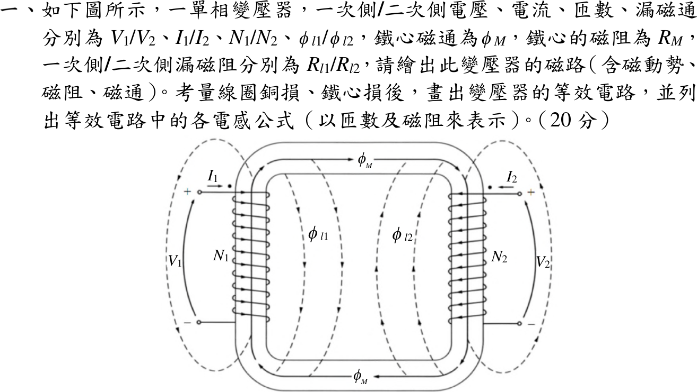
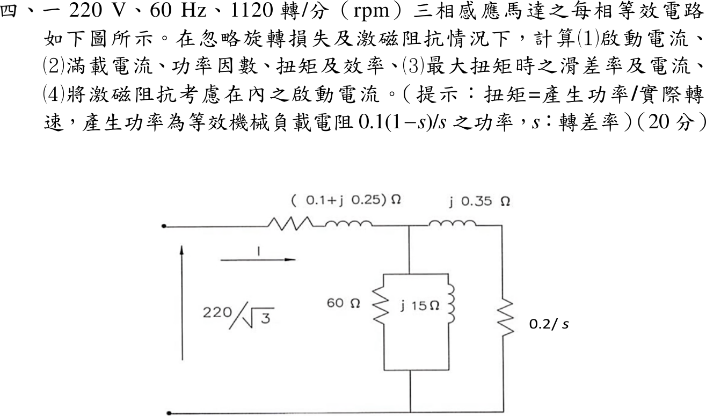
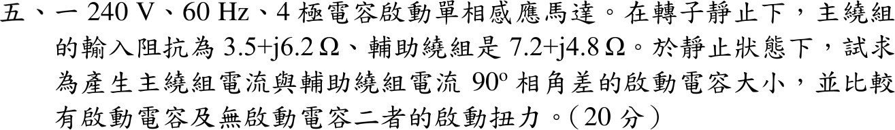

# 📝 113 年電機工程技師｜電機機械逐題詳解

> 本頁由題級 canonical 筆記組合；每題保留官方裁切圖、校驗狀態與可追溯的推導。

## 題目導覽
- [[#一、113 年第 1 題｜獨立驗證|第 1 題：獨立驗證]]
- [[#二、113 年第 2 題｜同步發電機標么阻抗、銅損與轉矩|第 2 題：同步發電機標么阻抗、銅損與轉矩]]
- [[#三、113 年第 3 題｜串激直流馬達分流調速與效率|第 3 題：串激直流馬達分流調速與效率]]
- [[#四、113 年電機機械第 4 題｜三相感應馬達等效電路與轉矩（參考書主解）|第 4 題：三相感應馬達等效電路與轉矩（參考書主解）]]
- [[#五、113 年第 5 題｜電容啟動單相感應馬達|第 5 題：電容啟動單相感應馬達]]

---

## 一、113 年第 1 題｜獨立驗證

> 題級識別：EE-113-04-1
> canonical 來源：[[canonical/EE-113-04-1.md]]
> 題級校驗狀態：verified



### 已知與所求

單相變壓器 \(V_1/V_2\)、\(I_1/I_2\)、\(N_1/N_2\)，漏磁通 \(\phi_{l1}/\phi_{l2}\)、鐵心磁通 \(\phi_M\)；鐵心磁阻 \(\mathcal R_M\)，漏磁阻 \(\mathcal R_{l1}/\mathcal R_{l2}\)。圖中 \(I_1\)、\(I_2\) 皆由打點端流入。求磁路、含銅損與鐵損的等效電路，以及各電感（以匝數與磁阻表示）。

### 考場標準作答

#### 磁路

兩個磁動勢源 \(N_1I_1\)、\(N_2I_2\)（同極性相加）共同驅動鐵心磁阻 \(\mathcal R_M\) 上的主磁通；各繞組另有只交鏈自身的漏磁路：

```text
      ┌─────────────[ R_M ]─────────────┐
      │             φ_M →               │
   ┌──┴───┐                         ┌───┴──┐
 (N1I1)  [R_l1] φ_l1        φ_l2 [R_l2]  (N2I2)
   └──┬───┘                         └───┬──┘
      └─────────────────────────────────┘
```

（左、右各為磁動勢源與其漏磁阻並聯，兩者經 \(\mathcal R_M\) 串成主磁路，\(N_1I_1\)、\(N_2I_2\) 對 \(\phi_M\) 同向相加。）

\[
\phi_M=\frac{N_1I_1+N_2I_2}{\mathcal R_M},\qquad \phi_{l1}=\frac{N_1I_1}{\mathcal R_{l1}},\qquad \phi_{l2}=\frac{N_2I_2}{\mathcal R_{l2}}
\]

#### 等效電路與電感

磁鏈 \(\lambda_1=N_1(\phi_{l1}+\phi_M)\)、\(\lambda_2=N_2(\phi_{l2}+\phi_M)\)，令 \(a=N_1/N_2\)、\(I_2'=I_2/a\)：
\[
v_1=R_1i_1+L_{l1}\frac{di_1}{dt}+L_m\frac{d(i_1+i_2')}{dt},\qquad
av_2=a^2R_2i_2'+a^2L_{l2}\frac{di_2'}{dt}+L_m\frac{d(i_1+i_2')}{dt}
\]
T 型等效電路（折算至一次側，\(X=\omega L\)）：

```text
  I1 →                                                  ← I2'=I2/a
 ●──[R1]──[jωL_l1]──┬────────┬──[a²R2]──[jωa²L_l2]──●
 +                  │        │                      +
 V1               [Rc]    [jωL_m]                  aV2   （接理想變壓器 a:1 → V2）
 −                  │        │                      −
 ●──────────────────┴────────┴──────────────────────●
 R1、a²R2：繞組銅損　Rc：鐵損（磁滯＋渦流）　L_m：激磁電感
 L_l1=N1²/R_l1　a²L_l2=N1²/R_l2　L_m=N1²/R_M　a=N1/N2
```

\[
\boxed{L_{l1}=\frac{N_1^2}{\mathcal R_{l1}},\quad L_{l2}=\frac{N_2^2}{\mathcal R_{l2}}\ \Big(a^2L_{l2}=\frac{N_1^2}{\mathcal R_{l2}}\Big),\quad L_m=\frac{N_1^2}{\mathcal R_M}}
\]
自感與互感：\(L_{11}=N_1^2/\mathcal R_{l1}+N_1^2/\mathcal R_M\)、\(L_{22}=N_2^2/\mathcal R_{l2}+N_2^2/\mathcal R_M\)、\(M=N_1N_2/\mathcal R_M\)。

### 驗算

由端點方程反推：\(\partial\lambda_1/\partial i_1=N_1^2/\mathcal R_{l1}+N_1^2/\mathcal R_M=L_{l1}+L_m\)，\(\partial\lambda_1/\partial i_2=N_1N_2/\mathcal R_M=L_m/a\)，代入 \(i_2=ai_2'\) 即得 T 型電路的 \(L_m\,d(i_1+i_2')/dt\) 項；二次側乘 \(a\) 後漏感為 \(a^2N_2^2/\mathcal R_{l2}=N_1^2/\mathcal R_{l2}\)。

### 失分點

- 激磁電感寫成 \(N_1N_2/\mathcal R_M\)（那是互感 \(M\)）；折算至一次側的 \(L_m\) 為 \(N_1^2/\mathcal R_M\)。
- 鐵損電阻 \(R_c\) 畫成串聯；它應與 \(X_m\) 並聯在激磁支路。

---

## 二、113 年第 2 題｜同步發電機標么阻抗、銅損與轉矩

> 題級識別：EE-113-04-2
> canonical 來源：[[canonical/EE-113-04-2.md]]
> 題級校驗狀態：verified


### 已知與所求

三相同步發電機 600 kVA、1800 rpm、4.2 kV、60 Hz、效率 0.9，於 0.9 滯後功因供額定電流；每相同步阻抗 \(2+j20\ \Omega\)。求極數、同步阻抗標么值、定子銅損與轉矩。

### 考場標準作答

\[
\boxed{P=\frac{120f}{n_s}=\frac{120(60)}{1800}=4\ \text{極}}
\]
\[
Z_b=\frac{V_{LL}^2}{S_{3\phi}}=\frac{4200^2}{600\times10^3}=29.4\ \Omega,\qquad
\boxed{Z_{s,pu}=\frac{2+j20}{29.4}=0.0680+j0.6803\ \mathrm{pu}}
\]
\[
I_a=\frac{600\times10^3}{\sqrt3(4200)}=82.48\ \mathrm A,\qquad
\boxed{P_{cu}=3I_a^2R_a=3(82.48)^2(2)=40.82\ \mathrm{kW}}
\]
\(P_o=600(0.9)=540\ \mathrm{kW}\)，\(\omega_m=2\pi(1800)/60=188.50\ \mathrm{rad/s}\)。「所產生的電機轉矩」取電磁（感應）轉矩：
\[
\boxed{T_{em}=\frac{P_o+P_{cu}}{\omega_m}=\frac{580.82\times10^3}{188.50}=3081\ \mathrm{N\cdot m}}
\]

### 驗算

標么法求銅損：額定電流 \(I_{pu}=1\)，\(P_{cu}=I_{pu}^2R_{pu}S_b=0.06803(600)=40.82\ \mathrm{kW}\)。功率平衡：效率 0.9 對應機械輸入 600 kW，\(600-540-40.82=19.18\ \mathrm{kW}\) 為題目未分列的鐵損與機械損，非負，數據自洽。

### 失分點

- 以相電壓 \(4200/\sqrt3\) 配三相容量求基準，\(Z_b\) 錯為 9.8 Ω。
- 用 \(|Z_s|=20.1\ \Omega\) 算銅損；銅損只取實部 \(R_a=2\ \Omega\)。

### 條件與疑義

題目給總效率 0.9，但未分列鐵損、機械損，「所產生的電機轉矩」可有兩種解讀：主解為電磁轉矩 3081 N·m；若指原動機軸端輸入轉矩，\(T_{shaft}=(540/0.9)\times10^3/188.50=3183\ \mathrm{N\cdot m}\)。作答時應寫明採用的定義。

---

## 三、113 年第 3 題｜串激直流馬達分流調速與效率

> 題級識別：EE-113-04-3
> canonical 來源：[[canonical/EE-113-04-3.md]]
> 題級校驗狀態：verified


### 已知與所求

串激直流馬達 300 V、60 A、1800 rpm，\(R_a=R_s=0.10\ \Omega\)；將 \(R_d=0.10\ \Omega\) 並聯於場繞組後扭矩加倍。忽略電樞反應與旋轉損失，求電樞電流、轉速、效率。

### 考場標準作答

#### 電樞電流

分流後 \(I_f=I_a\dfrac{R_d}{R_s+R_d}=\dfrac{I_a}{2}\)。以磁化曲線 \(\Phi(I_f)\) 表示，\(T=K\Phi(I_f)I_a\)，扭矩加倍：
\[
\Phi\!\left(\frac{I_{a2}}{2}\right)I_{a2}=2\,\Phi(60)\times60
\]
取 \(I_{a2}=120\ \mathrm A\) 時左式為 \(\Phi(60)\times120\)，恰等於右式；且 \(\Phi(I_a/2)I_a\) 隨 \(I_a\) 嚴格遞增，解唯一：
\[
\boxed{I_{a2}=120\ \mathrm A},\qquad I_{f2}=60\ \mathrm A=I_{f1}\Rightarrow\Phi_2=\Phi_1
\]
（線性模型 \(\Phi\propto I_f\) 下即 \(I_{a2}^2/2=2(3600)\)，結果相同。）

#### 轉速

\[
E_{a1}=300-60(0.1+0.1)=288\ \mathrm V,\qquad E_{a2}=300-120(0.1+0.05)=282\ \mathrm V
\]
\(\Phi_2=\Phi_1\)，\(E_a\propto\Phi n\)：
\[
\boxed{n_2=1800\times\frac{282}{288}=1762.5\ \mathrm{rpm}}
\]

#### 效率

忽略旋轉損失，\(P_{out}=E_{a2}I_{a2}\)：
\[
\boxed{\eta=\frac{282\times120}{300\times120}=94.00\%}
\]

### 驗算

逐元件損失：電樞 \(120^2(0.1)=1440\ \mathrm W\)，場繞組 \(60^2(0.1)=360\ \mathrm W\)，分流電阻 \(60^2(0.1)=360\ \mathrm W\)，合計 2160 W；\(36000-2160=33840\ \mathrm W=282\times120\)，與 \(E_{a2}I_{a2}\) 相符。

### 失分點

- 忘記分流後場電流只剩 \(I_a/2\)，直接用 \(T\propto I_a^2\) 得 \(I_{a2}=84.9\ \mathrm A\)。
- 分流後電樞迴路電阻應為 \(0.1+0.1\parallel0.1=0.15\ \Omega\)，不是 0.2 Ω。

### 條件與疑義

- 題目未給磁化曲線，也未聲明未飽和。但分流後場電流恰回到 \(60\ \mathrm A\)，\(I_{a2}=120\ \mathrm A\) 對任何單調磁化曲線都滿足扭矩加倍，磁通不變，故三個答案不依賴線性假設；前提是題示「忽略電樞反應」。

---

## 四、113 年電機機械第 4 題｜三相感應馬達等效電路與轉矩（參考書主解）

> 題級識別：EE-113-04-4
> canonical 來源：[[canonical/EE-113-04-4.md]]
> 題級校驗狀態：needs_manual_review
> [!WARNING] 本題仍有官方資料缺口或事件定義歧義；請以 canonical 條件式解答為準。



### 已知與所求

220 V、60 Hz、1120 rpm 三相感應馬達，每相等效電路：\(Z_1=0.1+j0.25\ \Omega\)，激磁支路 \(60\ \Omega\parallel j15\ \Omega\)，轉子支路 \(j0.35\ \Omega\) 串 \(0.2/s\ \Omega\)，相電壓 \(220/\sqrt3\)。忽略旋轉損失與激磁阻抗，求（1）啟動電流；（2）滿載電流、功因、扭矩、效率；（3）最大扭矩時滑差與電流；（4）計入激磁阻抗的啟動電流。提示：扭矩＝產生功率／實際轉速，產生功率為 \(0.1(1-s)/s\) 上的功率。

### 考場標準作答

主解依電路圖 \(R_2/s=0.2/s\)（機械負載電阻 \(0.2(1-s)/s\)），提示的 0.1 見條件與疑義。
\[
n_s=1200\ \mathrm{rpm}\ (6\text{ 極}),\quad s=\frac{1200-1120}{1200}=\frac1{15},\quad V_\phi=\frac{220}{\sqrt3}=127.02\ \mathrm V
\]

#### （1）啟動電流

\[
Z_{st}=0.3+j0.6\ \Omega,\qquad \boxed{|I_{st}|=\frac{127.02}{0.6708}=189.35\ \mathrm A}
\]

#### （2）滿載

\(R_2/s=3.0\ \Omega\)，\(Z_{fl}=3.1+j0.6\ \Omega\)：
\[
\boxed{|I_{fl}|=\frac{127.02}{3.1575}=40.23\ \mathrm A},\qquad \boxed{\mathrm{pf}=\frac{3.1}{3.1575}=0.982\ \text{滯後}}
\]
\[
P_{mech}=3I^2\cdot0.2\frac{1-s}{s}=3(40.23)^2(2.8)=13.59\ \mathrm{kW},\qquad \omega_m=\frac{2\pi(1120)}{60}=117.29\ \mathrm{rad/s}
\]
\[
\boxed{T=\frac{13593}{117.29}=115.9\ \mathrm{N\cdot m}},\qquad
\boxed{\eta=\frac{P_{mech}}{3I^2(R_1+R_2/s)}=\frac{2.8}{3.1}=90.32\%}
\]

#### （3）最大扭矩

\[
\boxed{s_{max}=\frac{R_2}{\sqrt{R_1^2+(X_1+X_2)^2}}=\frac{0.2}{\sqrt{0.1^2+0.6^2}}=0.3288}
\]
\[
Z=0.1+0.6083+j0.6=0.7083+j0.6\ \Omega,\qquad \boxed{|I_{Tmax}|=\frac{127.02}{0.9283}=136.83\ \mathrm A}
\]

#### （4）計入激磁阻抗的啟動電流

\[
Z_m=60\parallel j15=3.529+j14.118,\quad Z_m\parallel(0.2+j0.35)=0.1923+j0.3423
\]
\[
Z_{in}=0.2923+j0.5923\ \Omega,\qquad \boxed{|I_{st,m}|=\frac{127.02}{0.6605}=192.30\ \mathrm A}
\]

### 驗算

扭矩改由氣隙功率除以同步角速度：\(T=3I^2(R_2/s)/\omega_s=3(40.23)^2(3.0)/125.66=115.9\ \mathrm{N\cdot m}\)，與 \(P_{mech}/\omega_m\) 相同。最大扭矩點：\(R_2/s_{max}=0.6083=|0.1+j0.6|\)，符合最大功率轉移條件。（4）的電流略大於（1），因激磁支路與轉子支路並聯使阻抗變小，方向合理。

### 失分點

- 用電氣同步速 \(377\ \mathrm{rad/s}\) 或 1200 rpm 除機械功率；應用實際轉速 1120 rpm（或以氣隙功率除 \(\omega_s\)）。
- 效率分母只放 \(R_2/s\) 而漏掉 \(R_1\) 銅損。

### 條件與疑義

- 來源矛盾：圖示 0.2/s（\(R_2=0.2\ \Omega\)），提示文字卻寫機械負載電阻 0.1(1-s)/s（對應 \(R_2=0.1\ \Omega\)）。兩者不能同時成立。主解採電路圖。
- 若以提示為準，令 \(R_2=0.1\ \Omega\) 全面重算，完整重算的第二組結果：\(I_{st}=200.83\ \mathrm A\)、\(I_{fl}=74.33\ \mathrm A\)、pf \(0.936\) 滯後、\(T=197.85\ \mathrm{N\cdot m}\)、\(\eta=87.50\%\)、\(s_{max}=0.1644\)、\(I_{Tmax}=136.83\ \mathrm A\)、計入激磁之啟動電流 \(203.69\ \mathrm A\)。
- 參考書主解採混合慣例：電流用圖示 \(0.2/s\)（啟動電流 189.35 A、滿載 40.23 A、pf 0.98），機械功率卻用 \(0.1(1-s)/s\) 與 \(s=0.067\)，得 6761.3 W、轉矩 57.67 N·m、效率約 45%。此組違反功率平衡：氣隙功率 \(3(40.23)^2(3.0)=14.56\ \mathrm{kW}\)，轉子銅損 \(sP_{ag}=0.97\ \mathrm{kW}\) 加 6.76 kW 機械功率只有 7.73 kW，不宜作為考場答案。

---

## 五、113 年第 5 題｜電容啟動單相感應馬達

> 題級識別：EE-113-04-5
> canonical 來源：[[canonical/EE-113-04-5.md]]
> 題級校驗狀態：verified



### 已知與所求

240 V、60 Hz、4 極電容啟動單相感應馬達，靜止時主繞組 \(Z_m=3.5+j6.2\ \Omega\)、輔助繞組 \(Z_a=7.2+j4.8\ \Omega\)。求使兩繞組電流相差 \(90^\circ\) 的串聯啟動電容，並比較有、無電容的啟動扭力。

### 考場標準作答

#### 啟動電容

\(\angle I_m=-\tan^{-1}(6.2/3.5)=-60.55^\circ\)，要求 \(\angle I_a=-60.55^\circ+90^\circ=29.45^\circ\)，即 \(\angle Z_{aC}=-29.45^\circ\)：
\[
\frac{4.8-X_C}{7.2}=-\tan29.45^\circ=-\frac{3.5}{6.2}\ \Rightarrow\ X_C=4.8+\frac{7.2(3.5)}{6.2}=8.8645\ \Omega
\]
\[
\boxed{C=\frac{1}{2\pi(60)(8.8645)}=299.2\ \mu\mathrm F}
\]

#### 啟動扭力比較

\(T_{st}=K|I_m||I_a|\sin\alpha\)（\(\alpha\) 為兩電流相角差），\(|I_m|=240/7.120=33.71\ \mathrm A\) 兩情形相同。

- 無電容：\(|I_a|=240/8.653=27.74\ \mathrm A\)，\(\alpha=60.55^\circ-33.69^\circ=26.86^\circ\)
- 有電容：\(Z_{aC}=7.2-j4.065\)，\(|I_a|=240/8.268=29.03\ \mathrm A\)，\(\alpha=90^\circ\)

\[
\boxed{\frac{T_{st,C}}{T_{st,0}}=\frac{29.03\sin90^\circ}{27.74\sin26.86^\circ}=2.316}
\]
有啟動電容的啟動扭力約為無電容時的 2.32 倍。

### 驗算

不用正切公式，直接對 \(X_C\) 數值求根使 \(\angle I_a-\angle I_m=90^\circ\)，得 \(X_C=8.864516\ \Omega\)；扭力比改用 \(\operatorname{Im}(I_aI_m^*)\)（等於 \(|I_a||I_m|\sin\alpha\)）計算，比值同為 2.316。

### 失分點

- \(X_C=1/(\omega C)\) 誤用 \(\omega=60\) 而非 \(2\pi(60)\)，得 \(C=1.88\ \mathrm{mF}\)，大 \(2\pi\) 倍。
- 比較扭力時忘記電流大小也改變，只取 \(1/\sin26.86^\circ=2.21\)。

---
