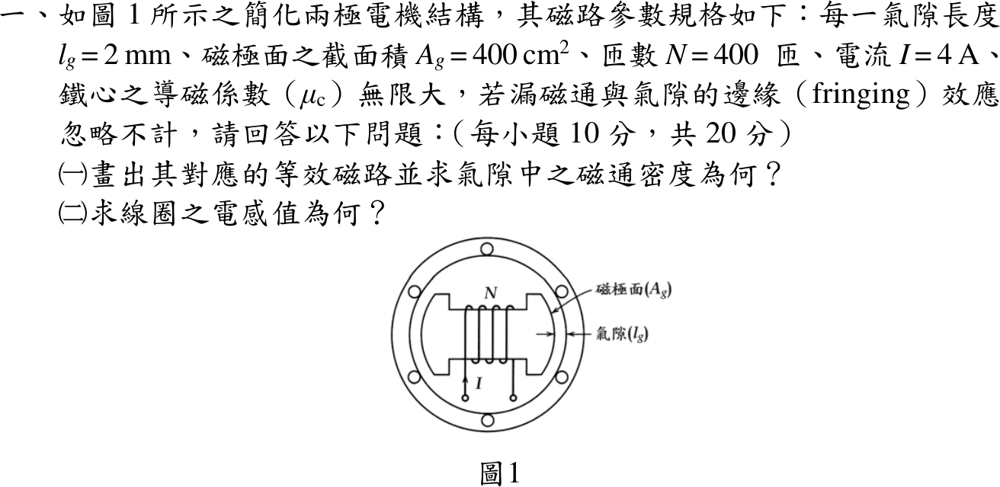
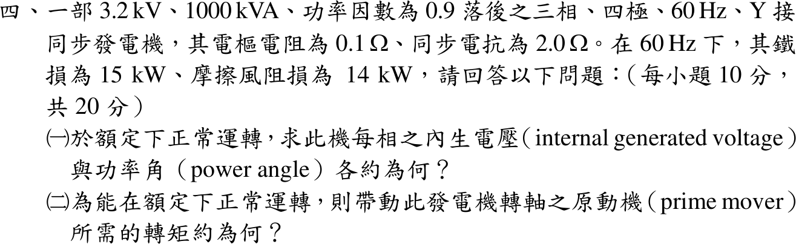
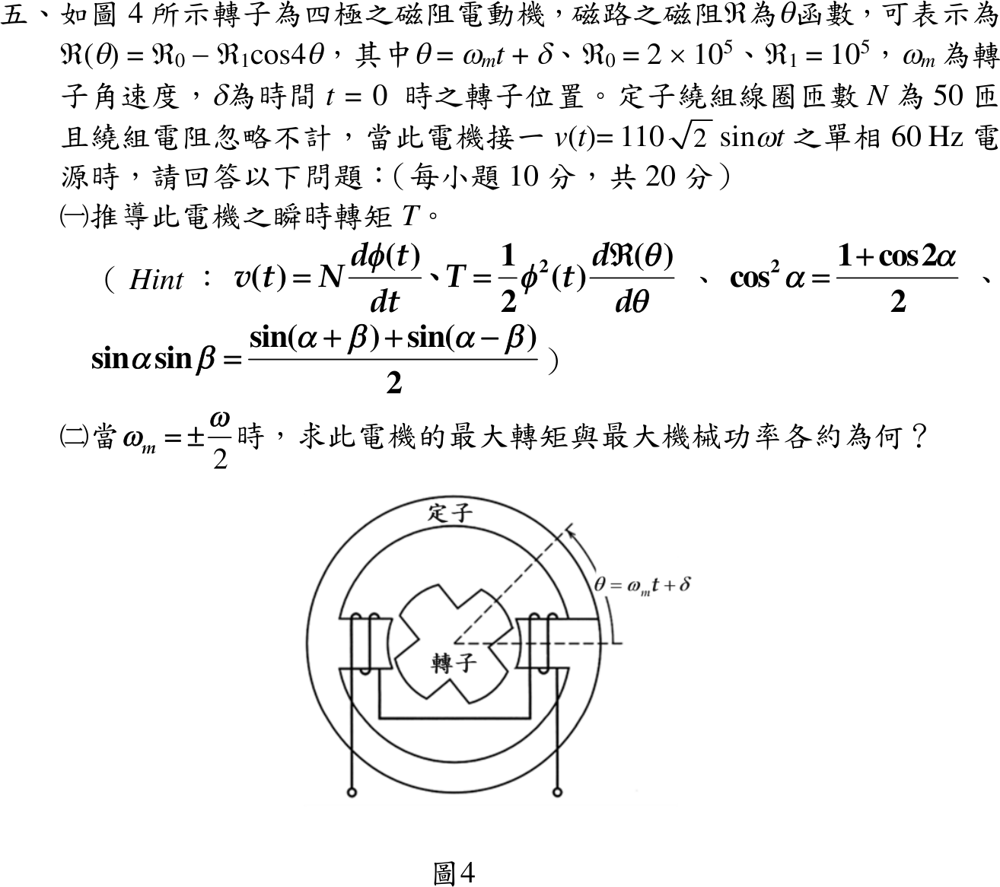

# 114 年電機工程技師｜電機機械逐題詳解

> 本頁由題級 canonical 筆記組合；每題保留 QID、官方裁切、校驗狀態與完整得分型解答。

## 題目導覽
- [[#一、114 年電機機械第 1 題｜兩極電機氣隙磁路與電感|第 1 題：兩極電機氣隙磁路與電感]]
- [[#二、114 年電機機械第 2 題｜變壓器分接頭最大功率|第 2 題：變壓器分接頭最大功率]]
- [[#三、114 年電機機械第 3 題｜單相感應電動機二相旋轉磁場|第 3 題：單相感應電動機二相旋轉磁場]]
- [[#四、114 年電機機械第 4 題｜同步發電機內生電壓與原動機轉矩|第 4 題：同步發電機內生電壓與原動機轉矩]]
- [[#五、114 年電機機械第 5 題｜磁阻電動機轉矩|第 5 題：磁阻電動機轉矩]]

---

## 一、114 年電機機械第 1 題｜兩極電機氣隙磁路與電感

> 題級識別：`EE-114-04-1`
> canonical 來源：`canonical/EE-114-04-1.md`
> 題級校驗狀態：`verified`

![[01_原始試題/依考科/04_電機機械/images/questions/PE_114年_電機機械_Q01.png]]

> 官方裁切來源：`01_原始試題/依考科/04_電機機械/images/questions/PE_114年_電機機械_Q01.png`



### 已知與所求

兩極結構，每一氣隙 \(l_g=2\ \mathrm{mm}\)、磁極面 \(A_g=400\ \mathrm{cm^2}=0.04\ \mathrm{m^2}\)，\(N=400\) 匝、\(I=4\ \mathrm A\)，\(\mu_c\to\infty\)，忽略漏磁與邊緣效應。求（一）等效磁路與氣隙磁通密度；（二）線圈電感。

### 考場標準作答

#### （一）等效磁路與氣隙磁通密度

等效磁路：磁動勢源 \(\mathcal F=NI\) 串聯兩個相同的氣隙磁阻（磁通由定子極穿過氣隙進入轉子，再穿過另一氣隙回到定子），鐵心磁阻為零：
\[
\mathcal R_g=\frac{l_g}{\mu_0A_g}=\frac{2\times10^{-3}}{(4\pi\times10^{-7})(0.04)}=3.979\times10^4\ \mathrm{A\,t/Wb},\qquad \mathcal R_{eq}=2\mathcal R_g=7.958\times10^4\ \mathrm{A\,t/Wb}
\]
\[
\Phi=\frac{NI}{\mathcal R_{eq}}=\frac{1600}{7.958\times10^4}=2.011\times10^{-2}\ \mathrm{Wb},\qquad
\boxed{B_g=\frac{\Phi}{A_g}=0.5027\ \mathrm T}
\]

#### （二）線圈電感

\[
\boxed{L=\frac{N^2}{\mathcal R_{eq}}=\frac{400^2}{7.958\times10^4}=2.011\ \mathrm H}
\]

### 驗算

安培定律只計氣隙：\(NI=H_g(2l_g)\Rightarrow B_g=\mu_0NI/(2l_g)=(4\pi\times10^{-7})(1600)/0.004=0.5027\ \mathrm T\)。磁鏈法：\(L=NB_gA_g/I=400(0.5027)(0.04)/4=2.011\ \mathrm H\)，兩式一致。

### 失分點

- 只算一個氣隙，得 \(B_g=1.005\ \mathrm T\)、\(L=4.02\ \mathrm H\)。
- \(400\ \mathrm{cm^2}\) 須換成 \(0.04\ \mathrm{m^2}\)；\(N^2/\mathcal R_{eq}=160000/79577=2.011\)，不是 5.03。


---

## 二、114 年電機機械第 2 題｜變壓器分接頭最大功率

> 題級識別：`EE-114-04-2`
> canonical 來源：`canonical/EE-114-04-2.md`
> 題級校驗狀態：`verified`

![[01_原始試題/依考科/04_電機機械/images/questions/PE_114年_電機機械_Q02.png]]

> 官方裁切來源：`01_原始試題/依考科/04_電機機械/images/questions/PE_114年_電機機械_Q02.png`


### 已知與所求

一次側接 \(110\sqrt2\ \mathrm V\) 電源、內阻 \(j1\ \Omega\)；二次側電阻性負載 \(1\)～\(4\ \Omega\)，以分接頭調整匝數比 \(a=N_1:N_2\) 使負載恆得最大功率。求 \(R_L=2.5\ \Omega\) 時（一）\(a\)；（二）負載電壓 \(V_o\)。

### 考場標準作答

#### （一）匝數比

負載折算至一次側 \(R_L'=a^2R_L\)。電源內阻為純電抗，只能調整負載電阻大小時，最大功率條件為 \(R_L'=|Z_s|=1\ \Omega\)：
\[
2.5a^2=1\ \Rightarrow\ \boxed{a=\sqrt{0.4}=0.6325}
\]

#### （二）負載電壓

依相量圖慣例取電源標示為 RMS（\(V_s=110\sqrt2\ \mathrm V\)）：
\[
|V_1|=V_s\frac{R_L'}{|R_L'+j1|}=110\sqrt2\cdot\frac{1}{\sqrt2}=110\ \mathrm V,\qquad
\boxed{|V_o|=\frac{|V_1|}{a}=\frac{110}{0.6325}=173.925\ \mathrm V_{rms}}
\]

### 驗算

功率守恆：一次側 \(|I_1|=110\sqrt2/\sqrt2=110\ \mathrm A\)，\(P=|I_1|^2(1)=12100\ \mathrm W\)；二次側 \(V_o^2/R_L=173.925^2/2.5=12100\ \mathrm W\)。對 \(a\in[0.3,1.2]\) 掃描負載功率，最大值落在 \(a=0.6325\)。

### 失分點

- 把最大功率條件寫成 \(a^2R_L=Z_s^*\)：負載為純電阻、只能調 \(a\)，應取 \(|Z_s|=1\ \Omega\)。
- 求出一次側 110 V 後忘了再除以 \(a\)（\(a<1\)，二次電壓高於一次）。

### 條件與疑義

題圖只標 \(110\sqrt2\) V，未註明 RMS 或峰值。主解採 RMS；若該值是峰值，RMS 電壓縮小 \(\sqrt2\) 倍，\(|V_o|=173.925/\sqrt2=122.984\ \mathrm V_{rms}\)（峰值 173.925 V）。匝數比 \(a=0.6325\) 兩種解讀相同。


---

## 三、114 年電機機械第 3 題｜單相感應電動機二相旋轉磁場

> 題級識別：`EE-114-04-3`
> canonical 來源：`canonical/EE-114-04-3.md`
> 題級校驗狀態：`verified`

![[01_原始試題/依考科/04_電機機械/images/questions/PE_114年_電機機械_Q03.png]]

> 官方裁切來源：`01_原始試題/依考科/04_電機機械/images/questions/PE_114年_電機機械_Q03.png`


### 已知與所求

主繞組 \(M\)（上，⊗）—\(M'\)（下，⊙）、輔助繞組 \(A\)（右，⊗）—\(A'\)（左，⊙），空間相隔 \(90^\circ\)；正電流由 \(M\)、\(A\) 流入。磁通與電流成正比，\(I_m\) 對應 \(\phi_m\)。由圖 3(b)，相鄰刻度相隔 \(45^\circ\) 電機角：\(i_A=I_m\sin\vartheta\)、\(i_M=-I_m\cos\vartheta\)，\(\vartheta=\omega(t-t_0)\)。求（一）\(t_1,t_3,t_5,t_7\) 的合成磁通與轉向；（二）證明對調輔助繞組頭尾使磁場反轉。

### 考場標準作答

#### （一）合成磁通與轉向

取紙面向右為 \(+x\)、向上為 \(+y\)。右手定則：上方導體流入、下方流出，中心磁場向左，故主繞組正電流產生 \(-x\) 磁通；右方流入、左方流出，中心磁場向上，故輔助繞組正電流產生 \(+y\) 磁通。合成磁通
\[
\boldsymbol\phi=-\phi_m\frac{i_M}{I_m}\hat x+\phi_m\frac{i_A}{I_m}\hat y=\phi_m(\cos\vartheta\,\hat x+\sin\vartheta\,\hat y)
\]

| 時刻 | \((i_M,i_A)/I_m\) | 合成磁通 | 相位 |
| --- | --- | --- | --- |
| \(t_1\) | \((-1,1)/\sqrt2\) | 右上，\(\phi_m\) | \(45^\circ\) |
| \(t_3\) | \((1,1)/\sqrt2\) | 左上，\(\phi_m\) | \(135^\circ\) |
| \(t_5\) | \((1,-1)/\sqrt2\) | 左下，\(\phi_m\) | \(225^\circ\) |
| \(t_7\) | \((-1,-1)/\sqrt2\) | 右下，\(\phi_m\) | \(315^\circ\) |

X–Y 草圖（四支箭頭由原點出發，長度皆為 \(\phi_m\)）：

```text
                  +Y
             t₃ ↖ │ ↗ t₁
                  │
       −X ────────O──────── +X
                  │
             t₅ ↙ │ ↘ t₇
                  −Y

          t₁ → t₃ → t₅ → t₇：逆時針
```

\[
\boxed{|\boldsymbol\phi|=\phi_m,\ \angle\boldsymbol\phi=\vartheta\ \text{（}45^\circ\to135^\circ\to225^\circ\to315^\circ\text{），逆時針旋轉}}
\]

#### （二）對調輔助繞組頭尾

對調 \(A\)、\(A'\) 後同一電流產生的 \(y\) 分量反號：
\[
\boldsymbol\phi'=\phi_m(\cos\vartheta\,\hat x-\sin\vartheta\,\hat y)=\phi_m\angle(-\vartheta)
\]
大小仍為 \(\phi_m\)，但相位隨時間遞減，\(t_1,t_3,t_5,t_7\) 依序為 \(315^\circ,225^\circ,135^\circ,45^\circ\)：
\[
\boxed{d\angle\boldsymbol\phi'/dt=-\omega\ \Rightarrow\ \text{旋轉磁場反轉為順時針}}
\]
對調主繞組時 \(x\) 分量反號，同理得 \(\phi_m\angle(180^\circ-\vartheta)\)，亦為反轉。

### 驗算

以向量式 \(\mathbf B\propto\hat{\mathbf I}\times\hat{\mathbf r}\)（\(\hat{\mathbf r}\) 由導體指向中心）重算軸向：\(M\) 在 \((0,1)\)、電流 \(-\hat z\)：\((-\hat z)\times(-\hat y)=-\hat x\)；\(A\) 在 \((1,0)\)：\((-\hat z)\times(-\hat x)=+\hat y\)，回流導體 \(M'\)、\(A'\) 貢獻同向，與主解一致。各時刻 \(|\boldsymbol\phi|^2=\phi_m^2(\cos^2\vartheta+\sin^2\vartheta)=\phi_m^2\)，四點都是 \(|i_M|=|i_A|=I_m/\sqrt2\)。

### 失分點

- 把 \(t_1,t_3,t_5,t_7\) 讀成某一繞組峰值、另一繞組為零；圖上四點兩電流量值都是 \(I_m/\sqrt2\)，磁通落在對角線。
- 把兩個互相垂直的分量代數相加成 \(\sqrt2\phi_m\) 或 \(2\phi_m\)。
- 第（二）小題只寫「相序改變」而沒寫出 \(y\) 分量反號、角速度變為 \(-\omega\)。


---

## 四、114 年電機機械第 4 題｜同步發電機內生電壓與原動機轉矩

> 題級識別：`EE-114-04-4`
> canonical 來源：`canonical/EE-114-04-4.md`
> 題級校驗狀態：`verified`

![[01_原始試題/依考科/04_電機機械/images/questions/PE_114年_電機機械_Q04.png]]

> 官方裁切來源：`01_原始試題/依考科/04_電機機械/images/questions/PE_114年_電機機械_Q04.png`



### 已知與所求

三相 Y 接、四極、60 Hz 同步發電機：\(3.2\ \mathrm{kV}\)、\(1000\ \mathrm{kVA}\)、PF 0.9 落後，\(R_a=0.1\ \Omega\)、\(X_s=2.0\ \Omega\)；鐵損 15 kW、摩擦風阻損 14 kW。求額定運轉時（一）每相內生電壓與功率角；（二）原動機轉矩。

### 考場標準作答

#### （一）內生電壓與功率角

\[
V_\phi=\frac{3200}{\sqrt3}=1847.52\ \mathrm V,\qquad I_a=\frac{10^6}{\sqrt3(3200)}=180.422\ \mathrm A,\qquad \underline I_a=180.422\angle-25.84^\circ=162.38-j78.64\ \mathrm A
\]
發電機方程：
\[
\underline E_f=\underline V_\phi+\underline I_a(R_a+jX_s)=1847.52+(173.53+j316.90)=2021.05+j316.90\ \mathrm V
\]
\[
\boxed{|E_f|=2045.7\ \mathrm{V/相}},\qquad \boxed{\delta=\tan^{-1}\frac{316.90}{2021.05}=8.91^\circ}
\]

#### （二）原動機轉矩

\[
P_{in}=P_o+3I_a^2R_a+P_{core}+P_{fw}=900+9.766+15+14=938.766\ \mathrm{kW}
\]
\[
n_s=\frac{120(60)}{4}=1800\ \mathrm{rpm},\quad \omega_m=188.496\ \mathrm{rad/s},\qquad
\boxed{T_{in}=\frac{938766}{188.496}=4.980\times10^3\ \mathrm{N\cdot m}}
\]

### 驗算

由相量直接算氣隙功率（電抗項不耗實功）：
\[
P_{gap}=3\operatorname{Re}(\underline E_f\underline I_a^*)=3(2021.05\times162.38-316.90\times78.64)\approx909.77\times10^3\ \mathrm W
\]
以未四捨五入的相量計算得 909.765625 kW，恰等於 \(P_o+P_{cu}=900+9.765625\)；再加 29 kW 鐵損與風阻損得 938.77 kW，與（二）一致。

### 失分點

- 套用電動機方程 \(\underline V-\underline I\underline Z\)，得 \(|E|\approx1704\ \mathrm V\) 且 \(\delta<0\)。
- 只加鐵損與風阻損、漏掉 9.77 kW 電樞銅損；或用電氣角速度 \(377\ \mathrm{rad/s}\) 換算，轉矩少一半。


---

## 五、114 年電機機械第 5 題｜磁阻電動機轉矩

> 題級識別：`EE-114-04-5`
> canonical 來源：`canonical/EE-114-04-5.md`
> 題級校驗狀態：`verified`

![[01_原始試題/依考科/04_電機機械/images/questions/PE_114年_電機機械_Q05.png]]

> 官方裁切來源：`01_原始試題/依考科/04_電機機械/images/questions/PE_114年_電機機械_Q05.png`



### 已知與所求

\(\mathcal R(\theta)=\mathcal R_0-\mathcal R_1\cos4\theta\)，\(\theta=\omega_mt+\delta\)，\(\mathcal R_0=2\times10^5\)、\(\mathcal R_1=10^5\)；\(N=50\)，繞組電阻忽略，\(v(t)=110\sqrt2\sin\omega t\)、60 Hz。題示 \(v=N\,d\phi/dt\)、\(T=\tfrac12\phi^2\,d\mathcal R/d\theta\)。求（一）瞬時轉矩；（二）\(\omega_m=\pm\omega/2\) 時最大轉矩與最大機械功率。

### 考場標準作答

#### （一）瞬時轉矩

採週期穩態、無直流磁通偏置，積分 \(v=N\,d\phi/dt\)：
\[
\phi(t)=-\frac{110\sqrt2}{N\omega}\cos\omega t=-\Phi_m\cos\omega t,\qquad \Phi_m=\frac{155.56}{50(120\pi)}=8.2530\times10^{-3}\ \mathrm{Wb}
\]
\(d\mathcal R/d\theta=4\mathcal R_1\sin4\theta\)，代入題示轉矩式（正號）：
\[
\boxed{T(t)=+2\mathcal R_1\Phi_m^2\cos^2(\omega t)\sin(4\omega_mt+4\delta)}
\]

#### （二）最大轉矩與最大機械功率

\(\omega_m=\omega/2\) 時 \(4\omega_mt=2\omega t\)，用 \(\cos^2\omega t=\tfrac12(1+\cos2\omega t)\) 與 \(\cos u\sin v=\tfrac12[\sin(v+u)+\sin(v-u)]\)：
\[
T=\mathcal R_1\Phi_m^2\Big[\sin(2\omega t+4\delta)+\tfrac12\sin(4\omega t+4\delta)+\tfrac12\sin4\delta\Big]
\]
前兩項平均為零，
\[
\boxed{T_{avg}=\tfrac12\mathcal R_1\Phi_m^2\sin4\delta}
\]
\(|\sin4\delta|=1\) 時最大：
\[
\boxed{|T_{avg,max}|=\frac{1}{2}\mathcal R_1\Phi_m^2=3.4055\ \mathrm{N\cdot m}}
\]
\[
\boxed{|P_{m,max}|=|T_{avg,max}|\frac{\omega}{2}=3.4055(60\pi)=641.9\ \mathrm W\approx0.642\;\mathrm{kW}}
\]

### 驗算

改取 \(\omega_m=-\omega/2\)：\(\cos^2\omega t\sin(-2\omega t+4\delta)\) 的一週期平均同樣只剩 \(\tfrac14\sin4\delta\)，得 \(T_{avg}=+\frac{1}{2}\mathcal R_1\Phi_m^2\sin(4\delta)\)，兩轉向同式；功率 \(T_{avg}\omega_m\) 的正負只隨轉向與 \(\delta\) 改變。量綱：\(\mathcal R\Phi^2\) 為 \((\mathrm{A/Wb})\mathrm{Wb}^2=\mathrm{A\cdot Wb}=\mathrm{J}\)，即 N·m/rad。

### 失分點

- 把瞬時轉矩振幅 \(2\mathcal R_1\Phi_m^2=13.6\ \mathrm{N\cdot m}\) 或 \(\mathcal R_1\Phi_m^2=6.81\ \mathrm{N\cdot m}\) 當平均轉矩。
- 漏掉積分的 \(1/\omega\) 或微分的 4；功率用 \(\omega=377\) 而非 \(\omega/2\)，結果大一倍。

### 條件與疑義

- 官方 Hint 的 \(\sin\alpha\sin\beta=[\sin(\alpha+\beta)+\sin(\alpha-\beta)]/2\) 是誤植（取 \(\alpha=\beta=\pi/2\) 即不成立）；實際需要的是 \(\cos u\sin v\) 積化和差式，見（二）。
- 題面未給初始磁通。若保留直流偏置 \(\phi_{dc}\)，瞬時式多出常數與交叉項，但在 \(\omega_m=\pm\omega/2\) 的平均為零，最大平均轉矩與功率不變。
