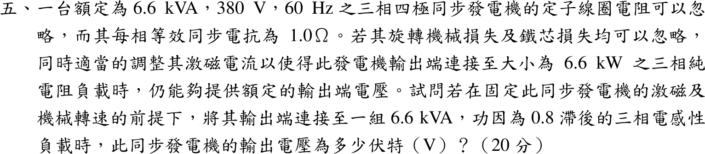

# 104 年電機機械第 5 題｜固定激磁下的端電壓

## 已知與所求

三相四極同步發電機：6.6 kVA、380 V、60 Hz，\(R_a\approx0\)、\(X_s=1.0\ \Omega\)/相，機械與鐵損忽略。先調激磁使 6.6 kW 三相純電阻負載下端電壓為額定 380 V；之後激磁與轉速不變，改接 6.6 kVA、功因 0.8 滯後的電感性負載。求此時輸出（線）電壓。

## 考場標準作答

### 步驟一：由電阻負載決定 \(E_f\)

\(V_\phi=380/\sqrt3=219.39\ \mathrm V\)，\(I_a=\dfrac{6600}{\sqrt3(380)}=10.028\ \mathrm A\)（與 \(V_\phi\) 同相）：
\[
E_f=|V_\phi+jX_sI_a|=\sqrt{219.39^2+10.028^2}=219.62\ \mathrm V/\text{相}
\]

### 步驟二：改接 0.8 滯後負載

負載以額定 380 V 下 6.6 kVA 定義，阻抗：
\[
Z_L=\frac{380^2}{6600}\angle36.87^\circ=21.88\angle36.87^\circ=17.50+j13.13\ \Omega
\]
電壓分壓：
\[
V_\phi'=E_f\frac{|Z_L|}{|Z_L+jX_s|}=219.62\frac{21.88}{|17.50+j14.13|}=219.62\frac{21.88}{22.49}=213.66\ \mathrm V
\]
\[
\boxed{V_L=\sqrt3(213.66)\approx370\ \mathrm V}
\]

## 驗算

回代：\(I=V_\phi'/|Z_L|=213.66/21.88=9.765\ \mathrm A\)，落後 \(36.87^\circ\)，\(jX_s\mathbf I=5.859+j7.812\ \mathrm V\)，\(|V_\phi'+jX_s\mathbf I|=|219.52+j7.812|=219.6\ \mathrm V\approx E_f\)。

## 失分點

- 滯後負載使電樞反應去磁，端電壓低於額定；若沿用 \(E_f=V_\phi+jX_sI\) 而 \(I\) 與 \(V\) 同相，會得 380 V。
- \(E_f\) 由「電阻負載、額定電壓」得出，不是由 0.8 滯後條件得出。

## 條件與疑義

「6.6 kVA 0.8 滯後負載」可有三種讀法，皆與 370 V 差 0.2% 以內：恆定阻抗（上式）370.0 V；負載恆定取 6.6 kVA（電流隨電壓 \(I=6600/3V_\phi\) 變化）369.4 V；電流固定為額定 10.028 A 369.7 V。
