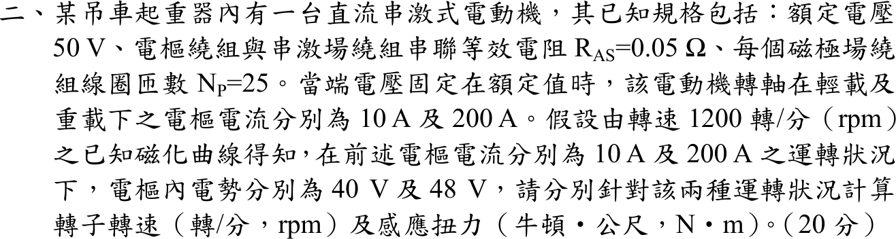

# 107 年電機機械第 2 題｜直流串激電動機工作點

## 已知與所求

串激式直流電動機：額定電壓 \(V_t=50\ \mathrm V\)、電樞加串激場總電阻 \(R_{AS}=0.05\ \Omega\)、每極線圈 \(N_p=25\) 匝。端電壓維持額定，輕載與重載電樞電流分別為 10 A 與 200 A。由 1200 rpm 磁化曲線，這兩個電流下的內電勢（1200 rpm）分別為 \(E_{a0}=40\ \mathrm V\)、\(48\ \mathrm V\)。求兩種狀況的轉速與感應轉矩。

## 考場標準作答

工作點反電勢 \(E_a=V_t-I_aR_{AS}\)；磁化曲線給的是同一電流（同一磁通）在 1200 rpm 的 \(E_{a0}\)，因 \(E_a\propto n\)，\(n=1200\,E_a/E_{a0}\)；感應（電磁）轉矩 \(T=E_aI_a/\omega_m\)。題目問感應轉矩，不另扣題面未給的旋轉損失。\(N_p\) 在已有磁化曲線時不需使用。

### 輕載 \(I_a=10\ \mathrm A\)

\[
E_a=50-10(0.05)=49.5\ \mathrm V,\qquad
\boxed{n=1200\frac{49.5}{40}=1485\,\mathrm{rpm}}
\]
\[
\omega_m=\frac{2\pi(1485)}{60}=155.51\ \mathrm{rad/s},\qquad
\boxed{T=\frac{49.5(10)}{155.51}=3.183\,\mathrm{N\cdot m}}
\]

### 重載 \(I_a=200\ \mathrm A\)

\[
E_a=50-200(0.05)=40.0\ \mathrm V,\qquad
\boxed{n=1200\frac{40.0}{48}=1000\,\mathrm{rpm}}
\]
\[
\omega_m=\frac{2\pi(1000)}{60}=104.72\ \mathrm{rad/s},\qquad
\boxed{T=\frac{40.0(200)}{104.72}=76.394\,\mathrm{N\cdot m}}
\]

## 驗算

轉矩只與磁通和電流有關，可由磁化曲線直接算：\(T=E_{a0}I_a/\omega_0\)，\(\omega_0=2\pi(1200)/60=125.66\ \mathrm{rad/s}\)。輕載 \(40(10)/125.66=3.183\ \mathrm{N\cdot m}\)，重載 \(48(200)/125.66=76.394\ \mathrm{N\cdot m}\)，與上式相同。

## 失分點

- 把磁化曲線的 40 V、48 V 當成工作點反電勢，漏掉 \(V_t-I_aR_{AS}\) 的 0.5 V 與 10 V 壓降。
- 把兩工作點視為同一磁通（例如重載也用 40 V 曲線值），重載會得 \(n=1200(40/40)=1200\ \mathrm{rpm}\)，正確應用 48 V 曲線值得 1000 rpm。
- 以 rpm 直接除 \(P\) 求轉矩，漏 \(2\pi/60\)。
