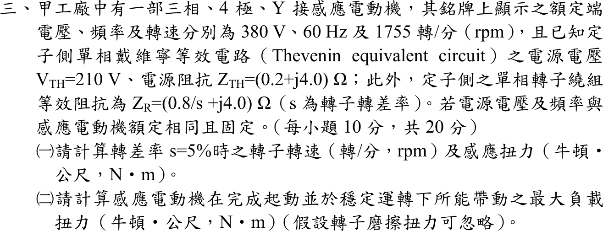

# 107 年電機機械第 3 題｜感應電動機戴維寧等效與轉矩

## 已知與所求

三相、4 極、Y 接感應電動機，額定 380 V、60 Hz、1755 rpm。定子側單相戴維寧等效：\(V_{TH}=210\ \mathrm V\)、\(Z_{TH}=0.2+j4.0\ \Omega\)；轉子單相等效阻抗 \(Z_R=0.8/s+j4.0\ \Omega\)。求（一）\(s=5\%\) 的轉子轉速與感應轉矩；（二）完成起動並穩定運轉時所能帶動的最大負載轉矩（轉子摩擦忽略）。

## 考場標準作答

### （一）\(s=5\%\)

\[
n_s=\frac{120(60)}{4}=1800\ \mathrm{rpm},\qquad
\boxed{n=(1-0.05)(1800)=1710\ \mathrm{rpm}},\qquad \omega_s=188.50\ \mathrm{rad/s}
\]
\[
I_2'=\frac{210}{|0.2+16+j8.0|}=\frac{210}{18.068}=11.623\ \mathrm A
\]
\[
\boxed{T_{ind}=\frac{3I_2'^2(0.8/s)}{\omega_s}=\frac{3(11.623)^2(16)}{188.50}=34.40\text{ N}\cdot\text{m}}
\]

### （二）最大負載轉矩

穩定運轉的最大轉矩即崩潰轉矩（摩擦忽略，負載轉矩 ＝ 感應轉矩）：
\[
s_{max}=\frac{R_2'}{\sqrt{R_{TH}^2+(X_{TH}+X_2')^2}}=\frac{0.8}{\sqrt{0.2^2+8^2}}=0.0999
\]
\[
\boxed{T_{max}=\frac{3V_{TH}^2}{2\omega_s\left[R_{TH}+\sqrt{R_{TH}^2+(X_{TH}+X_2')^2}\right]}=\frac{3(210)^2}{2(188.50)(0.2+8.0025)}=42.78\text{ N}\cdot\text{m}}
\]

## 驗算

直接以電路在 \(s=0.0999\) 計算：\(R_2'/s=8.0025\ \Omega\)，\(|Z|=\sqrt{8.2025^2+8^2}=11.457\ \Omega\)，\(I_2'=18.33\ \mathrm A\)，\(T=3(18.33)^2(8.0025)/188.50=42.78\ \mathrm{N\cdot m}\)。在 \(0<s\le1\) 掃描 \(T(s)\)，最大值同在 \(s\approx0.10\)。堵轉（\(s=1\)）時 \(T=8.64\ \mathrm{N\cdot m}\)，說明「完成起動」後才可帶到 42.78 N·m。

## 失分點

- 同步轉速用 3600 rpm（忘記 4 極），或轉子轉速誤寫 1755 rpm（那是額定轉速，不是 5% 滑差）。
- 氣隙功率漏用 \(R_2'/s=16\ \Omega\)，改用 0.8 Ω。
- 最大轉矩把 \(R_{TH}\) 或 \(X_2'\) 漏掉；\(s_{max}\) 的分母要含 \(X_{TH}+X_2'=8\ \Omega\)。
