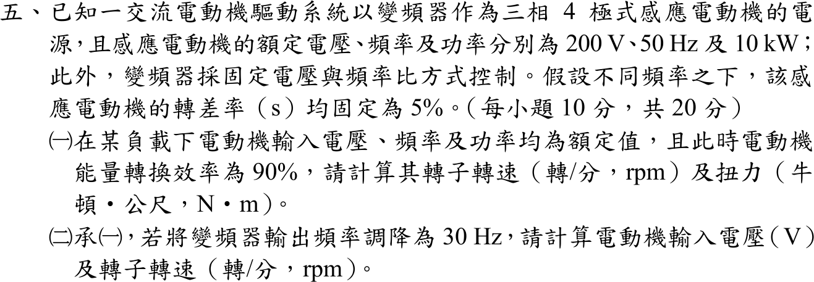

# 107 年電機機械第 5 題｜感應電動機 V/f 控制

## 已知與所求

三相 4 極感應電動機，額定 200 V、50 Hz、10 kW（輸入功率），變頻器採固定 V/f，各頻率轉差率固定 \(s=5\%\)。（一）額定電壓、頻率、輸入功率且能量轉換效率 90% 時的轉子轉速與扭力；（二）頻率調為 30 Hz 時的輸入電壓與轉子轉速。

## 考場標準作答

### （一）額定頻率

\[
n_s=\frac{120(50)}{4}=1500\ \mathrm{rpm},\qquad
\boxed{n=(1-0.05)(1500)=1425\,\mathrm{rpm}}
\]
能量轉換效率 90%，機械輸出 \(P_m=0.90(10)=9.0\ \mathrm{kW}\)（題目未另給機械損，視為軸功率）：
\[
\omega_m=\frac{2\pi(1425)}{60}=149.23\ \mathrm{rad/s},\qquad
\boxed{T=\frac{9000}{149.23}=60.31\ \mathrm{N\cdot m}}
\]

### （二）30 Hz

V/f 固定：
\[
\boxed{V_2=200\cdot\frac{30}{50}=120\,\mathrm V}
\]
\[
n_{s2}=\frac{120(30)}{4}=900\ \mathrm{rpm},\qquad
\boxed{n_2=(1-0.05)(900)=855\,\mathrm{rpm}}
\]

## 驗算

氣隙功率法：\(P_{ag}=P_m/(1-s)=9000/0.95=9473.7\ \mathrm W\)，\(T=P_{ag}/\omega_s=9473.7/157.08=60.31\ \mathrm{N\cdot m}\)，與軸功率法相同。V/f 檢查：\(200/50=120/30=4\ \mathrm{V/Hz}\)，轉差率 \(855/900=0.95\)。

## 失分點

- 把 10 kW 當軸功率（漏乘效率 90%）得 67.01 N·m；或用 1500 rpm 當轉子轉速得 57.30 N·m。
- 以電壓與頻率的平方成比例（或 \(V\propto f^2\)）算 \(V_2\)；固定 V/f 是一次方比例。
- 30 Hz 轉差率改變：題目明示各頻率 \(s\) 固定為 5%。
