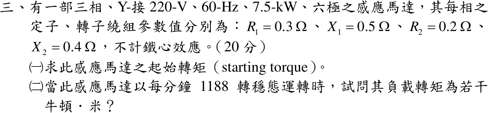

# 109 年電機機械第 3 題｜感應馬達起動轉矩與負載轉矩

## 已知與所求

三相 Y 接、220 V、60 Hz、7.5 kW、六極感應馬達，\(R_1=0.3\)、\(X_1=0.5\)、\(R_2=0.2\)、\(X_2=0.4\ \Omega\)，不計鐵心效應（無激磁支路）。求（一）起動轉矩；（二）1188 rpm 穩態時的負載轉矩。

## 考場標準作答

\(V_\phi=220/\sqrt3=127.02\ \mathrm V\)，\(n_s=1200\ \mathrm{rpm}\)，\(\omega_s=125.66\ \mathrm{rad/s}\)；無激磁支路時 \(I_1=I_2\)，
\[
T=\frac{3I_2^2R_2/s}{\omega_s},\qquad I_2=\frac{V_\phi}{\sqrt{(R_1+R_2/s)^2+(X_1+X_2)^2}}
\]

### （一）起動轉矩（\(s=1\)）

\[
I_2=\frac{127.02}{\sqrt{0.5^2+0.9^2}}=\frac{127.02}{1.0296}=123.37\ \mathrm A,\qquad
\boxed{T_{st}=\frac{3(123.37)^2(0.2)}{125.66}=72.67\text{ N}\cdot\text{m}}
\]

### （二）1188 rpm 負載轉矩

\(s=(1200-1188)/1200=0.01\)，\(R_2/s=20\ \Omega\)：
\[
I_2=\frac{127.02}{\sqrt{20.3^2+0.9^2}}=6.2509\ \mathrm A,\qquad
\boxed{T_L=\frac{3(6.2509)^2(20)}{125.66}=18.66\text{ N}\cdot\text{m}}
\]
穩態且無機械損失時，負載轉矩等於電磁轉矩。

## 驗算

機械功率法：\(P_{ag}=3(6.2509)^2(20)=2344.4\ \mathrm W\)，\(P_{conv}=(1-s)P_{ag}=2320.9\ \mathrm W\)，\(\omega_m=2\pi(1188)/60=124.41\ \mathrm{rad/s}\)，\(T=2320.9/124.41=18.66\ \mathrm{N\cdot m}\)，與氣隙功率法相同。量級：2.32 kW 低於 7.5 kW 額定，屬輕載。

## 失分點

- 轉矩除以轉子機械角速度 \(\omega_m\) 卻用 \(P_{ag}\)（或除以 \(\omega_s\) 卻用 \(P_{conv}\)），兩者混用。
- 用線電壓 220 V 當相電壓，轉矩多出 3 倍。
- 六極 60 Hz 同步轉速誤為 1800 rpm，使 \(s=0.34\)。
