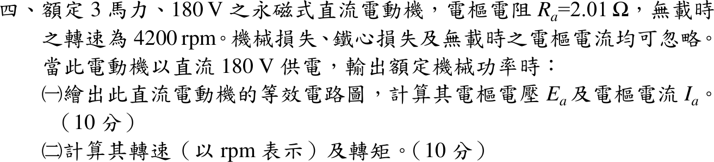

# 110 年電機機械第 4 題｜永磁式直流電動機額定工作點



## 已知與所求

3 hp、180 V 永磁式直流電動機，\(R_a=2.01\ \Omega\)，無載轉速 4200 rpm；機械損、鐵損及無載電樞電流忽略。180 V 供電、輸出額定機械功率時，求（一）等效電路、\(E_a\)、\(I_a\)；（二）轉速與轉矩。

## 考場標準作答

### （一）等效電路、\(E_a\) 與 \(I_a\)

```text
      I_a →
  ●──────[ R_a = 2.01 Ω ]──────┐
  +                            +
 V_t = 180 V                 ( E_a )   永磁場：kφ 固定
  −                            −
  ●────────────────────────────┘
        V_t = E_a + I_a R_a ,  P_out = E_a I_a
```

無載 \(I_a=0\Rightarrow E_a=180\ \mathrm V\) 於 4200 rpm，\(K=180/4200\ \mathrm{V/rpm}\)。忽略其他損失，\(P_{out}=E_aI_a=3(746)=2238\ \mathrm W\)：
\[
(180-2.01I_a)I_a=2238\Rightarrow 2.01I_a^2-180I_a+2238=0
\]
\[
I_a=\frac{180-\sqrt{180^2-4(2.01)(2238)}}{2(2.01)}=\frac{180-120.03}{4.02}
\]
\[
\boxed{I_a=14.92\ \mathrm A,\quad E_a=180-2.01(14.92)=150.01\ \mathrm V}
\]
另一根 \(I_a=74.63\ \mathrm A\)（\(E_a=30\ \mathrm V\)，效率僅 16.7%，且為不穩定的低速平衡點）不取。

### （二）轉速與轉矩

\[
n=4200\times\frac{150.01}{180}=3500.3\ \mathrm{rpm},\qquad
T=\frac{2238}{3500.3(2\pi/60)}=\frac{2238}{366.55}
\]
\[
\boxed{n\approx3500\ \mathrm{rpm},\quad T=6.106\ \mathrm{N\cdot m}}
\]

## 驗算

轉矩常數法：\(K_T=180/(4200\cdot2\pi/60)=0.40926\ \mathrm{N\cdot m/A}\)，\(T=K_TI_a=0.40926(14.92)=6.106\ \mathrm{N\cdot m}\)。KVL：\(150.01+14.92(2.01)=180.0\ \mathrm V\)；功率：\(180(14.92)=2685.6=2238+14.92^2(2.01)=2238+447.4\ \mathrm W\)。

## 失分點

- 把 \(P_{out}=2238\ \mathrm W\) 當輸入功率，算成 \(I_a=2238/180=12.43\ \mathrm A\)，漏掉 \(I_a^2R_a\)。
- 二次式取大根 74.63 A，得 700 rpm、30.5 N·m。
- 轉矩用 rpm 直接除：\(T=P/n\)；須換成 \(\omega=2\pi n/60\)。
