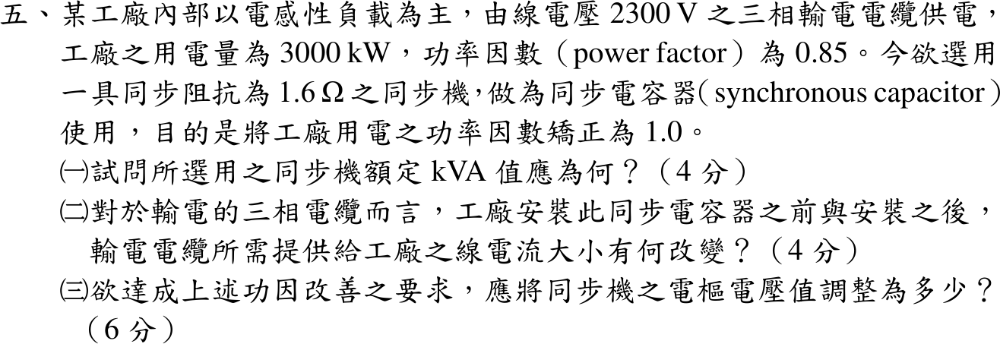

# 111 年電機機械第 5 題｜同步電容器功率因數改善

## 已知與所求

線電壓 2300 V 三相供電，工廠 3000 kW、PF 0.85 落後；同步機（同步阻抗 1.6 Ω，視為每相 \(X_s\)，忽略 \(R_a\) 與損失）作同步電容器，將 PF 改善為 1.0。求（一）同步機額定 kVA；（二）安裝前後電纜線電流；（三）所需電樞（內生）電壓。

## 考場標準作答

### （一）同步機額定容量

同步電容器不供實功率，只需補償全部落後無效功率：
\[
Q_c=P\tan(\cos^{-1}0.85)=3000(0.61974)=1859.2\ \mathrm{kvar}
\]
\[
\boxed{S_{sc}\approx1859\ \mathrm{kVA}}
\]

### （二）電纜線電流

\[
I_{\text{前}}=\frac{3000\times10^3}{\sqrt3(2300)(0.85)}=885.96\ \mathrm A,\qquad
I_{\text{後}}=\frac{3000\times10^3}{\sqrt3(2300)}=753.07\ \mathrm A
\]
\[
\boxed{885.96\ \mathrm A\rightarrow753.07\ \mathrm A,\ \text{減少 }132.9\ \mathrm A\ (15\%)}
\]

### （三）電樞電壓

\(V_\phi=2300/\sqrt3=1327.91\ \mathrm V\)，同步機電流 \(I_c=Q_c/(\sqrt3V_L)=466.71\ \mathrm A\)，超前 \(90^\circ\)：\(\underline I_c=j466.71\ \mathrm A\)。電動機慣例：
\[
\underline E_f=\underline V_\phi-jX_s\underline I_c=1327.91-j1.6(j466.71)=1327.91+746.73=2074.64\ \mathrm V
\]
\[
\boxed{E_f=2074.6\text{ V/相}\ (\text{線間 }3593\ \mathrm V)}
\]
\(E_f>V_\phi\)，為過激磁運轉。

## 驗算

匯流排 KCL：\(\underline I_{\text{負載}}=885.96\angle-31.79^\circ=753.07-j466.71\)，加上 \(j466.71\) 得 \(753.07\angle0^\circ\ \mathrm A\)，與（二）一致。同步機無效功率另算：\(Q=3V_\phi(E_f-V_\phi)/X_s=3(1327.91)(746.73)/1.6=1859.2\ \mathrm{kvar}\)，與（一）相同。

## 失分點

- 以 \(P/0.85=3529\ \mathrm{kVA}\) 當同步機容量；同步電容器只承擔無效功率 1859 kvar。
- 電動機式寫成 \(\underline E=\underline V+jX_s\underline I\) 且電流取超前，得 \(E_f=581\ \mathrm V\)（欠激磁），與「當電容器」矛盾。
- 相電壓與線電壓混用：用 2300 V 直接加 \(X_sI\)，答成 3047 V。
