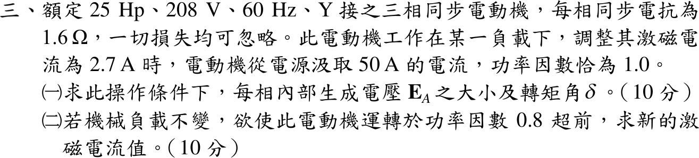

# 112 年電機機械第 3 題｜同步電動機激磁調整

## 已知與所求

25 hp、208 V、60 Hz、Y 接同步電動機，\(X_s=1.6\ \Omega\)，損失忽略；\(I_f=2.7\ \mathrm A\) 時取 50 A、PF 1.0。求（一）\(E_A\) 與轉矩角 \(\delta\)；（二）負載不變、PF 0.8 超前時的激磁電流。

## 考場標準作答

### （一）內部生成電壓與轉矩角

\(V_\phi=208/\sqrt3=120.09\ \mathrm V\)，\(\mathbf I_A=50\angle0^\circ\)，電動機方程：
\[
\mathbf E_A=\mathbf V_\phi-jX_s\mathbf I_A=120.09-j80.0\ \mathrm V
\]
\[
\boxed{|E_A|=144.3\ \mathrm{V/相}},\qquad \boxed{\delta=\tan^{-1}\frac{-80}{120.09}=-33.67^\circ}
\]

### （二）新的激磁電流

負載不變且無損失 → 輸入實功率不變：\(I_A(0.8)=50\Rightarrow I_A=62.5\ \mathrm A\)，\(\mathbf I_A=62.5\angle36.87^\circ=50+j37.5\ \mathrm A\)。
\[
\mathbf E_A=120.09-j1.6(50+j37.5)=180.09-j80.0\ \mathrm V,\qquad |E_A|=197.06\ \mathrm V
\]
未飽和時 \(E_A\propto I_f\)：
\[
\boxed{I_f=2.7\times\frac{197.06}{144.30}=3.69\ \mathrm A}
\]

## 驗算

定功率軌跡：\(P=3V_\phi E_A\sin|\delta|/X_s\) 不變，故 \(E_A\sin|\delta|=X_sP/(3V_\phi)=1.6(50)=80\ \mathrm V\)；兩個工作點的虛部都是 \(-80\ \mathrm V\)，符合。\(P=3(120.09)(50)=18.01\ \mathrm{kW}=3(120.09)(62.5)(0.8)\)。

## 失分點

- 用發電機方程 \(\mathbf V+jX\mathbf I\)，使 \(\delta\) 變號、（二）的 \(|E_A|\) 變小。
- PF 改變後仍取 50 A，違反定負載條件。

## 條件與疑義

題目未給磁化曲線，（二）採未飽和線性關係 \(E_A\propto I_f\)；若鐵心已飽和，所需激磁電流會大於 3.69 A。
