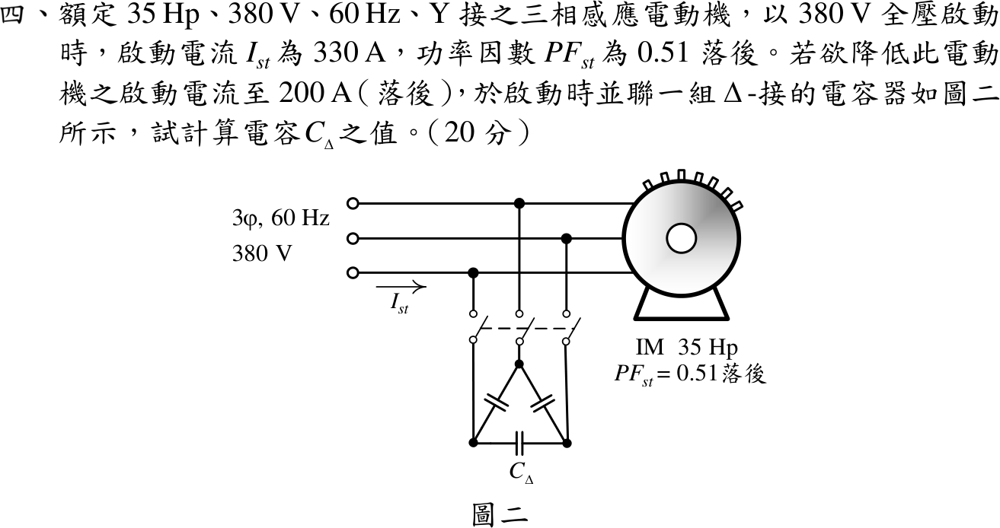

# 112 年電機機械第 4 題｜Δ 接電容降低感應電動機啟動電流

## 已知與所求

35 hp、380 V、60 Hz、Y 接感應電動機，全壓啟動 \(I_{st}=330\ \mathrm A\)、\(PF_{st}=0.51\) 落後；啟動時並聯 Δ 接電容，使線電流降為 200 A（仍落後）。求每支路電容 \(C_\Delta\)。

## 考場標準作答

以相電壓為基準，啟動電流分量：
\[
\mathbf I_m=330(0.51-j0.8602)=168.30-j283.86\ \mathrm A
\]
電容只供無功、不改變有功分量 168.30 A；補償後仍落後：
\[
I_q'=-\sqrt{200^2-168.30^2}=-108.05\ \mathrm A,\qquad I_{C,line}=283.86-108.05=175.81\ \mathrm A
\]
Δ 接每支路跨線電壓 380 V，支路電流 \(I_{C,line}/\sqrt3=101.50\ \mathrm A\)：
\[
X_C=\frac{380}{101.50}=3.744\ \Omega,\qquad
\boxed{C_\Delta=\frac{1}{2\pi(60)(3.744)}=708.5\ \mu\mathrm F}
\]

## 驗算

無功功率平衡：馬達 \(Q_m=\sqrt3(380)(283.86)=186.83\ \mathrm{kvar}\)，補償後 \(Q'=\sqrt3(380)(108.05)=71.12\ \mathrm{kvar}\)；電容須供 \(115.71\ \mathrm{kvar}=3V_{LL}^2\omega C_\Delta=3(380^2)(377)C_\Delta\)，得 \(C_\Delta=708.5\ \mu\mathrm F\)。

## 失分點

- 把線電流 \(175.81\ \mathrm A\) 直接當 Δ 支路電流，\(C\) 大 \(\sqrt3\) 倍（\(1227\ \mu\mathrm F\)）。
- 取正根 \(+108.05\ \mathrm A\)（超前），電容變為 \(1579\ \mu\mathrm F\)，違反「落後」條件。
