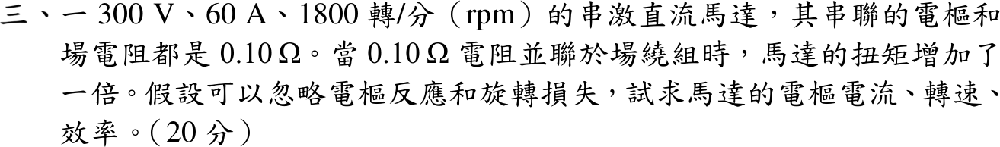

# 113 年電機機械第 3 題｜串激直流馬達分流與效率

## 已知與所求

串激直流馬達 300 V、60 A、1800 rpm，\(R_a=R_s=0.10\ \Omega\)；將 \(R_d=0.10\ \Omega\) 並聯於場繞組後扭矩加倍。忽略電樞反應與旋轉損失，求電樞電流、轉速、效率。

## 考場標準作答

### 電樞電流

分流後 \(I_f=I_a\dfrac{R_d}{R_s+R_d}=\dfrac{I_a}{2}\)。以磁化曲線 \(\Phi(I_f)\) 表示，\(T=K\Phi(I_f)I_a\)，扭矩加倍：
\[
\Phi\!\left(\frac{I_{a2}}{2}\right)I_{a2}=2\,\Phi(60)\times60
\]
取 \(I_{a2}=120\ \mathrm A\) 時左式為 \(\Phi(60)\times120\)，恰等於右式；且 \(\Phi(I_a/2)I_a\) 隨 \(I_a\) 嚴格遞增，解唯一：
\[
\boxed{I_{a2}=120\ \mathrm A},\qquad I_{f2}=60\ \mathrm A=I_{f1}\Rightarrow\Phi_2=\Phi_1
\]
（線性模型 \(\Phi\propto I_f\) 下即 \(I_{a2}^2/2=2(3600)\)，結果相同。）

### 轉速

\[
E_{a1}=300-60(0.1+0.1)=288\ \mathrm V,\qquad E_{a2}=300-120(0.1+0.05)=282\ \mathrm V
\]
\(\Phi_2=\Phi_1\)，\(E_a\propto\Phi n\)：
\[
\boxed{n_2=1800\times\frac{282}{288}=1762.5\ \mathrm{rpm}}
\]

### 效率

忽略旋轉損失，\(P_{out}=E_{a2}I_{a2}\)：
\[
\boxed{\eta=\frac{282\times120}{300\times120}=94.00\%}
\]

## 驗算

逐元件損失：電樞 \(120^2(0.1)=1440\ \mathrm W\)，場繞組 \(60^2(0.1)=360\ \mathrm W\)，分流電阻 \(60^2(0.1)=360\ \mathrm W\)，合計 2160 W；\(36000-2160=33840\ \mathrm W=282\times120\)，與 \(E_{a2}I_{a2}\) 相符。

## 失分點

- 忘記分流後場電流只剩 \(I_a/2\)，直接用 \(T\propto I_a^2\) 得 \(I_{a2}=84.9\ \mathrm A\)。
- 分流後電樞迴路電阻應為 \(0.1+0.1\parallel0.1=0.15\ \Omega\)，不是 0.2 Ω。

## 條件與疑義

- 題目未給磁化曲線，也未聲明未飽和。但分流後場電流恰回到 \(60\ \mathrm A\)，\(I_{a2}=120\ \mathrm A\) 對任何單調磁化曲線都滿足扭矩加倍，磁通不變，故三個答案不依賴線性假設；前提是題示「忽略電樞反應」。
