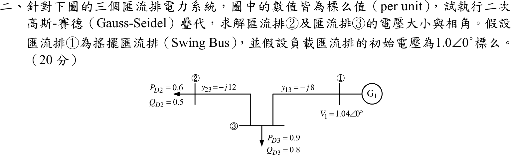
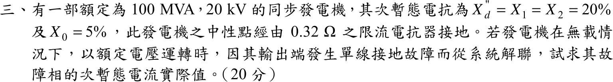
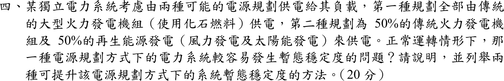
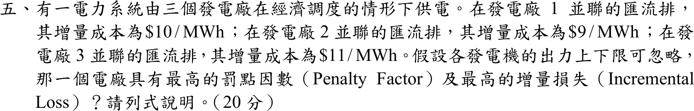

# 📝 105 年電機工程技師｜電力系統逐題詳解

> 本頁由題級 canonical 筆記組合；每題保留官方裁切圖、校驗狀態與可追溯的推導。

## 題目導覽
- [[#一、105 年電力系統第 1 題|第 1 題：105 年電力系統第 1 題]]
- [[#二、105 年電力系統第 2 題｜三匯流排高斯–賽德潮流迭代|第 2 題：三匯流排高斯–賽德潮流迭代]]
- [[#三、105 年電力系統第 3 題|第 3 題：105 年電力系統第 3 題]]
- [[#四、105 年電力系統第 4 題｜再生能源併網與暫態穩定度|第 4 題：再生能源併網與暫態穩定度]]
- [[#五、105 年電力系統第 5 題｜經濟調度罰點因數與增量損失|第 5 題：經濟調度罰點因數與增量損失]]

---

## 一、105 年電力系統第 1 題

> 題級識別：EE-105-05-1
> canonical 來源：[[canonical/EE-105-05-1.md]]
> 題級校驗狀態：verified

### 已知與所求

論述題，無數據。說明中、長程輸電線路串聯補償與並聯補償的主要目的，以及兩者如何實施。

### 考場標準作答

#### 1. 串聯補償（電容串入線路）

**目的**：抵消部分線路串聯感抗，縮短電氣距離。令補償度 \(k=X_C/X_L\)：
\[
X_{eff}=X_L-X_C=(1-k)X_L,\qquad
\boxed{P_{max}=\frac{V_1V_2}{X_{eff}}=\frac{V_1V_2}{(1-k)X_L}}
\]
傳輸容量極限提高為 \(1/(1-k)\) 倍（\(k=0.5\) 時加倍），暫態穩定度隨之改善，線路壓降 \(IX_{eff}\) 減小，並聯線路間的負載分配也較易調整。

**方式**：將電容器組串聯在相導線上（線路中段或兩端），並設旁路間隙／MOV 與旁路開關保護；補償度一般取部分補償（約 20–70%），避免次同步共振（SSR）與過度補償。

#### 2. 並聯補償（電容器或電抗器接在匯流排與地之間）

**目的**：平衡無功、控制電壓。小壓降近似 \(\Delta V\approx \dfrac{RP+XQ}{V}\)，並聯元件改變線路輸送的 \(Q\)：

- 重載：並聯電容器供應無功（\(\boxed{Q_c=V^2/X_c}\)），抵消感性負載需求，抬升受端電壓並降低線路電流與損失。
- 輕載或空載：長線路充電無功過剩，受端電壓升高（費蘭梯效應 \(V_r=V_s/\cos\beta\ell\)），須並聯電抗器吸收多餘無功以抑制過電壓。

**方式**：在變電所匯流排或線路中段、兩端投入並聯電容器組與並聯電抗器（機械開關切換）；需連續或快速調節時採用 SVC、STATCOM 或同步調相機。

### 驗算

以符號與數值核對上述關係：\(P_{max}\) 比值化簡為 \(1/(1-k)\)，\(k=0.5\) 時為 2；以同一線路（一般示例參數，非題目數據）解受端電壓，並聯電容投入前後受端電壓由約 0.806 升至 0.969 pu，方向與「重載並聯電容升壓」一致；\(1/\cos\beta\ell>1\) 對任意 \(\beta\ell>0\) 成立，故空載線路受端電壓高於送端。

### 失分點

- 並聯電容器是「供應」無功以抵消感性需求，不是供應「感性虛功」；方向寫反會被扣分。
- 串聯補償靠降低 \(X_{eff}\) 提高 \(P_{max}\) 與穩定度，並聯補償靠無功平衡控制電壓；兩者目的不可混為一談。
- 只答「如何進行」而漏寫串聯補償的保護（旁路間隙／MOV）與 \(k\) 的限制，屬方法敘述不完整。

---

## 二、105 年電力系統第 2 題｜三匯流排高斯–賽德潮流迭代

> 題級識別：EE-105-05-2
> canonical 來源：[[canonical/EE-105-05-2.md]]
> 題級校驗狀態：verified

### 已知與所求

標么值系統：匯流排 ① 為搖擺匯流排，\(V_1=1.04\angle0^\circ\)；線路 \(y_{13}=-j8\)（①–③）、\(y_{23}=-j12\)（②–③），①②間無線路；負載 \(S_{D2}=0.6+j0.5\)、\(S_{D3}=0.9+j0.8\)。負載匯流排初值 \(V_2^{(0)}=V_3^{(0)}=1.0\angle0^\circ\)。求二次高斯–賽德疊代後 \(V_2,V_3\) 的大小與相角。圖中未標示並聯元件，假設無（\(Y_{ii}\) 只含線路導納）。

### 考場標準作答

#### 1. 導納與注入

\[
Y_{22}=-j12,\quad Y_{33}=-j20,\quad Y_{23}=Y_{32}=+j12,\quad Y_{31}=+j8
\]
負載為負注入：\(S_2=-0.6-j0.5\)、\(S_3=-0.9-j0.8\)，故 \(P_i-jQ_i\) 分別為 \(-0.6+j0.5\)、\(-0.9+j0.8\)。

\[
V_i^{(k+1)}=\frac1{Y_{ii}}\left[\frac{P_i-jQ_i}{(V_i^{(k)})^*}-\sum_{j<i}Y_{ij}V_j^{(k+1)}-\sum_{j>i}Y_{ij}V_j^{(k)}\right]
\]
同一輪中 \(V_3\) 立即使用剛算出的 \(V_2\)。

#### 2. 第一次疊代

\[
V_2^{(1)}=\frac{(-0.6+j0.5)-j12(1)}{-j12}=0.958333-j0.050000=0.959637\angle-2.987^\circ
\]
\[
V_3^{(1)}=\frac{(-0.9+j0.8)-j12V_2^{(1)}-j8(1.04)}{-j20}=0.951000-j0.075000=0.953953\angle-4.509^\circ
\]

#### 3. 第二次疊代

\[
\frac{-0.6+j0.5}{(V_2^{(1)})^*}=-0.59724+j0.55290
\]
\[
V_2^{(2)}=\frac{(-0.59724+j0.55290)-j12V_3^{(1)}}{-j12}
\;\Rightarrow\;
\boxed{V_2^{(2)}=0.904925-j0.124770=0.913486\angle-7.8504^\circ\ \mathrm{pu}}
\]
\[
V_3^{(2)}=\frac{\dfrac{-0.9+j0.8}{(V_3^{(1)})^*}-j12V_2^{(2)}-j8(1.04)}{-j20}
\;\Rightarrow\;
\boxed{V_3^{(2)}=0.913445-j0.118592=0.921111\angle-7.3973^\circ\ \mathrm{pu}}
\]

### 驗算

將第二輪結果回代各更新式的等號兩側：
\[
-j12V_2^{(2)}+j12V_3^{(1)}=-0.59724+j0.55290=\frac{-0.6+j0.5}{(V_2^{(1)})^*},
\]
\[
-j20V_3^{(2)}+j12V_2^{(2)}+j8(1.04)=-0.87459+j0.91019=\frac{-0.9+j0.8}{(V_3^{(1)})^*}
\]
兩側相等。兩次疊代尚未收斂：以相同公式迭代至收斂得 \(V_2\approx0.733\angle-18.08^\circ\)、\(V_3\approx0.793\angle-13.14^\circ\)，故本題答案是「第二次疊代值」，不可寫成收斂解。

### 失分點

- 分子用 \(P_i-jQ_i\) 並除以 \(V_i^{(k)*}\)；負載若誤當正注入，會得 \(V_2^{(1)}=1.0417+j0.050\)（負載匯流排電壓反高於 1 pu，相角也反號）。
- 同一輪先算 \(V_2^{(2)}\)，再把它代入 \(V_3^{(2)}\)；\(V_3^{(2)}\) 若仍用 \(V_2^{(1)}\) 即成 Jacobi 法。
- 非對角項是支路導納的負值：\(Y_{23}=+j12\)、\(Y_{31}=+j8\)；搖擺匯流排 \(V_1=1.04\) 要代入 \(V_3\) 的式子，漏掉會少 \(-j8.32\) 項。

---

## 三、105 年電力系統第 3 題

> 題級識別：EE-105-05-3
> canonical 來源：[[canonical/EE-105-05-3.md]]
> 題級校驗狀態：verified

### 已知與所求

發電機 100 MVA、20 kV，\(X_d''=X_1=X_2=20\%\)、\(X_0=5\%\)，中性點經 \(0.32\ \Omega\) 限流電抗器接地。無載、額定電壓運轉，輸出端發生單線接地故障（已與系統解聯，只有發電機本身），求故障相次暫態電流實際值。故障前電壓取 \(1.0\) pu，故障阻抗為零。

### 考場標準作答

基準阻抗與中性點電抗標么值：
\[
Z_b=\frac{20^2}{100}=4\ \Omega,\qquad X_n=\frac{0.32}{4}=0.08\ \mathrm{pu}
\]
單線接地時三序網串聯，零序須含 \(3X_n\)：
\[
I_{a1}=\frac{1.0}{j(X_1+X_2+X_0+3X_n)}=\frac{1.0}{j(0.20+0.20+0.05+0.24)}=\frac{1}{j0.69}=-j1.4493\ \mathrm{pu}
\]
\[
I_f=3I_{a1}=-j4.3478\ \mathrm{pu},\qquad I_b=\frac{100}{\sqrt3(20)}=2.8868\ \mathrm{kA}
\]
\[
\boxed{|I_f|=4.3478\times2.8868=12.55\ \mathrm{kA}}
\]

### 驗算

改用實際歐姆值：\(Z_1=Z_2=0.20(4)=0.8\ \Omega\)，\(Z_0=0.05(4)=0.2\ \Omega\)，\(3X_n=0.96\ \Omega\)，相電壓 \(20/\sqrt3=11.547\) kV：
\[
I_{a1}=\frac{11\,547}{0.8+0.8+0.2+0.96}=\frac{11\,547}{2.76}=4184\ \mathrm{A},\qquad I_f=3I_{a1}=12.55\ \mathrm{kA}
\]
與標么法一致；中性點電流等於故障電流，中性點電壓 \(=12.55\times0.32=4.02\) kV。

### 失分點

- 圖中 \(X_0=5\%\)，不是 8%；若誤用 0.08（恰與 \(X_n\) 相同）會得 \(3/0.72=4.167\) pu、12.03 kA 的錯值。
- 中性點電抗在零序網要乘 3：\(3X_n=0.24\ \mathrm{pu}\)，漏乘 3 則總阻抗 0.53、電流 16.3 kA。
- 最後電流 \(I_f=3I_{a1}\)，不是 \(I_{a1}=1.449\) pu（4.18 kA）。

---

## 四、105 年電力系統第 4 題｜再生能源併網與暫態穩定度

> 題級識別：EE-105-05-4
> canonical 來源：[[canonical/EE-105-05-4.md]]
> 題級校驗狀態：verified

### 已知與所求

獨立電力系統兩種電源規劃：甲案 100% 傳統火力同步機；乙案 50% 火力＋50% 風力、太陽能。問正常運轉下何者較易發生暫態穩定度問題，並列舉兩種提升該方案暫態穩定度的方法。假設風光經變流器併網，本身不提供同步慣量，其餘條件相同。

### 考場標準作答

#### 1. 判定：乙案（50% 再生能源）較易發生暫態穩定問題

理由由搖擺方程式導出：
\[
\frac{2H}{\omega_s}\frac{d^2\delta}{dt^2}=P_m-P_e
\]
1. **慣量減半**：同步機只剩一半，系統等效 \(H\) 為甲案的 \(1/2\)。同樣擾動 \(\Delta P\) 下頻率變化率 \(\mathrm{RoCoF}=\dfrac{f_0\Delta P}{2H}\) 加倍；等面積準則下臨界清除時間 \(t_{cr}=\sqrt{\dfrac{2H(\delta_{cr}-\delta_0)}{\pi f_0P_m}}\propto\sqrt H\)，縮為 \(\boxed{t_{cr}\ \text{約為甲案的 }1/\sqrt2=0.707\ \text{倍}}\)。
2. **短路容量與電壓支撐下降**：變流器故障電流受限（約 1.1–1.5 pu），系統變弱，故障時電壓跌落較深、較久。
3. **故障穿越與鎖相迴路**：風光在電壓驟降時若無法穿越會跳機，造成二次失去發電；弱電網下 PLL 也可能失穩。

#### 2. 兩種提升方法（任列兩種）

- **加裝同步調相機**：提供旋轉慣量與短路容量，維持電壓。
- **虛擬慣性控制／成形電網（grid-forming）變流器，搭配電池儲能（BESS）**：模擬慣量並於故障後快速注入有功支援，降低 RoCoF。
- 另可：具故障穿越能力的變流器、STATCOM 動態無功支援、縮短故障清除時間。

### 驗算

用比例分析檢查：\(H\) 乘以 0.5 → RoCoF 乘以 2，\(t_{cr}\) 乘以 \(\sqrt{0.5}=0.707\)；兩者與選用的 \(H\)、\(\Delta P\)、\(P_m\)、\(\delta\) 數值無關，只依賴「同步慣量比例減半」這一題設事實。同步調相機補回慣量與短路容量，方向正確。

### 失分點

- 結論要明確寫「乙案」，並以慣量降低（\(H\) 減半）當主因；只列方法而無判定理由會失分。
- 虛擬慣性、調相機需與題設的變流器併網假設連結；若風光採同步機型併網，結論要另行評估。
- 方法至少給兩種且各附一句作用機理（調相機補慣量與短路容量；儲能與成形變流器補快速有功）。

---

## 五、105 年電力系統第 5 題｜經濟調度罰點因數與增量損失

> 題級識別：EE-105-05-5
> canonical 來源：[[canonical/EE-105-05-5.md]]
> 題級校驗狀態：verified

### 已知與所求

三座電廠經濟調度（考慮輸電損失），出力上下限可忽略。各電廠機組增量成本
\[
\text{IC}_1=10,\qquad \text{IC}_2=9,\qquad \text{IC}_3=11\quad\$/\mathrm{MWh}
\]
求何廠具有最高罰點因數 \(L\) 與最高增量損失 \(\mathrm{ITL}\)。系統增量成本 \(\lambda\) 題目未給，視為共同未知量；\(\text{IC}_i\) 解讀為各廠 \(dF_i/dP_i\)。

### 考場標準作答

含損失的最佳調度（協調方程式）：
\[
\text{IC}_iL_i=\lambda,\qquad L_i=\frac1{1-\mathrm{ITL}_i},\qquad \mathrm{ITL}_i=\frac{\partial P_L}{\partial P_i}
\]
故
\[
L_i=\frac{\lambda}{\text{IC}_i},\qquad \mathrm{ITL}_i=1-\frac1{L_i}=1-\frac{\text{IC}_i}{\lambda}
\]
\(L_i\) 與 \(\mathrm{ITL}_i\) 都是 \(\text{IC}_i\) 的遞減函數（\(\lambda>0\)，且 \(\lambda>11\) 才使 \(0<\mathrm{ITL}_i<1\)）。\(\text{IC}_2=9\) 最小，故
\[
\boxed{\text{發電廠 2 同時具最高罰點因數與最高增量損失}}
\]
排序為 \(L_2>L_1>L_3\)、\(\mathrm{ITL}_2>\mathrm{ITL}_1>\mathrm{ITL}_3\)，不需 \(\lambda\) 的數值。

### 驗算

兩廠之差與 \(\lambda\) 無關的符號：\(L_2-L_1=\lambda\!\left(\tfrac19-\tfrac1{10}\right)>0\)，\(L_2-L_3=\lambda\!\left(\tfrac19-\tfrac1{11}\right)>0\)，\(L_1-L_3>0\)。取 \(\lambda\) 由 11 掃到 200 逐點計算，第 2 廠的 \(L\) 與 \(\mathrm{ITL}\) 恆為最大。

### 失分點

- 罰點因數 \(L_i=\lambda/\text{IC}_i\)：增量成本最低的廠 \(L\) 最大，不是最高者最大；方向反了會選成第 3 廠。
- ITL 要用 \(1-1/L_i\)（或 \(1-\text{IC}_i/\lambda\)），不可與 \(L\) 直接當同一量比較數值。
- 排序題要寫出協調方程式 \(\text{IC}_iL_i=\lambda\)，只下結論不列式不得分（題目要求「列式說明」）。

### 條件與疑義

題目未給 \(\lambda\)，也未給損失係數；本題的判定只依賴協調方程式的單調性，結論對任何 \(\lambda>11\ \$/\mathrm{MWh}\) 成立。

---
