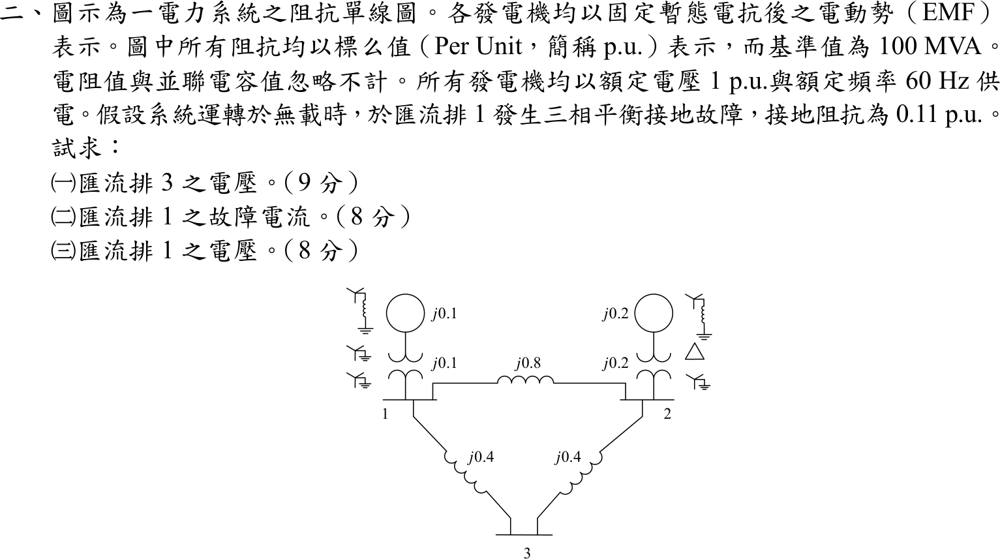

# 106 年電機工程技師｜電力系統逐題詳解

> 本頁由題級 canonical 筆記組合；每題保留官方裁切圖、校驗狀態與可追溯的推導。

## 題目導覽
- [[#一、106 年電力系統第 1 題|第 1 題：106 年電力系統第 1 題]]
- [[#二、106 年電力系統第 2 題|第 2 題：106 年電力系統第 2 題]]
- [[#三、106 年電力系統第 3 題｜三匯流排潮流與無效功率流向|第 3 題：三匯流排潮流與無效功率流向]]
- [[#四、106 年電力系統第 4 題|第 4 題：106 年電力系統第 4 題]]

---

## 一、106 年電力系統第 1 題

> 題級識別：EE-106-05-1
> canonical 來源：[[canonical/EE-106-05-1.md]]
> 題級校驗狀態：verified

### 已知與所求

三相 60 Hz、161 kV 輸電線長 40 km，每相 \(0.15\ \Omega/\mathrm{km}\)、\(1.3\ \mathrm{mH/km}\)，並聯電容忽略（短線模型）；受電端接 161 kV、300 MVA、功因 0.8 落後的負載。求（一）送電端電壓；（二）送電端三相功率輸出；（三）電壓調整率；（四）傳輸效率。

### 考場標準作答

線路每相阻抗：
\[
R=0.15(40)=6.0\ \Omega,\qquad X=2\pi(60)(1.3\times10^{-3})(40)=19.604\ \Omega
\]
受電端（相電壓為參考）：
\[
V_R=\frac{161\,000}{\sqrt3}=92\,952\ \mathrm V,\qquad I=\frac{300\times10^6}{\sqrt3(161\,000)}\angle-36.87^\circ=1075.8\angle-36.87^\circ=860.6-j645.5\ \mathrm A
\]

#### （一）送電端電壓

\[
V_S=V_R+(R+jX)I=92\,952+(17\,818+j12\,998)=110\,770+j12\,998\ \mathrm V
\]
\[
\boxed{V_S=111.53\angle6.69^\circ\ \mathrm{kV/相}},\qquad \boxed{V_{S,LL}=\sqrt3(111.53)=193.18\ \mathrm{kV}}
\]

#### （二）送電端三相功率

線損 \(3I^2R=3(1075.8)^2(6)=20.83\) MW；負載 \(P_R=300(0.8)=240\) MW、\(Q_R=300(0.6)=180\) Mvar，線路電抗消耗 \(3I^2X=68.07\) Mvar：
\[
\boxed{P_S=240+20.83=260.83\ \mathrm{MW}},\qquad \boxed{Q_S=180+68.07=248.07\ \mathrm{Mvar}}
\]

#### （三）電壓調整率

短線無並聯分路，無載時受電端電壓等於 \(V_S\)：
\[
\mathrm{VR}=\frac{|V_S|-|V_R|}{|V_R|}\times100\%=\frac{111.53-92.952}{92.952}\times100\%=\boxed{19.99\%}
\]

#### （四）傳輸效率

\[
\eta=\frac{P_R}{P_S}\times100\%=\frac{240}{260.83}\times100\%=\boxed{92.01\%}
\]

### 驗算

以複功率回推電壓：\(|S_S|=\sqrt{260.83^2+248.07^2}=359.97\) MVA，
\[
V_{S,LL}=\frac{|S_S|}{\sqrt3\,|I|}=\frac{359.97\times10^6}{\sqrt3(1075.8)}=193.18\ \mathrm{kV}
\]
與相量法相同；\(P_S\) 亦等於 \(3\,\mathrm{Re}(V_SI^*)=260.83\) MW。

### 失分點

- \(X=\omega L\ell\) 要乘 40 km 並把 mH 換成 H：\(0.49009\ \Omega/\mathrm{km}\times40=19.604\ \Omega\)。
- 電壓調整率用相電壓比相電壓（或線電壓比線電壓）；以 193.18 kV 對 92.95 kV 比較會得 107.8%。
- 效率是有功比 \(P_R/P_S\)，不是視在功率比；送電端 \(Q_S\) 含線路電抗消耗，不可直接取負載 180 Mvar。

---

## 二、106 年電力系統第 2 題

> 題級識別：EE-106-05-2
> canonical 來源：[[canonical/EE-106-05-2.md]]
> 題級校驗狀態：verified

### 已知與所求

100 MVA 基準標么阻抗圖：發電機 \(G_1\) 的 \(j0.1\) 與變壓器 \(j0.1\) 接 Bus 1，\(G_2\) 的 \(j0.2\) 與變壓器 \(j0.2\) 接 Bus 2；線路 \(1\text{-}2\) 為 \(j0.8\)、\(1\text{-}3\) 與 \(2\text{-}3\) 各 \(j0.4\)。電阻與並聯電容忽略，發電機 EMF 為 1 p.u.。無載運轉，Bus 1 經接地阻抗 \(0.11\) p.u. 發生三相平衡接地故障（按純電抗網路取 \(Z_f=j0.11\)，見「條件與疑義」）。求（一）Bus 3 電壓；（二）Bus 1 故障電流；（三）Bus 1 電壓。

### 考場標準作答

#### 1. 戴維寧阻抗

無載時故障前各匯流排電壓皆為 \(V_f=1\angle0^\circ\)。發電機支路：Bus 1 為 \(0.1+0.1=j0.2\)，Bus 2 為 \(0.2+0.2=j0.4\)。從 Bus 1 看入，經 Bus 3 的路徑 \(0.4+0.4=0.8\) 與線路 \(1\text{-}2\) 的 \(0.8\) 並聯得 \(0.4\)，再串 Bus 2 發電機支路 \(0.4\)，得 \(0.8\)，與 Bus 1 發電機支路並聯：
\[
Z_{11}=j(0.2\parallel0.8)=j0.16
\]
注入 1 A 於 Bus 1：\(V_1=0.16\)，\(V_2=0.16\times\dfrac{0.4}{0.4+0.4}=0.08\)，Bus 3 在 \(1\text{-}3\text{-}2\) 路徑中點，\(V_3=\dfrac{0.16+0.08}{2}=0.12\)，故 \(Z_{21}=j0.08\)、\(Z_{31}=j0.12\)。

#### （二）故障電流

\[
I_f=\frac{V_f}{Z_{11}+Z_f}=\frac{1}{j(0.16+0.11)}=-j3.704\ \mathrm{pu}\quad\Rightarrow\quad \boxed{I_f=3.704\angle-90^\circ\ \mathrm{pu}}
\]

#### （一）Bus 3 電壓

\[
V_3=V_f-Z_{31}I_f=1-(j0.12)(-j3.704)=\boxed{0.5556\ \mathrm{pu}}
\]

#### （三）Bus 1 電壓

\[
V_1=I_fZ_f=(-j3.704)(j0.11)=\boxed{0.4074\ \mathrm{pu}}
\]

### 驗算

節點 KCL（Bus 2 電壓 \(V_2=1-Z_{21}I_f=0.7037\)）：Bus 1 的發電機供給 \((1-0.4074)/j0.2=-j2.963\)，流向 Bus 2 與 Bus 3 的電流為
\[
\frac{0.4074-0.7037}{j0.8}=j0.3704,\qquad \frac{0.4074-0.5556}{j0.4}=j0.3704
\]
故障電流 \(=-j2.963-j0.3704-j0.3704=-j3.704\)，與 \(I_f\) 相同；且 \(V_1=1-Z_{11}I_f=1-0.16(3.704)=0.4074\)。

### 失分點

- \(Z_{11}\) 不是只有 Bus 1 發電機支路 \(0.2\)（會得 \(I_f=3.226\)），要並聯整個其餘網路，結果為 \(0.16\)。
- \(Z_{31}\) 是 Bus 3 對 Bus 1 注入的互阻抗（\(0.12\)），不是 Bus 3 的自阻抗；電壓式為 \(V_3=V_f-Z_{31}I_f\)。
- 三相平衡故障只用正序網路；圖中變壓器接線與中性點接地僅影響不平衡故障，與本題無關。

### 條件與疑義

題面寫「接地阻抗為 0.11 p.u.」未標 \(j\)。本題網路為純電抗（電阻忽略），故取 \(Z_f=j0.11\)。若解讀為純電阻 \(0.11\) p.u.，則 \(|I_f|=1/|0.11+j0.16|=5.150\)，\(|V_1|=0.5665\)、\(|V_3|=0.6028\) p.u.。

---

## 三、106 年電力系統第 3 題｜三匯流排潮流與無效功率流向

> 題級識別：EE-106-05-3
> canonical 來源：[[canonical/EE-106-05-3.md]]
> 題級校驗狀態：verified

### 已知與所求

承上題的網路（線路電抗 \(x_{12}=0.8,\ x_{13}=0.4,\ x_{23}=0.4\) pu，取自上題圖），Bus 3 增加負載 \(S_L=1+j0.9\) pu；Bus 1 為無限匯流排 \(V_1=1\angle0^\circ\)；Bus 2 為發電機匯流排 \(P_2=1\) pu、\(|V_2|=1\) pu。求（一）導納矩陣；（二）潮流方程式；（三）Bus 1 的有功輸出；（四）Bus 2–3 線路無效功率流向。

### 考場標準作答

#### （一）導納矩陣

線路串聯導納 \(1/(jx)=-j/x\)：\(y_{12}=-j1.25\)、\(y_{13}=y_{23}=-j2.5\)。發電機暫態電抗不放入負載潮流的 \(Y_{bus}\)（Bus 1、Bus 2 以電壓／注入條件給定）：
\[
\boxed{
Y_{bus}=\begin{bmatrix}
-j3.75&j1.25&j2.50\\
j1.25&-j3.75&j2.50\\
j2.50&j2.50&-j5.00
\end{bmatrix}\ \mathrm{pu}}
\]

#### （二）潮流方程式

令 \(V_2=1\angle\delta_2\)、\(V_3=V_3\angle\delta_3\)，未知數為 \(\delta_2,\delta_3,V_3\)：
\[
\boxed{
\begin{aligned}
P_2&=1.25\sin\delta_2+2.5V_3\sin(\delta_2-\delta_3)=1\\
P_3&=2.5V_3\sin\delta_3+2.5V_3\sin(\delta_3-\delta_2)=-1\\
Q_3&=5V_3^2-2.5V_3\cos\delta_3-2.5V_3\cos(\delta_3-\delta_2)=-0.9
\end{aligned}}
\]

#### （三）Bus 1 有功輸出

網路無電阻，各匯流排實功注入總和為 0：
\[
P_1=-(P_2+P_3)=-(1-1)\ \Rightarrow\ \boxed{P_1=0\ \mathrm{pu}}
\]
此結果與電壓根無關。

#### （四）Bus 2–3 線路無效功率流向

以牛頓法解上列三式，得兩個正電壓根：

| 分支 | \(\delta_2\) | \(\delta_3\) | \(\lvert V_3\rvert\) | \(S_{23}\)（Bus 2 送出） |
| --- | --- | --- | --- | --- |
| 高電壓 | \(13.930^\circ\) | \(-10.092^\circ\) | 0.68692 | \(0.6991+j0.9314\) |
| 低電壓 | \(17.299^\circ\) | \(-22.009^\circ\) | 0.39673 | \(0.6283+j1.7326\) |

兩根的 \(\mathrm{Im}\,S_{23}\) 皆為正：
\[
\boxed{\text{Bus 2–3 線路無效功率流向：由 Bus 2 流向 Bus 3}}
\]

### 驗算

回代高電壓根，注入功率 \(S_1=j0.8460\)、\(S_2=1+j0.9682\)、\(S_3=-1-j0.9\)，\(P_1=0\)、\(P_2=1\)、\(P_3=-1\) 皆成立。無效功率守恆：\(0.8460+0.9682-0.9=0.9142=\sum|I_k|^2x_k\)（三條線路電抗消耗）。低電壓根同樣滿足 \(P_1=0\) 與守恆（\(\sum Q=2.5261\)）。

### 失分點

- \(Y_{bus}\) 以線路電抗 \(0.8/0.4/0.4\) 的倒數建立；若沿用其他電抗（如 0.2、0.25）則三個元素全錯。
- 負載為負注入：\(P_3=-1\)、\(Q_3=-0.9\)。
- \(P_1=0\) 來自無損網路的實功守恆，不需解出電壓；但 \(Q_1\)、\(V_3\) 要看採用哪一個根。

### 條件與疑義

題面未指定 Newton 初值或「正常運轉」分支，同一組方程有高、低兩個正電壓根；本題所問的 Y_bus、方程式、\(P_1=0\) 與 Bus 2–3 線路無效功率流向在兩根下相同，答案與分支無關。依通常運轉語境，高電壓根為主要候選，低電壓根亦保留作數值診斷（\(\lvert V_3\rvert\)、\(Q_1\) 才需指定分支，本題不問）。

#### Jacobian 分支診斷

令 \(F=[P_2-1,\ P_3+1,\ Q_3+0.9]^T\)，\(J=\partial F/\partial(\delta_2,\delta_3,V_3)\)：

| 分支 | \(\det J\) | 最小奇異值 |
| --- | ---: | ---: |
| 高電壓 \(\lvert V_3\rvert=0.68692\) pu | \(+10.8587\) | \(1.30072\) |
| 低電壓 \(\lvert V_3\rvert=0.39673\) pu | \(-4.96510\) | \(0.99092\) |

兩根的行列式正負號相反，表示分別位於潮流可解邊界（鼻點）兩側；高電壓根 \(\det J>0\)，對應通常的穩態操作分支，低電壓根 \(\det J<0\)。這是靜態潮流的分支診斷，不等同動態穩定證明，僅用於說明兩根的位置；所問答案不依賴分支選擇。

---

## 四、106 年電力系統第 4 題

> 題級識別：EE-106-05-4
> canonical 來源：[[canonical/EE-106-05-4.md]]
> 題級校驗狀態：verified

### 已知與所求

單相雙繞組變壓器一次側、二次側匝數比 \(N_1:N_2\)，一次電流 \(I_1\) 流入、二次電流 \(I_2\) 流出；CT\(_1\)、CT\(_2\) 匝數比為 \(1/n_1\)、\(1/n_2\)，二次電流 \(I_1'\)、\(I_2'\) 如圖，差動電驛電流 \(I'\)。求（一）\(I'\) 以 \(I_1,I_2,n_1,n_2\) 表示；（二）CT 匝數比應如何設定；（三）依（二）設定，變壓器內部無故障時的 \(I'\)。

### 考場標準作答

#### （一）差動電流

CT 電流與匝比成反比：\(I_1'=I_1/n_1\)、\(I_2'=I_2/n_2\)。圖中 \(I_1'\) 流入、\(I_2'\) 流出電驛中點，對該節點 KCL：
\[
\boxed{I'=I_1'-I_2'=\frac{I_1}{n_1}-\frac{I_2}{n_2}}
\]

#### （二）CT 匝比設定

理想變壓器安匝平衡 \(N_1I_1=N_2I_2\)，即 \(I_2=\dfrac{N_1}{N_2}I_1\)。為使無故障時 \(I'=0\)，兩側 CT 二次電流必須相等：
\[
\frac{I_1}{n_1}=\frac{N_1}{N_2}\frac{I_1}{n_2}\ \Rightarrow\ \boxed{\frac{n_1}{n_2}=\frac{N_2}{N_1}\ \ (n_1N_1=n_2N_2)}
\]
即 CT 匝比須與變壓器電流比互相補償：高壓（匝數多）側電流小，其 CT 的 \(n\) 取較小值；並使兩 CT 極性使穿越電流在電驛節點相減。

#### （三）內部無故障時

\[
I'=\frac{I_1}{n_1}-\frac{N_1}{N_2}\frac{I_1}{n_2}=0\ \Rightarrow\ \boxed{I'=0\ \mathrm A}
\]
電驛不動作；內部故障時 \(I_1\)、\(I_2\) 不再滿足安匝平衡，\(I'\neq0\)，電驛動作。

### 驗算

代入假設數值（非題目所給）：\(N_1/N_2=2\)（如 22 kV/11 kV）、\(n_2=200\)，則 \(n_1=n_2N_2/N_1=100\)。若 \(I_1=50\) A，則 \(I_2=100\) A，\(I_1'=0.5\) A、\(I_2'=0.5\) A，\(I'=0\)。若內部故障使 \(I_2\) 只有 80 A，則 \(I'=0.5-0.4=0.1\) A\(\neq0\)，電驛動作。

### 失分點

- 圖中 \(I_1'\)、\(I_2'\) 在同一導線上皆指向右，電驛節點電流是兩者相減 \(I_1'-I_2'\)，不是相加。
- 電流比 \(I_1/I_2=N_2/N_1\)（與匝數比相反）；把它寫成 \(N_1/N_2\) 會使 \(n_1/n_2\) 條件顛倒。
- \(I'=0\) 在忽略激磁電流與 CT 誤差時成立；實務上以抽頭或輔助 CT 補償標準匝比的差異，並用百分比制動避免誤動作。

---
