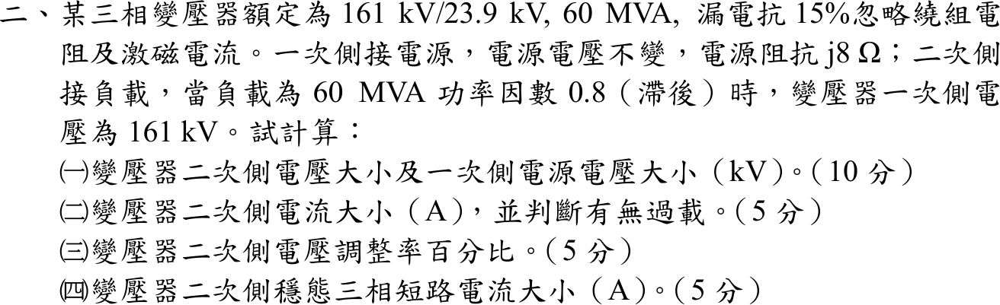
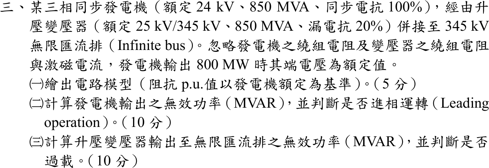
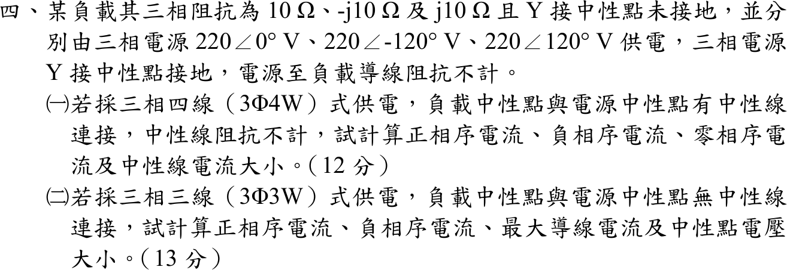

# 107 年電機工程技師｜電力系統逐題詳解

> 本頁由題級 canonical 筆記組合；每題保留官方裁切圖、校驗狀態與可追溯的推導。

## 題目導覽
- [[#一、107 年電力系統第 1 題｜輸電線並聯電容補償|第 1 題：輸電線並聯電容補償]]
- [[#二、107 年電力系統第 2 題｜變壓器電壓調整率與短路電流|第 2 題：變壓器電壓調整率與短路電流]]
- [[#三、107 年電力系統第 3 題｜同步發電機併網|第 3 題：同步發電機併網]]
- [[#四、107 年電力系統第 4 題｜三相四線／三線不平衡負載|第 4 題：三相四線／三線不平衡負載]]

---

## 一、107 年電力系統第 1 題｜輸電線並聯電容補償

> 題級識別：EE-107-05-1
> canonical 來源：[[canonical/EE-107-05-1.md]]
> 題級校驗狀態：verified


### 已知與所求

線路阻抗 \(0.02+j0.2\) pu；受電端負載 \(P=1.6\) pu、功因 0.8 落後，受電端電壓 \(|V_R|=1\) pu，電容器組補償虛功 \(Q_C=1.2\) pu（與負載並聯於受電端）。求（一）線路電流與有功損失；（二）送電端電壓；（三）電容器組阻抗；（四）送電端送出之 \(P\)、\(Q\)。

### 考場標準作答

負載 \(Q_L=1.6\tan(\cos^{-1}0.8)=1.2\) pu，故線路受電端淨功率 \(S_R=1.6+j(1.2-1.2)=1.6\) pu。取 \(V_R=1\angle0^\circ\)。

#### （一）線路電流與損失

\[
I=\Big(\frac{S_R}{V_R}\Big)^*=1.6\angle0^\circ,\qquad \boxed{|I|=1.6\ \mathrm{pu}}
\]
\[
\boxed{P_{loss}=I^2R=1.6^2(0.02)=0.0512\ \mathrm{pu}}
\]

#### （二）送電端電壓

\[
V_S=V_R+IZ=1+1.6(0.02+j0.2)=1.032+j0.32=1.0805\angle17.23^\circ,\qquad \boxed{|V_S|=1.0805\ \mathrm{pu}}
\]

#### （三）電容器組阻抗

\[
Z_C=\frac{|V_R|^2}{(-jQ_C)^*}=\frac{1}{j1.2}=\boxed{-j0.8333\ \mathrm{pu}}
\]

#### （四）送電端功率

\[
S_S=V_SI^*=(1.032+j0.32)(1.6)=1.6512+j0.5120
\]
\[
\boxed{P_S=1.6512\ \mathrm{pu}},\qquad \boxed{Q_S=0.5120\ \mathrm{pu}\ (\text{送出，感性})}
\]

### 驗算

功率守恆：\(S_S=S_{load}+S_C+I^2Z=(1.6+j1.2)+(-j1.2)+(0.0512+j0.512)\)，實部 \(1.6512\)、虛部 \(0.512\)，與 \(V_SI^*\) 相同。線路無效功率消耗 \(I^2X=2.56(0.2)=0.512\) pu，即 \(Q_S\) 全部消耗在線路電抗上。

### 失分點

- 電容器與負載並聯在受電端，線路電流看到的是淨功率 \(1.6+j0\)，不是 \(1.6+j1.2\)；用負載視在功率 2.0 pu 算電流會得 \(I=2\)、損失 0.08。
- \(Z_C=-jV_R^2/Q_C\) 為容抗（負虛數）；寫成 \(+j0.8333\) 即成電感。
- 送電端電壓用 \(V_R+IZ\) 的複數和再取模，不能只加 \(IR\)。

---

## 二、107 年電力系統第 2 題｜變壓器電壓調整率與短路電流

> 題級識別：EE-107-05-2
> canonical 來源：[[canonical/EE-107-05-2.md]]
> 題級校驗狀態：verified



### 已知與所求

三相變壓器 161 kV/23.9 kV、60 MVA，漏電抗 15%，忽略繞組電阻與激磁電流。一次側接電源（電壓不變，源阻抗 \(j8\ \Omega\)），二次側負載 60 MVA、功因 0.8 落後時，變壓器一次側電壓為 161 kV。求（一）二次側電壓及電源電壓（kV）；（二）二次側電流（A），並判斷有無過載；（三）二次側電壓調整率（%）；（四）二次側穩態三相短路電流（A）。

### 考場標準作答

基準取 60 MVA、161/23.9 kV：\(Z_{1b}=161^2/60=432.02\ \Omega\)，\(Z_s=8/432.02=j0.018518\) pu，\(X_T=0.15\) pu，\(I_{2b}=\dfrac{60\times10^6}{\sqrt3(23.9\times10^3)}=1449.41\) A。負載 \(S=0.8+j0.6\) pu（恆功率），\(V_1=1\) pu。

#### （一）二次側電壓與電源電壓

正解：雙匯流排功率潮流精確公式。取 \(V_2\) 為參考，\(I=(P-jQ)/V_2\)，\(V_1=V_2+jX_TI\) 取模平方：
\[
V_2^4-(V_1^2-2QX_T)V_2^2+(P^2+Q^2)X_T^2=0\Rightarrow V_2^4-0.82V_2^2+0.0225=0
\]
\[
V_2^2=\frac{0.82+\sqrt{0.5824}}{2}=0.79158,\qquad V_2=0.88971\ \mathrm{pu}
\]
取高電壓根（另一根 \(0.169\) pu 不是正常運轉點）。二次側電壓為 \(\boxed{V_2=0.88971\times23.9=21.264\ \mathrm{kV}}\)，即 $21.264\text{ kV}$。

電流 \(I=(0.8-j0.6)/0.88971=0.89919-j0.67439\) pu，\(V_1=0.99087+j0.13488\) pu（\(|V_1|=1\)）。電源電壓：
\[
E_s=V_1+jZ_sI=1.00336+j0.15153,\qquad |E_s|=1.01473\ \mathrm{pu}\Rightarrow \boxed{E_s=163.37\ \mathrm{kV}}
\]

#### （二）二次側電流

\[
I_2=\frac{S}{\sqrt3V_2}=\frac{60\times10^6}{\sqrt3(21.264\times10^3)}=\boxed{1629.10\ \mathrm{A}}
\]
即 $1629.10\text{ A}$，為額定 1449.41 A 的 112.4%，故**過載**（超載 12.4%）。

#### （三）電壓調整率

電源電壓不變，無載時二次側電壓為 \(E_s/a=1.01473\) pu：
\[
\mathrm{VR}=\frac{1.01473-0.88971}{0.88971}\times100\%=\boxed{14.05\%}
\]

#### （四）二次側三相短路電流

短路時 \(E_s\) 加在 \(Z_s+X_T=j0.168518\) pu：
\[
I_{sc}=\frac{1.01473}{0.168518}(1449.41)=6.0215(1449.41)=\boxed{8727.6\ \mathrm{A}}
\]

### 驗算

電源端複功率 \(E_sI^*=0.8000+j0.8129\) pu；實功等於負載 0.8（無損），虛功等於 \(0.6+|I|^2(X_T+Z_s)=0.6+1.2634(0.168518)=0.8129\)，與電源電壓計算一致。\(V_2\) 亦可由 \(P=\dfrac{V_1V_2}{X_T}\sin\delta\) 檢驗：\(\sin\delta=0.8(0.15)/0.88971=0.13488\)，\(\cos\delta=0.99086\)，\(Q=V_2(V_1\cos\delta-V_2)/X_T=0.88971(0.99086-0.88971)/0.15=0.6000\)。

### 失分點

- 負載是恆功率 60 MVA，\(V_2\) 下降電流隨之上升，不可令電流固定為額定 1 pu 做壓降（得 \(V_2=0.9179\) pu，約 21.94 kV，偏高）。
- 電壓調整率的無載電壓是電源電壓經變比的 \(1.01473\) pu（含 \(j8\ \Omega\) 源阻抗效應），不是 23.9 kV。
- 短路電流分母要把源阻抗 \(0.018518\) 與 \(X_T=0.15\) 相加；漏掉 \(j8\ \Omega\) 會得 \(1.01473/0.15\) 的偏大值。

---

## 三、107 年電力系統第 3 題｜同步發電機併網

> 題級識別：EE-107-05-3
> canonical 來源：[[canonical/EE-107-05-3.md]]
> 題級校驗狀態：verified



### 已知與所求

同步發電機 24 kV、850 MVA、\(X_s=100\%\)，經升壓變壓器（25 kV/345 kV、850 MVA、漏電抗 20%）併接 345 kV 無限匯流排；忽略繞組電阻與激磁電流，輸出 800 MW 時端電壓為額定值。求（一）以發電機額定為基準的電路模型；（二）發電機輸出無效功率，並判斷是否進相；（三）變壓器輸出至無限匯流排的無效功率，並判斷是否過載。

### 考場標準作答

#### （一）電路模型

基準：850 MVA、發電機側 24 kV，高壓側 \(24\times345/25=331.2\) kV。變壓器低壓側額定 25 kV，與基準電壓不同，需換算：
\[
X_T=0.20\Big(\frac{25}{24}\Big)^2=0.21701\ \mathrm{pu},\qquad V_\infty=\frac{345}{331.2}=1.04167\ \mathrm{pu},\qquad X_s=1.0\ \mathrm{pu}
\]
```
E ∠δg --- j1.0 --- Vt=1.0 --- j0.21701 --- V∞=1.04167 ∠-δ （無限匯流排）
   (內部電勢)    (發電機端)   (變壓器)
```

#### （二）發電機輸出無效功率

\(P=800/850=0.94118\) pu，端電壓 \(V_t=1\)。端點到無限匯流排只經過 \(X_T\)（\(X_s\) 僅用於回推內部電勢）：
\[
\sin\delta=\frac{PX_T}{V_tV_\infty}=\frac{0.94118(0.21701)}{1.04167}=0.19608,\quad \delta=11.308^\circ
\]
\[
Q_G=\frac{V_t^2-V_tV_\infty\cos\delta}{X_T}=\frac{1-1.04167(0.98058)}{0.21701}=-0.09882\ \mathrm{pu}
\]
\[
\boxed{Q_G=-84.0\,\mathrm{Mvar}}
\]
\(Q_G<0\)：發電機自系統吸收無效功率，為**進相（leading）運轉**。

#### （三）變壓器輸出至無限匯流排的無效功率與負載

\[
Q_\infty=\frac{V_tV_\infty\cos\delta-V_\infty^2}{X_T}=\frac{1.02144-1.08507}{0.21701}=-0.29320\ \mathrm{pu}
\]
\[
\boxed{Q_\infty=-249.2\ \mathrm{MVAR}}
\]
即變壓器高壓側不是送出而是自無限匯流排吸收 249.2 MVAR（其中 84.0 MVAR 供發電機端，165.2 MVAR 消耗在漏電抗）。變壓器兩側視在功率：
\[
S_{LV}=\sqrt{800^2+84.0^2}=804.40\ \mathrm{MVA},\qquad
S_{HV}=\sqrt{800^2+249.2^2}=\boxed{837.9\ \mathrm{MVA}}
\]
較大側 837.9 MVA \(<850\) MVA（負載率 98.6%），**未過載**。

### 驗算

以電流相量檢查：\(V_\infty\angle-\delta=1.02145-j0.20425\)，
\[
I=\frac{V_t-V_\infty\angle-\delta}{jX_T}=\frac{-0.02145+j0.20425}{j0.21701}=0.94118+j0.09882\ \mathrm{pu}
\]
\(V_tI^*=0.94118-j0.09882\)，與 \(P\)、\(Q_G\) 相符；\(|I|=0.94635\) pu，\(|I|^2X_T=0.19435\) pu \(=165.2\) MVAR，恰為 \(Q_G-Q_\infty\)（\(-84.0+249.2\)）。

### 失分點

- 變壓器低壓側額定 25 kV、發電機 24 kV：未換算而取 \(X_T=0.20\)、\(V_\infty=1\)，會得 \(Q_G\approx+76\) MVAR（落後），方向與結論皆反。
- \(X_s=1.0\) 屬內部電勢到端點的電抗，端點至無限匯流排的功率流不可再串入。
- 變壓器漏電抗吸收無效功率，高壓側 \(Q\)（\(-249.2\)）與低壓側（\(-84.0\)）不同；判斷過載要看較大的 837.9 MVA，不能只用 804.40 MVA。

---

## 四、107 年電力系統第 4 題｜三相四線／三線不平衡負載

> 題級識別：EE-107-05-4
> canonical 來源：[[canonical/EE-107-05-4.md]]
> 題級校驗狀態：verified



### 已知與所求

Y 接負載 \(Z_a=10\ \Omega\)、\(Z_b=-j10\ \Omega\)、\(Z_c=j10\ \Omega\)，由 \(V_a=220\angle0^\circ\)、\(V_b=220\angle-120^\circ\)、\(V_c=220\angle120^\circ\) V 供電（電源 Y 接、中性點接地，導線阻抗不計）。（一）3Φ4W：求正序、負序、零序電流及中性線電流大小。（二）3Φ3W：求正序、負序電流、最大導線電流及中性點電壓大小。以下取 \(a=1\angle120^\circ\)。

### 考場標準作答

#### （一）三相四線（負載中性點接電源中性點）

各相電流：
\[
I_a=\frac{220}{10}=22\angle0^\circ,\quad I_b=\frac{220\angle-120^\circ}{-j10}=22\angle-30^\circ,\quad I_c=\frac{220\angle120^\circ}{j10}=22\angle30^\circ\ \mathrm A
\]
\[
I_{a1}=\frac{I_a+aI_b+a^2I_c}{3}=\frac{22(1+j-j)}{3}=\boxed{7.333\ \mathrm A}
\]
\[
I_{a2}=\frac{I_a+a^2I_b+aI_c}{3}=\frac{22(1+2\cos150^\circ)}{3}=-5.368,\quad \boxed{|I_{a2}|=5.368\ \mathrm A}\ (\angle180^\circ)
\]
\[
I_{a0}=\frac{I_a+I_b+I_c}{3}=\frac{22(1+2\cos30^\circ)}{3}=\boxed{20.035\ \mathrm A}
\]
\[
\boxed{I_n=I_a+I_b+I_c=3I_{a0}=60.105\ \mathrm A}
\]

#### （二）三相三線（負載中性點浮接）

導納 \(Y_a=0.1,\ Y_b=j0.1,\ Y_c=-j0.1\) S，\(\sum Y=0.1\) S。彌爾曼定理：
\[
V_N=\frac{V_aY_a+V_bY_b+V_cY_c}{\sum Y}=V_a+jV_b-jV_c=220(1+2\cos30^\circ)=\boxed{601.051\ \mathrm V}
\]
線電流 \(I_k=(V_k-V_N)/Z_k\)：
\[
I_a'=\frac{220-601.05}{10}=-38.105,\quad
I_b'=19.053-j71.105=73.613\angle-75^\circ,\quad
I_c'=19.053+j71.105=73.613\angle75^\circ\ \mathrm A
\]
\[
\boxed{I_{max}=73.613\ \mathrm A}\ (b、c\text{ 相})
\]
\(\sum I'=0\)，零序為 0，且
\[
I_{a1}'=\frac{-38.105+73.613(\angle45^\circ+\angle-45^\circ)}{3}=\boxed{22.0\ \mathrm A},\qquad
|I_{a2}'|=\Big|\frac{-38.105+73.613(\angle165^\circ+\angle195^\circ)}{3}\Big|=\boxed{60.105\ \mathrm A}
\]

### 驗算

線間電壓 KVL（與 \(V_N\) 無關）：\(Z_aI_a'-Z_bI_b'=-381.05-(-j10)(19.053-j71.105)=330+j190.53=381.05\angle30^\circ\)，等於 \(V_a-V_b=220-220\angle-120^\circ=330+j190.53\) V。四線制 \(I_n=3I_{a0}\)，三線制 \(I_a'+I_b'+I_c'=0\)，兩者與各自的零序結果一致。

### 失分點

- 四線制中性線電流是 \(3I_{a0}=60.105\) A，不是 0；每相仍分到全額 220 V，所以三相電流都是 22 A。
- 三線制零序電流必為 0，但中性點偏移 601.05 V（約 2.73 倍相電壓），使 b、c 相承受 \(|V_{b,c}-V_N|\approx736\) V，電流升到 73.613 A。
- 序分量變換中負序是 \(I_a+a^2I_b+aI_c\)；與正序式互換會使 \(I_{a1}\)、\(I_{a2}\) 對調。

---
