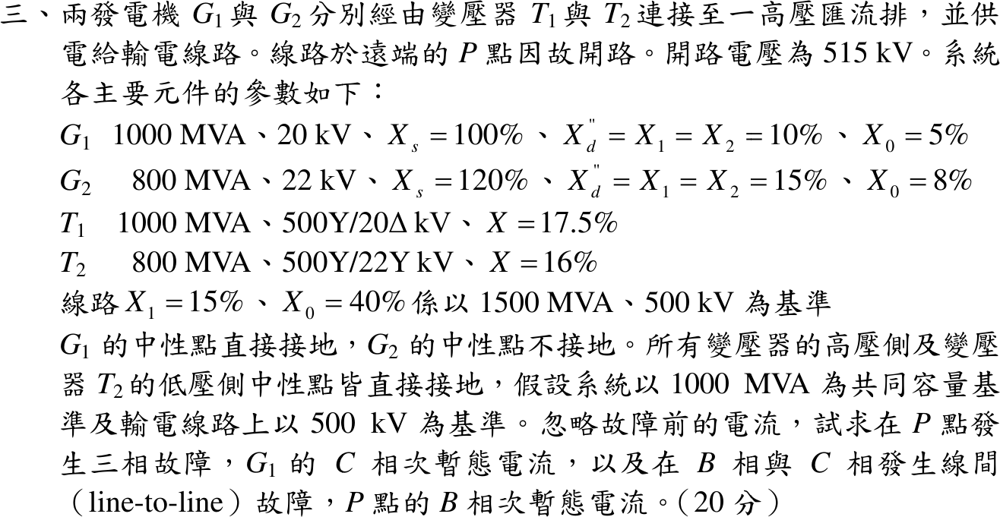
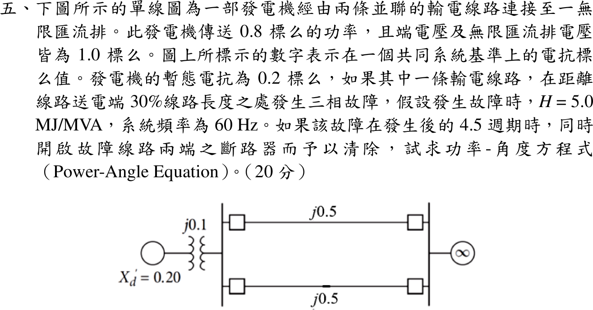

# 108 年電機工程技師｜電力系統逐題詳解

> 本頁由題級 canonical 筆記組合；每題保留 QID、官方裁切、校驗狀態與完整得分型解答。

## 題目導覽
- [[#一、108 年電力系統第 1 題｜同步發電機相量圖與激磁控制|第 1 題：同步發電機相量圖與激磁控制]]
- [[#二、108 年電力系統第 2 題｜快速解耦電力潮流法二次疊代|第 2 題：快速解耦電力潮流法二次疊代]]
- [[#三、108 年電力系統第 3 題｜多機系統三相與線間短路|第 3 題：多機系統三相與線間短路]]
- [[#四、108 年電力系統第 4 題｜發電機繞組差動電驛保護|第 4 題：發電機繞組差動電驛保護]]
- [[#五、108 年電力系統第 5 題｜雙迴線三相故障之功率角方程式|第 5 題：雙迴線三相故障之功率角方程式]]

---

## 一、108 年電力系統第 1 題｜同步發電機相量圖與激磁控制

> 題級識別：`EE-108-05-1`
> canonical 來源：`canonical/EE-108-05-1.md`
> 題級校驗狀態：`verified`

![[01_原始試題/依考科/05_電力系統/images/questions/PE_108年_電力系統_Q01.png]]

> 官方裁切來源：`01_原始試題/依考科/05_電力系統/images/questions/PE_108年_電力系統_Q01.png`

### 已知與所求

圓柱形轉子、忽略電樞電阻，\(X_d=1.7241\) pu，端電壓 \(V=1.0\angle0^\circ\) pu，電流 \(0.8\) pu、功因 0.9 落後（標么值均以機組額定為基準）。
（一）求內部電壓 \(E_i\) 的大小與角度，及送至匯流排的 \(P\)、\(Q\)。
（二）\(P\) 不變、激磁增加 20%（磁路線性，\(E_i\) 增 20%），求 \(E_i\) 與匯流排電壓的夾角 \(\delta\) 及 \(Q\)。

### 考場標準作答

#### （一）內部電壓與 \(P\)、\(Q\)

落後功因 \(\phi=\cos^{-1}0.9=25.84^\circ\)，\(I=0.8\angle-25.84^\circ=0.72-j0.3487\) pu：
\[
E_i=V+jX_dI=1+j1.7241(0.72-j0.3487)=1.6012+j1.2414
\]
\[
\boxed{|E_i|=2.026\ \mathrm{pu}},\qquad \boxed{\delta=37.78^\circ}
\]
\[
S=VI^*=0.72+j0.3487\Rightarrow \boxed{P=0.720\ \mathrm{pu}},\quad \boxed{Q=0.3487\ \mathrm{pu}}\ (\text{發電機送出，落後})
\]

#### （二）激磁增加 20%

\(E_i'=1.2(2.026)=2.431\) pu。原動機輸入不變，\(P=0.72\) 不變：
\[
\sin\delta'=\frac{PX_d}{E_i'V}=\frac{0.72(1.7241)}{2.431}=0.5106
\Rightarrow \boxed{\delta'=30.70^\circ}
\]
\[
Q'=\frac{E_i'V\cos\delta'-V^2}{X_d}=\frac{2.431(0.8598)-1}{1.7241}=\boxed{0.6325\ \mathrm{pu}}
\]

### 驗算

改用電流相量：\(E_i'\angle\delta'=2.0905+j1.2414\)，
\[
I'=\frac{E_i'\angle\delta'-V}{jX_d}=\frac{1.0905+j1.2414}{j1.7241}=0.7200-j0.6325\ \mathrm{pu}
\]
\(S'=VI'^*=0.7200+j0.6325\)，實功與原值相同，\(Q'\) 與上式一致；電流增為 0.958 pu、功因降為 0.751 落後。

### 失分點

- 落後功因的電流角為 \(-25.84^\circ\)；寫成 \(+25.84^\circ\) 會使 \(E_i\) 的角度與大小皆錯。
- 激磁增 20% 是 \(E_i\) 乘 1.2，不是 \(X_d\) 或 \(\delta\) 增加；固定的是 \(P\)（即 \(E_i\sin\delta\) 乘積），不是 \(\delta\)。
- 取 \(\sin\delta'=0.5106\) 的銳角解 \(30.70^\circ\)，鈍角解 \(149.3^\circ\) 屬不穩定區。

---

## 二、108 年電力系統第 2 題｜快速解耦電力潮流法二次疊代

> 題級識別：`EE-108-05-2`
> canonical 來源：`canonical/EE-108-05-2.md`
> 題級校驗狀態：`verified`

![[01_原始試題/依考科/05_電力系統/images/questions/PE_108年_電力系統_Q02.png]]

> 官方裁切來源：`01_原始試題/依考科/05_電力系統/images/questions/PE_108年_電力系統_Q02.png`

### 已知與所求

三匯流排（標么值）：Bus 1 slack，\(V_1=1.02\angle0^\circ\)；Bus 2 發電機（PV），\(|V_2|=1.01\)、\(P_{G2}=0.7\)；Bus 3 負載（PQ），\(P_{D3}=0.9\)、\(Q_{D3}=0.8\)。線路 \(y_{13}=-j8\)、\(y_{23}=-j12\)。以快速解耦法做兩次疊代，起始值取平坦啟動 \(\theta_2=\theta_3=0\)、\(|V_3|=1\)。求 \(\theta_2,\theta_3,|V_3|\)。

### 考場標準作答

#### 1. 指定注入與矩陣

\(P_2^{sp}=0.7\)，\(P_3^{sp}=-0.9\)，\(Q_3^{sp}=-0.8\)。無電阻、無並聯元件，故 \(B'\) 與 \(B''\) 皆取線路電納：
\[
B'=\begin{bmatrix}12&-12\\-12&20\end{bmatrix},\qquad B''=[20]
\]
每次疊代先解 \(B'\Delta\boldsymbol\theta=\Delta\mathbf P/|V|\)，再以新角度算 \(Q_3\)，解 \(B''\Delta|V_3|=\Delta Q_3/|V_3|\)。

#### 2. 第 1 次疊代

平坦啟動下 \(P_2=P_3=0\)：
\[
\frac{\Delta\mathbf P}{|V|}=\begin{bmatrix}0.7/1.01\\-0.9/1.0\end{bmatrix}=\begin{bmatrix}0.69307\\-0.90000\end{bmatrix}
\Rightarrow
\Delta\boldsymbol\theta=\begin{bmatrix}0.031889\\-0.025866\end{bmatrix}\mathrm{rad}
\]
以新角度算得 \(Q_3=-0.25706\)，\(\Delta Q_3/|V_3|=-0.8+0.25706=-0.54294\)：
\[
\Delta|V_3|=\frac{-0.54294}{20}=-0.027147,\qquad |V_3|^{(1)}=0.97285
\]

#### 3. 第 2 次疊代

用 \(\theta^{(1)}\)、\(|V_3|^{(1)}\) 重算 \(P_2=0.68062\)、\(P_3=-0.88594\)：
\[
\frac{\Delta\mathbf P}{|V|}=\begin{bmatrix}0.019189\\-0.014457\end{bmatrix}
\Rightarrow
\Delta\boldsymbol\theta=\begin{bmatrix}0.002191\\0.000592\end{bmatrix}\mathrm{rad}
\]
\(\theta_2^{(2)}=0.034080\) rad、\(\theta_3^{(2)}=-0.025275\) rad。再算 \(Q_3=-0.77730\)，\(\Delta Q_3/|V_3|=-0.023334\)，\(\Delta|V_3|=-0.001167\)：
\[
\boxed{V_2=1.01\angle1.953^\circ\ \mathrm{pu}},\qquad
\boxed{V_3=0.9717\angle-1.448^\circ\ \mathrm{pu}}
\]

### 驗算

把兩次疊代結果代回完整交流潮流式：\(P_2=0.69860\)、\(P_3=-0.89898\)、\(Q_3=-0.79904\) pu，與指定值 \((0.7,-0.9,-0.8)\) 的殘差不超過 \(1.4\times10^{-3}\) pu。以牛頓法解到收斂得 \(\theta_2=1.962^\circ\)、\(\theta_3=-1.446^\circ\)、\(|V_3|=0.97163\)，兩次 FDLF 結果與之相差 \(|V_3|\) 0.006%、角度 0.01°。收斂解下 slack 輸出 \(P_1=0.9-0.7=0.2\) pu，亦與功率守恆（無損）一致。

### 失分點

- 負載是負注入：\(P_3=-0.9\)、\(Q_3=-0.8\)；寫成正值會使 \(\Delta P_3,\Delta Q_3\) 全部反號。
- \(B'\) 只含 Bus 2、3（刪除 slack），\(B''\) 只含 PQ 的 Bus 3（\(=20\)）；Bus 2 的 \(|V_2|=1.01\) 保持固定。
- 右端要除以目前的 \(|V|\)（第 1 次 \(0.7/1.01\)），第 2 次的 \(\Delta P_3\) 要除以已更新的 \(|V_3|^{(1)}\)。

---

## 三、108 年電力系統第 3 題｜多機系統三相與線間短路

> 題級識別：`EE-108-05-3`
> canonical 來源：`canonical/EE-108-05-3.md`
> 題級校驗狀態：`verified`

![[01_原始試題/依考科/05_電力系統/images/questions/PE_108年_電力系統_Q03.png]]

> 官方裁切來源：`01_原始試題/依考科/05_電力系統/images/questions/PE_108年_電力系統_Q03.png`

### 已知與所求

\(G_1\)：1000 MVA、20 kV，\(X_d''=X_1=X_2=10\%\)；\(G_2\)：800 MVA、22 kV，\(X_d''=X_1=X_2=15\%\)。\(T_1\)：1000 MVA、500Y/20Δ kV、17.5%；\(T_2\)：800 MVA、500Y/22Y kV、16%。線路 \(X_1=15\%\)（1500 MVA、500 kV 基準）。\(P\) 點開路電壓 515 kV，忽略故障前電流，共同基準 1000 MVA、輸電線 500 kV。求 \(P\) 點三相故障時 \(G_1\) 的 \(C\) 相次暫態電流，以及 \(B\)、\(C\) 相間故障時 \(P\) 點 \(B\) 相次暫態電流。

### 考場標準作答

#### 1. 標么值與正序戴維寧阻抗

故障前電壓 \(E_P=515/500=1.03\) pu。換算到 1000 MVA：
\[
X_{G1}+X_{T1}=0.10+0.175=0.275,\qquad X_{G2}+X_{T2}=0.15\tfrac{1000}{800}+0.16\tfrac{1000}{800}=0.1875+0.20=0.3875
\]
\[
X_L=0.15\tfrac{1000}{1500}=0.10,\qquad X_1=X_2=0.10+0.275\parallel0.3875=0.10+0.16085=0.26085\ \mathrm{pu}
\]
負序網路與正序相同。

#### 2. 三相故障：\(G_1\) 的 \(C\) 相電流

三相故障只有正序：
\[
I_f=\frac{1.03}{0.26085}=3.9486\ \mathrm{pu}
\]
\(G_1\) 支路分得（電流分配，反比於支路電抗）：
\[
I_{G1}=I_f\frac{0.3875}{0.275+0.3875}=2.3096\ \mathrm{pu}
\]
\(G_1\) 側基準電流 \(I_{B,20}=\dfrac{1000}{\sqrt3(20)}=28.868\) kA，三相對稱，\(C\) 相大小與 \(A\)、\(B\) 相相同：
\[
\boxed{|I_{G1,C}|=2.3096\ \mathrm{pu}=66.67\ \mathrm{kA}}
\]

#### 3. \(B\)-\(C\) 線間故障：\(P\) 點 \(B\) 相電流

線間故障 \(I_0=0\)，正、負序串聯，\(I_2=-I_1\)：
\[
I_1=\frac{1.03}{X_1+X_2}=\frac{1.03}{0.5217}=1.9743\ \mathrm{pu},\qquad
I_B=a^2I_1+aI_2=(a^2-a)I_1=-j\sqrt3\,I_1
\]
\(I_{B,500}=\dfrac{1000}{\sqrt3(500)}=1.1547\) kA：
\[
\boxed{|I_{P,B}|=\sqrt3(1.9743)=3.4196\ \mathrm{pu}=3.949\ \mathrm{kA}}
\]

### 驗算

節點法：故障點電壓為 0，高壓匯流排電壓 \(V_H=X_LI_f=0.10(3.9486)=0.3949\) pu，兩機支路電流為
\[
\frac{1.03-0.3949}{0.275}=2.3096,\qquad \frac{1.03-0.3949}{0.3875}=1.6391\ \mathrm{pu}
\]
相加 \(3.9486=I_f\)，且 \(G_1\) 值與上式一致。另外線間故障電流恆為三相故障的 \(\sqrt3/2\)（\(X_1=X_2\)）：\(0.8660\times3.9486=3.4196\)。

### 失分點

- \(G_2\)、\(T_2\) 為 800 MVA、線路為 1500 MVA 基準，百分比必須先乘 \(1000/800\)、\(1000/1500\) 再相加；直接相加會錯。
- 三相故障不含零序，\(G_1\) 的中性點接地、\(X_0\) 資料只用於接地故障，本題用不到；\(X_s\) 為穩態電抗，也不用。
- 20 kV 側與 500 kV 側基準電流不同：\(G_1\) 電流乘 28.868 kA，\(P\) 點乘 1.1547 kA。

---

## 四、108 年電力系統第 4 題｜發電機繞組差動電驛保護

> 題級識別：`EE-108-05-4`
> canonical 來源：`canonical/EE-108-05-4.md`
> 題級校驗狀態：`verified`

![[01_原始試題/依考科/05_電力系統/images/questions/PE_108年_電力系統_Q04.png]]

> 官方裁切來源：`01_原始試題/依考科/05_電力系統/images/questions/PE_108年_電力系統_Q04.png`

### 已知與所求

保護區很小時可用電流連續原理（KCL）構成保護。圖中發電機一相繞組兩端各接一具 CT；\(I_1',I_2'\) 為繞組兩端的一次電流，\(I_1,I_2\) 為 CT 二次電流，線圈 1、2 為抑制線圈，線圈 3 為動作線圈，流過 \(I_1-I_2\)；\(I_f'\) 為保護區內的故障電流。虛線之間為「跳脫」區，兩側為「閉合」（不動作）區。說明發電機繞組差動保護的動作原理。

### 考場標準作答

#### 1. 保護區與接線

兩具 CT 的位置劃定保護區（兩虛線之間）。二次側依極性接成環流式：兩側電流在抑制線圈 1、2 中同向流通，動作線圈 3 接在其中點，流過兩者之差 \(I_1-I_2\)。

#### 2. 正常運轉與區外故障（不動作）

保護區內無故障時，流入繞組的電流等於流出的電流，\(I_1'=I_2'\)，經同比 CT 後
\[
I_1=I_2\ \Rightarrow\ I_{op}=I_1-I_2=0
\]
動作線圈無電流；區外故障雖有大穿越電流，兩端電流仍相等，抑制線圈 1、2 產生穩定的抑制力矩，電驛不動作，斷路器維持閉合。

#### 3. 區內故障（跳脫）

故障點在兩 CT 之間，KCL 給出 \(I_1'=I_2'+I_f'\)，兩端電流不再相等（單側饋入時 \(I_2'=0\)，雙側饋入時 \(I_2'\) 反向）：
\[
I_{op}=I_1-I_2\propto I_f'\neq0
\]
差流流過動作線圈 3，產生動作力矩；超過抑制力矩時電驛動作，跳脫發電機兩側斷路器並滅磁。

#### 4. 動作判據

為容許 CT 比差、飽和誤差，採百分比差動特性（\(K\) 為斜率設定，另可加最小動作電流）：
\[
\boxed{|I_1-I_2|>K\,\frac{|I_1|+|I_2|}{2}}
\]
左側為動作量，右側為抑制量；穿越電流愈大，抑制量愈大。

### 驗算

用假設數值（非題目所給）檢查判據，取 \(K=0.2\)：

| 狀況 | \(I_1\) | \(I_2\) | 動作量 | 抑制量 | 比值 | 結果 |
| --- | --- | --- | --- | --- | --- | --- |
| 區外故障，CT 理想 | 10 | 10 | 0 | 10 | 0 | 不動作 |
| 區外故障，CT 差 5% | 10 | 9.5 | 0.5 | 9.75 | 0.051 | 不動作 |
| 區內故障，單側饋入 | 10 | 0 | 10 | 5 | 2.0 | 動作 |
| 區內故障，雙側饋入 | 6 | \(-4\) | 10 | 5 | 2.0 | 動作 |

各情況與 KCL 預測一致（區內動作量即為 \(I_f'\) 折算值）。

### 失分點

- 差動保護比較的是兩端電流之「差」，不是電流大小：區外大穿越電流下 \(I_1=I_2\)，動作量為 0，不會誤跳。
- 線圈 3（動作）接在中點流 \(I_1-I_2\)，線圈 1、2 為抑制；功能不可對調，也要說明 CT 極性使穿越電流在動作線圈中抵消。
- 題目沒有給 CT 變比、斜率或整定值，不可編造數值門檻；判據只寫符號式。

---

## 五、108 年電力系統第 5 題｜雙迴線三相故障之功率角方程式

> 題級識別：`EE-108-05-5`
> canonical 來源：`canonical/EE-108-05-5.md`
> 題級校驗狀態：`verified`

![[01_原始試題/依考科/05_電力系統/images/questions/PE_108年_電力系統_Q05.png]]

> 官方裁切來源：`01_原始試題/依考科/05_電力系統/images/questions/PE_108年_電力系統_Q05.png`

### 已知與所求

發電機（\(X_d'=0.20\)）經 \(j0.1\) 升壓變壓器，再由兩條並聯線（各 \(j0.5\)）接至無限匯流排。\(P_e=0.8\) pu，端電壓與無限匯流排電壓均為 1.0 pu（均為共同基準標么值）。其中一條線距送電端 30% 處發生三相故障，4.5 週期後兩端斷路器同時開啟清除故障；\(H=5.0\) MJ/MVA、60 Hz。求功率-角度方程式（故障前、故障中、故障清除後）。

端電壓取發電機端（\(X_d'\) 與變壓器之間）；若取在線路送電端匯流排，結果見「條件與疑義」。\(H\)、4.5 週期供求清除角與搖擺曲線使用，本題只問功率角方程式。

### 考場標準作答

#### 1. 故障前與內部電勢 \(E'\)

發電機端至無限匯流排的電抗 \(0.1+0.5\parallel0.5=0.35\)：
\[
0.8=\frac{1.0\times1.0}{0.35}\sin\alpha\Rightarrow\sin\alpha=0.28,\quad V_t=0.96+j0.28
\]
\[
I=\frac{V_t-1}{j0.35}=0.8+j0.1143,\qquad
E'=V_t+jX_d'I=0.9371+j0.4400=1.0353\angle25.15^\circ\ \mathrm{pu}
\]
\(E'\) 至無限匯流排的總電抗 \(0.20+0.10+0.25=0.55\)：
\[
\boxed{P_{e1}=\frac{1.0353}{0.55}\sin\delta=1.8824\sin\delta}
\]

#### 2. 故障中

令送電端匯流排為 A，故障線被故障點分成 \(0.3(0.5)=0.15\)（A 到故障點）與 \(0.35\)（故障點到無限匯流排）。故障點接地，\(0.35\) 段僅跨接於理想電壓源與地，不影響轉移。A 點接出：往 \(E'\) 為 \(0.3\)，往無限匯流排為健康線 \(0.5\)，對地為 \(0.15\)。Y-Δ 轉換：
\[
X_{12}=0.3+0.5+\frac{0.3(0.5)}{0.15}=1.8\ \mathrm{pu}
\]
\[
\boxed{P_{e2}=\frac{1.0353}{1.8}\sin\delta=0.5752\sin\delta}
\]

#### 3. 故障清除後

故障線兩端開啟，只剩一條健康線，\(X=0.20+0.10+0.50=0.80\)：
\[
\boxed{P_{e3}=\frac{1.0353}{0.80}\sin\delta=1.2941\sin\delta}
\]

### 驗算

故障前工作角：\(\delta_0=\sin^{-1}(0.8/1.8824)=25.15^\circ\)，與 \(E'\) 相角 \(25.15^\circ\) 一致。
故障中改用節點消去法：A 點自導納 \(1/0.3+1/0.15+1/0.5=12\)，\(E'\) 與無限匯流排間的轉移導納 \(\dfrac{(1/0.3)(1/0.5)}{12}=0.5556\)，倒數 \(1.8\)，與 Y-Δ 結果相同。三者最大功率 \(1.8824>1.2941>0.5752\)，符合「正常、單線、故障中」的排序。

### 失分點

- 端電壓 1.0 是發電機端電壓，內部電勢必須用 \(V_t+jX_d'I\) 回推，不能令 \(E'=1\)。
- 30% 是故障點位置，故障點與送電端間為 \(0.3\times0.5=0.15\) pu；故障中 A 點對地分路 0.15 使轉移電抗升至 1.8。
- 清除後是單線運轉 \(0.2+0.1+0.5=0.8\)，不可沿用故障前的 \(0.25\) 並聯線路。

### 條件與疑義

題圖未標示「端電壓」所在的匯流排。若將 1.0 pu 理解為送電端（線路）匯流排電壓，則 \(\sin\alpha=0.8(0.25)=0.2\)，並須把 \(X_d'\) 與 \(j0.1\) 升壓變壓器一併串入 \(E'\) 的路徑：
\[
E'=e^{j\alpha}+j0.30\,I=0.9556+j0.4400,\qquad |E'|=1.0520
\]
此讀法下 \(P_{e1}=1.9127045\sin\delta\)、\(P_{e2}=0.5844375\sin\delta\)、\(P_{e3}=1.3149844\sin\delta\)，各段轉移電抗（0.55、1.8、0.8）不變，只有 \(|E'|\) 不同。本解依「端電壓即發電機端電壓」作答。
