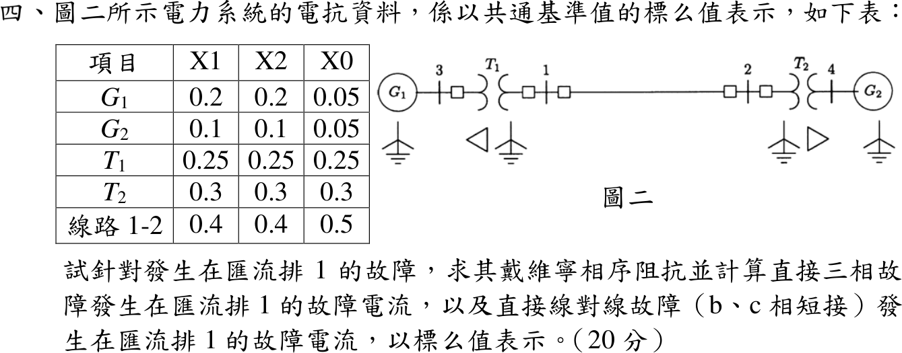

# 109 年電機工程技師｜電力系統逐題詳解

> 本頁由題級 canonical 筆記組合；每題保留官方裁切圖、校驗狀態與可追溯的推導。

## 題目導覽
- [[#一、109 年電力系統第 1 題｜瞬時功率與實功／虛功|第 1 題：瞬時功率與實功／虛功]]
- [[#二、109 年電力系統第 2 題｜345 kV 雙分裂導線中程 π 模型與傳輸功率|第 2 題：345 kV 雙分裂導線中程 π 模型與傳輸功率]]
- [[#三、109 年電力系統第 3 題｜二匯流排牛頓－拉弗森法二次疊代|第 3 題：二匯流排牛頓－拉弗森法二次疊代]]
- [[#四、109 年電力系統第 4 題｜三相與線間故障電流|第 4 題：三相與線間故障電流]]
- [[#五、109 年電力系統第 5 題｜含輸電損失的經濟調度|第 5 題：含輸電損失的經濟調度]]
- [[#六、109 年電力系統第 6 題｜負載頻率控制與穩態頻率偏差|第 6 題：負載頻率控制與穩態頻率偏差]]

---

## 一、109 年電力系統第 1 題｜瞬時功率與實功／虛功

> 題級識別：EE-109-05-1
> canonical 來源：[[canonical/EE-109-05-1.md]]
> 題級校驗狀態：verified

### 考場標準作答

\(v=\sqrt2V\cos(\omega t+\alpha)\)、\(i=\sqrt2I\cos(\omega t+\beta)\)（\(V,I\) 為有效值），令 \(\theta=\alpha-\beta\)。積化和差：
\[
p(t)=vi=VI\cos\theta+VI\cos(2\omega t+\alpha+\beta)
\]
將 \(2\omega t+\alpha+\beta=2(\omega t+\alpha)-\theta\) 展開：
\[
\boxed{p(t)=\underbrace{VI\cos\theta}_{P}\,[1+\cos2(\omega t+\alpha)]+\underbrace{VI\sin\theta}_{Q}\,\sin2(\omega t+\alpha)}
\]
雙倍頻項一週期平均為零，故平均功率
\[
\boxed{P=\frac1T\int_0^Tp\,dt=V_{rms}I_{rms}\cos(\alpha-\beta)\ \mathrm W}
\]
- 第一項 \(P[1+\cos2(\omega t+\alpha)]\) 恆不為負，平均值為 \(P\)：**實功率**，負載淨吸收的能量速率。
- 第二項 \(Q\sin2(\omega t+\alpha)\) 平均為零，其振幅 \(\boxed{Q=V_{rms}I_{rms}\sin(\alpha-\beta)\ \mathrm{var}}\)：**虛功率**，電源與 L／C 儲能間往返交換。

### 驗算

複功率 \(S=\mathbf V\mathbf I^*=VI\angle(\alpha-\beta)=VI\cos\theta+jVI\sin\theta\)，實部、虛部恰為上式 \(P\)、\(Q\)；\(\theta>0\)（電流落後）時 \(Q>0\)，負載吸收虛功。

---

## 二、109 年電力系統第 2 題｜345 kV 雙分裂導線中程 π 模型與傳輸功率

> 題級識別：EE-109-05-2
> canonical 來源：[[canonical/EE-109-05-2.md]]
> 題級校驗狀態：verified

### 已知與所求

三相 345 kV、60 Hz 換位線，每相兩條 Bluejay（直徑 3.195 cm、GMR 1.268 cm），子導體間隔 40 cm；水平排列相間 10 m；忽略電阻與電導；長 200 km；\(V_S=345\angle30^\circ\) kV、\(V_R=327.75\angle0^\circ\) kV（線電壓）。以 π 模型求傳輸實功率。

### 考場標準作答

**幾何量**：
\[
D_m=\sqrt[3]{10\cdot10\cdot20}=12.599\ \mathrm m,\quad
D_{sL}=\sqrt{0.01268(0.40)}=0.07122\ \mathrm m,\quad
D_{sC}=\sqrt{0.015975(0.40)}=0.07994\ \mathrm m
\]

**線路常數**（\(l=200\) km）：
\[
L=2\times10^{-7}\ln\frac{12.599}{0.07122}=1.0351\times10^{-6}\ \mathrm{H/m},\qquad X=\omega Ll=377(1.0351\times10^{-6})(2\times10^5)=78.05\ \Omega
\]
\[
C=\frac{2\pi\varepsilon_0}{\ln(12.599/0.07994)}=1.0994\times10^{-11}\ \mathrm{F/m},\qquad Y=j\omega Cl=j8.289\times10^{-4}\ \mathrm S\ (Y/2\text{ 接兩端})
\]

**傳輸功率**：π 模型兩端並聯導納為純電容，只吸收虛功率，實功率全經串聯 \(jX\)：
\[
\boxed{P=\frac{|V_S||V_R|}{X}\sin\delta=\frac{345(327.75)}{78.05}\sin30^\circ=724.4\ \mathrm{MW}}
\]
（線電壓 kV 相乘直接得三相 MW。）

### 驗算

每相複功率：\(I_{ser}=(V_S-V_R)/(jX)\)，受電端 \(I_R=I_{ser}-j\tfrac Y2V_R\)，\(3\,\mathrm{Re}(V_RI_R^*)=724.4\) MW；送電端 \(I_S=I_{ser}+j\tfrac Y2V_S\)，\(3\,\mathrm{Re}(V_SI_S^*)=724.4\) MW，送受兩端相等，符合無損線路。

### 失分點

- 電感用導體 GMR（1.268 cm），電容用導體實際半徑 \(3.195/2\) cm；兩者互換會使 \(L\)、\(C\) 皆錯。
- 水平排列的 \(D_{31}=20\) m，\(D_m=\sqrt[3]{2000}\)，不是 10 m。
- 題給為線電壓，\(V_SV_R\sin\delta/X\) 已是三相功率，不可再乘 3。

---

## 三、109 年電力系統第 3 題｜二匯流排牛頓－拉弗森法二次疊代

> 題級識別：EE-109-05-3
> canonical 來源：[[canonical/EE-109-05-3.md]]
> 題級校驗狀態：verified

### 已知與所求

匯流排 1 為 slack，\(V_1=1.0\angle0^\circ\)；匯流排 2 負載 200 MW、50 Mvar；\(y_{12}=-j10\) pu，基準 100 MVA。寫出匯流排 2 潮流方程，由 \(V_2=1.0\angle0^\circ\) 起以牛頓－拉弗森法疊代兩次，求 \(|V_2|\)、\(\delta_2\)。

### 考場標準作答

\(Y_{22}=-j10\)、\(Y_{21}=j10\)；負載為負注入：\(P_2^{sch}=-2.0\)、\(Q_2^{sch}=-0.5\) pu。由 \(S_2=V_2(Y_{21}V_1+Y_{22}V_2)^*\)：
\[
P_2=10|V_2|\sin\delta_2,\qquad Q_2=10|V_2|^2-10|V_2|\cos\delta_2
\]
\[
J=\begin{bmatrix}\partial P_2/\partial\delta_2&\partial P_2/\partial|V_2|\\\partial Q_2/\partial\delta_2&\partial Q_2/\partial|V_2|\end{bmatrix}
=\begin{bmatrix}10|V_2|\cos\delta_2&10\sin\delta_2\\10|V_2|\sin\delta_2&20|V_2|-10\cos\delta_2\end{bmatrix}
\]

**第 1 次**（\(|V_2|=1,\ \delta_2=0\)）：\(P_2=Q_2=0\)，\(\Delta P=-2.0\)、\(\Delta Q=-0.5\)，\(J=\mathrm{diag}(10,10)\)：
\[
\Delta\delta_2=-0.2\ \mathrm{rad},\ \Delta|V_2|=-0.05\ \Rightarrow\ \boxed{\delta_2^{(1)}=-0.2\ \mathrm{rad}=-11.46^\circ,\quad |V_2|^{(1)}=0.95\ \mathrm{pu}}
\]

**第 2 次**：\(P_2=9.5\sin(-0.2)=-1.88736\)，\(Q_2=9.025-9.5\cos0.2=-0.28564\)；\(\Delta P=-0.11264\)、\(\Delta Q=-0.21436\)。
\[
\begin{bmatrix}9.31063&-1.98669\\-1.88736&9.19933\end{bmatrix}
\begin{bmatrix}\Delta\delta_2\\\Delta|V_2|\end{bmatrix}=
\begin{bmatrix}-0.11264\\-0.21436\end{bmatrix}
\Rightarrow \Delta\delta_2=-0.017852,\ \Delta|V_2|=-0.026965
\]
\[
\boxed{\delta_2^{(2)}=-0.21785\ \mathrm{rad}=-12.48^\circ,\quad |V_2|^{(2)}=0.9230\ \mathrm{pu}}
\]

### 驗算

兩匯流排可求精確解：由 \(|V_2|\sin\delta_2=-0.2\)、\(|V_2|\cos\delta_2=|V_2|^2+0.05\) 消去 \(\delta_2\) 得 \((u+0.05)^2+0.04=u\)（\(u=|V_2|^2\)），取大根 \(|V_2|=0.92195\)、\(\delta_2=-12.53^\circ\)。第二次疊代值與精確解差 \(0.0011\) pu、\(0.05^\circ\)，收斂方向正確。

### 失分點

- 負載是負注入，\(P_2^{sch}=-2.0\)、\(Q_2^{sch}=-0.5\)；寫成正值會使修正方向全反。
- \(\partial Q_2/\partial|V_2|=20|V_2|-10\cos\delta_2\)，漏掉 \(|V_2|^2\) 項的 2 倍會讓第 2 次電壓修正錯。
- 第 2 次要以 \(\delta_2=-0.2\) rad、\(|V_2|=0.95\) 重算 Jacobian，沿用初始 \(J\) 不算牛頓法。

---

## 四、109 年電力系統第 4 題｜三相與線間故障電流

> 題級識別：EE-109-05-4
> canonical 來源：[[canonical/EE-109-05-4.md]]
> 題級校驗狀態：verified

### 已知與所求

共同基準標么電抗（\(X_1/X_2/X_0\)）：\(G_1\) 0.2/0.2/0.05，\(G_2\) 0.1/0.1/0.05，\(T_1\) 0.25，\(T_2\) 0.3，線路 1-2 0.4/0.4/0.5。圖二：\(G_1\)–3–\(T_1\)–1–線路–2–\(T_2\)–4–\(G_2\)；\(T_1\) 在匯流排 3 側為 \(\Delta\)、匯流排 1 側 Y 接地；\(T_2\) 在匯流排 2 側 Y 接地、匯流排 4 側 \(\Delta\)；兩發電機中性點接地。求匯流排 1 的戴維寧相序阻抗、三相直接故障電流、b-c 直接線間故障電流。題目未給故障前電壓，設 \(V_f=1\angle0^\circ\) pu。

### 考場標準作答

**正、負序**（匯流排 1 往左 \(G_1+T_1\)，往右線路\(+T_2+G_2\)）：
\[
\boxed{Z_1=Z_2=j(0.2+0.25)\parallel j(0.4+0.3+0.1)=j\frac{0.45(0.8)}{1.25}=j0.288\ \mathrm{pu}}
\]
**零序**：\(T_1\) 的 Y 接地側在匯流排 1，\(\Delta\) 側使零序電流經 \(X_{T1,0}\) 入地、隔開 \(G_1\)；右側經線路到 \(T_2\) 的 Y 接地側，同理隔開 \(G_2\)：
\[
\boxed{Z_0=j0.25\parallel j(0.5+0.3)=j\frac{0.25(0.8)}{1.05}=j0.1905\ \mathrm{pu}}
\]

**三相故障**：
\[
\boxed{I_f^{3\phi}=\frac{1}{j0.288}=-j3.472\ \mathrm{pu}}
\]

**b-c 線間故障**：\(I_{a0}=0\)、\(I_{a2}=-I_{a1}\)，
\[
I_{a1}=\frac{1}{Z_1+Z_2}=\frac{1}{j0.576}=-j1.7361,\qquad I_b=(a^2-a)I_{a1}=(-j\sqrt3)(-j1.7361)
\]
\[
\boxed{I_b=-I_c=-3.007\ \mathrm{pu}\ \ (|I_f^{LL}|=3.007\ \mathrm{pu})}
\]

### 驗算

相域回代：\(V_{a1}=1-j0.288I_{a1}=0.5\)、\(V_{a2}=-j0.288I_{a2}=0.5\)，得 \(V_b=V_c=-0.5\) pu、\(I_a=0\)，符合 b-c 金屬短路；且 \(|I_f^{LL}|/|I_f^{3\phi}|=3.007/3.472=0.866=\sqrt3/2\)。

### 失分點

- 零序網路須依變壓器接線判斷：\(\Delta\) 側把 \(G_1\)、\(G_2\) 的零序隔開，若直接串入 \(X_{G,0}=0.05\) 會得錯誤的 \(Z_0\)。
- 線路零序電抗是 0.5，不是正序的 0.4。
- 線間故障電流是 \(\sqrt3|I_{a1}|\)，不是 \(|I_{a1}|\)；且不經零序網路，\(Z_0\) 雖要求列出但不參與。

---

## 五、109 年電力系統第 5 題｜含輸電損失的經濟調度

> 題級識別：EE-109-05-5
> canonical 來源：[[canonical/EE-109-05-5.md]]
> 題級校驗狀態：verified

### 已知與所求

\(C_i=\beta P_{Gi}+\gamma P_{Gi}^2\)（\(\$/\mathrm h\)），\(\beta=6\ \$/\mathrm{MWh}\)、\(\gamma=5\times10^{-3}\ \$/\mathrm{MW^2h}\)；\(P_L=B_{11}P_{G1}^2+B_{22}P_{G2}^2\)，\(B_{11}=0.5\times10^{-3}\)、\(B_{22}=0.2\times10^{-3}\ \mathrm{MW^{-1}}\)；\(P_D=600\) MW。代入數值列出求 \(P_{G1}\)、\(P_{G2}\) 最佳調度的方程式。

### 考場標準作答

拉格朗日函數 \(\mathcal L=C_1+C_2+\lambda(P_D+P_L-P_{G1}-P_{G2})\)，\(\partial\mathcal L/\partial P_{Gi}=0\)：
\[
\frac{dC_i}{dP_{Gi}}=\lambda\Big(1-\frac{\partial P_L}{\partial P_{Gi}}\Big),\qquad
\frac{dC_i}{dP_{Gi}}=6+0.01P_{Gi},\quad
\frac{\partial P_L}{\partial P_{G1}}=0.001P_{G1},\quad
\frac{\partial P_L}{\partial P_{G2}}=0.0004P_{G2}
\]
協調方程與功率平衡：
\[
\boxed{\frac{6+0.01P_{G1}}{1-0.001P_{G1}}=\frac{6+0.01P_{G2}}{1-0.0004P_{G2}}=\lambda}
\]
\[
\boxed{P_{G1}+P_{G2}=600+0.0005P_{G1}^2+0.0002P_{G2}^2\ \ (\mathrm{MW})}
\]
解出：由協調式 \(P_{G1}=\dfrac{\lambda-6}{0.01+0.001\lambda}\)、\(P_{G2}=\dfrac{\lambda-6}{0.01+0.0004\lambda}\)，代入功率平衡對 \(\lambda\) 疊代：
\[
\boxed{\lambda=11.888\ \$/\mathrm{MWh},\quad P_{G1}=269.00\ \mathrm{MW},\quad P_{G2}=399.03\ \mathrm{MW}}
\]
（\(P_L=68.02\) MW。）

### 驗算

以未四捨五入值驗證：\(P_{G1}=268.9957\)、\(P_{G2}=399.0284\) 時兩懲罰因數為 \(L_1=1/(1-0.26900)=1.36798\)、\(L_2=1/(1-0.15961)=1.18992\)，\(L_1(8.6900)=L_2(9.9903)=11.8877\)；功率平衡 \(668.0241=600+36.1793+31.8447\)。表列兩位小數時兩側會差 0.01 MW，屬獨立四捨五入誤差。

### 失分點

- 協調式是 \(IC_i/(1-\partial P_L/\partial P_{Gi})\)；寫成 \(IC_i(1-\partial P_L/\partial P_{Gi})=\lambda\) 會使損失大的機組反而多發電。
- \(\partial P_L/\partial P_{G1}=2B_{11}P_{G1}=0.001P_{G1}\)，漏乘 2 是常見錯誤。
- 功率平衡要含 \(P_L\)；只寫 \(P_{G1}+P_{G2}=600\) 為無損調度。

---

## 六、109 年電力系統第 6 題｜負載頻率控制與穩態頻率偏差

> 題級識別：EE-109-05-6
> canonical 來源：[[canonical/EE-109-05-6.md]]
> 題級校驗狀態：verified

### 已知與所求

單區域兩機組 500 MVA、800 MVA，各以自身額定為基準的速率調整率 \(R=5\%\)；\(D=0\)；60 Hz 時機組 1 供 200 MW、機組 2 供 500 MW（共 700 MW）。負載增加 150 MW，求穩態頻率偏移及兩機組新發電量。

### 考場標準作答

各機組頻率響應（MW/Hz）\(\beta_i=S_i/(R_if_0)\)：
\[
\beta_1=\frac{500}{0.05(60)}=166.67,\qquad \beta_2=\frac{800}{0.05(60)}=266.67,\qquad \beta=\beta_1+\beta_2+D=433.33\ \mathrm{MW/Hz}
\]
\[
\boxed{\Delta f=-\frac{\Delta P_L}{\beta}=-\frac{150}{433.33}=-0.3462\ \mathrm{Hz}\ \ (f=59.654\ \mathrm{Hz})}
\]
\[
\Delta P_1=-\beta_1\Delta f=57.69\ \mathrm{MW},\qquad \Delta P_2=-\beta_2\Delta f=92.31\ \mathrm{MW}
\]
\[
\boxed{P_1=200+57.69=257.69\ \mathrm{MW}},\qquad \boxed{P_2=500+92.31=592.31\ \mathrm{MW}}
\]

### 驗算

改用 1000 MVA 共同基準：\(R_1=0.05(1000/500)=0.1\)、\(R_2=0.05(1000/800)=0.0625\) pu，\(\Delta f=-0.15/(10+16)=-0.0057692\) pu \(=-0.3462\) Hz，相同。兩機增量比 \(57.69:92.31=500:800\)（同 \(R\) 時依額定容量分攤），且 \(257.69+592.31=850=700+150\) MW。

### 失分點

- \(R=5\%\) 是以各自額定為基準，須先換成 MW/Hz（或同一基準）再相加，不能直接把兩個 0.05 並聯。
- 負載增加使頻率下降，\(\Delta f\) 為負；兩機出力依容量比分攤，不是依原出力 200:500。

---
