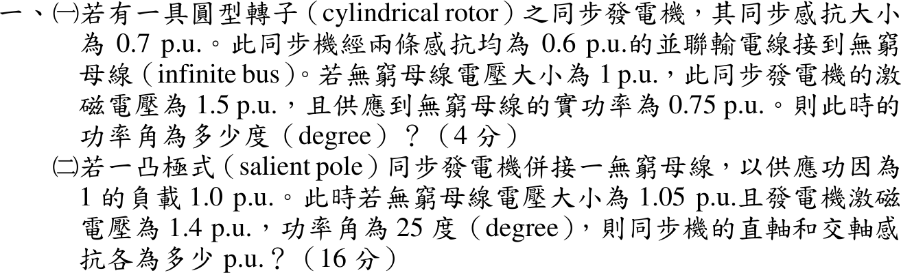
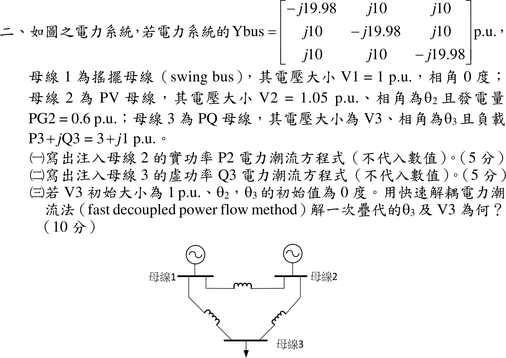

# 110 年電機工程技師｜電力系統逐題詳解

> 本頁由題級 canonical 筆記組合；每題保留官方裁切圖、校驗狀態與可追溯的推導。

## 題目導覽
- [[#一、110 年電力系統第 1 題｜同步發電機功角與雙反應理論|第 1 題：同步發電機功角與雙反應理論]]
- [[#二、110 年電力系統第 2 題｜三匯流排快速解耦電力潮流|第 2 題：三匯流排快速解耦電力潮流]]
- [[#三、110 年電力系統第 3 題｜同時故障對稱成分分析|第 3 題：同時故障對稱成分分析]]
- [[#四、110 年電力系統第 4 題｜含線路損耗的經濟調度與微增損失|第 4 題：含線路損耗的經濟調度與微增損失]]
- [[#五、110 年電力系統第 5 題｜發電機電壓調整率與暫態穩定|第 5 題：發電機電壓調整率與暫態穩定]]

---

## 一、110 年電力系統第 1 題｜同步發電機功角與雙反應理論

> 題級識別：EE-110-05-1
> canonical 來源：[[canonical/EE-110-05-1.md]]
> 題級校驗狀態：verified

### 已知與所求

（一）圓型轉子機 \(X_s=0.7\)，經兩條 \(0.6\) pu 並聯線接無窮母線，\(V=1\)、\(E=1.5\)、\(P=0.75\) pu，求功率角 \(\delta\)。（二）凸極機接無窮母線，pf 1、\(P=1.0\)，\(V=1.05\)、\(E=1.4\) pu、\(\delta=25^\circ\)，求 \(X_d\)、\(X_q\)。

### 考場標準作答

#### （一）圓型轉子

\(X=0.7+0.6\parallel0.6=0.7+0.3=1.0\) pu：
\[
P=\frac{EV}{X}\sin\delta\Rightarrow\sin\delta=\frac{0.75(1.0)}{1.5(1.0)}=0.5,\qquad\boxed{\delta=30^\circ}
\]

#### （二）凸極機

pf 1：\(I=P/V=1/1.05=0.95238\angle0^\circ\) pu。電流與 q 軸（\(E\) 方向）夾角即 \(\delta\)：
\[
I_q=I\cos25^\circ=0.86315,\qquad I_d=I\sin25^\circ=0.40250\ \mathrm{pu}
\]
相量圖投影：垂直 q 軸方向 \(V\sin\delta=X_qI_q\)，沿 q 軸 \(E=V\cos\delta+X_dI_d\)：
\[
\boxed{X_q=\frac{1.05\sin25^\circ}{0.86315}=\frac{0.44375}{0.86315}=0.5141\ \mathrm{pu}}
\]
\[
\boxed{X_d=\frac{1.4-1.05\cos25^\circ}{0.40250}=\frac{0.44838}{0.40250}=1.1140\ \mathrm{pu}}
\]

### 驗算

代回凸極機功率式（\(1/X_q=1.9451\)、\(1/X_d=0.8977\)）：
\[
P=\frac{EV}{X_d}\sin\delta+\frac{V^2}{2}\Big(\frac1{X_q}-\frac1{X_d}\Big)\sin2\delta=0.5577+0.55125(1.0475)(0.7660)=0.5577+0.4423=1.000
\]
\[
Q=\frac{EV}{X_d}\cos\delta-V^2\Big(\frac{\cos^2\delta}{X_d}+\frac{\sin^2\delta}{X_q}\Big)=1.1959-(0.8129+0.3830)=0
\]
與題給 \(P=1.0\)、功因 1 相符。

### 失分點

- （一）兩條線是並聯，等效 0.3 pu；誤加成 1.2 pu 會得 \(X=1.9\)、\(\delta\) 錯誤。
- （二）\(X_q\) 由垂直 q 軸的分量 \(V\sin\delta=X_qI_q\) 求得，不可把 \(E=1.4\) 代入 \(X_q\) 式。
- \(X_d\) 分子是 \(E-V\cos\delta\)；漏乘 \(\cos\delta\) 寫成 \(1.4-1.05\) 會得 \(X_d=0.87\) pu。

---

## 二、110 年電力系統第 2 題｜三匯流排快速解耦電力潮流

> 題級識別：EE-110-05-2
> canonical 來源：[[canonical/EE-110-05-2.md]]
> 題級校驗狀態：verified

### 已知與所求

\(Y_{bus}\)：對角 \(-j19.98\)、非對角 \(j10\) pu（\(G=0\)，\(B_{ii}=-19.98\)、\(B_{ik}=10\)）。母線 1 搖擺 \(1\angle0^\circ\)；母線 2 PV，\(|V_2|=1.05\)、\(P_{G2}=0.6\)；母線 3 PQ，負載 \(3+j1\) pu。求（一）\(P_2\) 潮流方程；（二）\(Q_3\) 潮流方程（皆不代數值）；（三）\(V_3=1\)、\(\theta_2=\theta_3=0\) 起始，快速解耦法一次疊代的 \(\theta_3\)、\(V_3\)。

### 考場標準作答

令 \(Y_{ik}=|Y_{ik}|\angle\gamma_{ik}=G_{ik}+jB_{ik}\)。

#### （一）\(P_2\)

\[
\boxed{P_2=\sum_{k=1}^{3}|V_2||V_k||Y_{2k}|\cos(\gamma_{2k}-\theta_2+\theta_k)=|V_2|\sum_{k=1}^{3}|V_k|\big[G_{2k}\cos\theta_{2k}+B_{2k}\sin\theta_{2k}\big]}
\]
（\(\theta_{2k}=\theta_2-\theta_k\)；本題 \(G=0\)，即 \(P_2=|V_2||V_1|B_{21}\sin\theta_{21}+|V_2||V_3|B_{23}\sin\theta_{23}\)。）

#### （二）\(Q_3\)

\[
\boxed{Q_3=-\sum_{k=1}^{3}|V_3||V_k||Y_{3k}|\sin(\gamma_{3k}-\theta_3+\theta_k)=|V_3|\sum_{k=1}^{3}|V_k|\big[G_{3k}\sin\theta_{3k}-B_{3k}\cos\theta_{3k}\big]}
\]
（本題即 \(Q_3=-|V_3||V_1|B_{31}\cos\theta_{31}-|V_3||V_2|B_{32}\cos\theta_{32}-|V_3|^2B_{33}\)。）

#### （三）快速解耦一次疊代

平坦起始的計算值：\(P_2=P_3=0\)；\(Q_3=-(10\cdot1+10\cdot1.05-19.98\cdot1)=-0.52\)。不平衡量：
\[
\Delta P_2=0.6,\quad \Delta P_3=-3,\quad \Delta Q_3=-1-(-0.52)=-0.48
\]
\(B'=-\mathrm{Im}\,Y\)（去搖擺母線）、\(B''=-B_{33}\)，解 \(\Delta P/|V|=B'\Delta\theta\)、\(\Delta Q/|V|=B''\Delta|V|\)：
\[
\begin{bmatrix}19.98&-10\\-10&19.98\end{bmatrix}
\begin{bmatrix}\Delta\theta_2\\\Delta\theta_3\end{bmatrix}=
\begin{bmatrix}0.6/1.05\\-3/1\end{bmatrix}
\Rightarrow
\Delta\theta_2=\frac{19.98(0.57143)-30}{299.2}=-0.06211,\quad
\Delta\theta_3=\frac{5.7143-59.94}{299.2}=-0.18123\ \mathrm{rad}
\]
\[
\boxed{\theta_3^{(1)}=-0.18123\ \mathrm{rad}=-10.38^\circ}
\]
\[
\Delta|V_3|=\frac{-0.48/1}{19.98}=-0.02402,\qquad \boxed{|V_3|^{(1)}=0.9760\ \mathrm{pu}}
\]

### 驗算

回代 \(B'\)：\(19.98(-0.06211)-10(-0.18123)=0.5714\)、\(-10(-0.06211)+19.98(-0.18123)=-3.000\)，與右側一致。另以完整 Newton–Raphson 從同一起點走一步得 \(\theta_3=-10.14^\circ\)、\(|V_3|=0.9753\)，與解耦結果差 \(0.24^\circ\)、\(0.0007\) pu，屬解耦近似的合理差距。

### 失分點

- \(Q_3\) 的計算值含自導納項 \(-|V_3|^2B_{33}=+19.98\)，漏掉會得 \(\Delta Q_3=-1+20.5\) 而方向全錯。
- \(B'\) 的符號：\(\Delta P/|V|=-B\Delta\theta\)，取 \(-\mathrm{Im}\,Y\) 為正定矩陣；直接用 \(\mathrm{Im}\,Y\) 會使 \(\theta_3\) 變號。
- 母線 2 為 PV，不列 \(\Delta Q_2\) 方程，\(B''\) 只剩 \(1\times1\) 的 \(19.98\)。

---

## 三、110 年電力系統第 3 題｜同時故障對稱成分分析

> 題級識別：EE-110-05-3
> canonical 來源：[[canonical/EE-110-05-3.md]]
> 題級校驗狀態：verified

### 已知與所求

電源 \(1\angle0^\circ\) pu，經正序感抗 \(X_1=0.1\) pu 的饋線接末端負載。末端 A 相接地，同時 BC 相間故障；\(I_a=-j9\)、\(I_b=-6.92\) pu。求（一）正序、零序故障電流；（二）負序故障電壓；（三）饋線零序感抗。題目未給負序感抗。

### 考場標準作答

故障邊界：A 相接地 \(V_a=0\)；BC 金屬相間短路（不接地）\(V_b=V_c\)、\(I_b+I_c=0\Rightarrow I_c=+6.92\) pu。

#### （一）正序與零序電流

\(a=1\angle120^\circ\)，\(a-a^2=j\sqrt3\)：
\[
\boxed{I_{a0}=\frac{I_a+I_b+I_c}{3}=\frac{-j9}{3}=-j3.00\ \mathrm{pu}}
\]
\[
\boxed{I_{a1}=\frac{I_a+aI_b+a^2I_c}{3}=\frac{-j9-j6.92\sqrt3}{3}=-j6.995\ \mathrm{pu}\approx-j7\ \mathrm{pu}}
\]
（負序 \(I_{a2}=\dfrac{-j9+j6.92\sqrt3}{3}=+j0.995\) pu，供後兩小題使用。）

#### （二）負序故障電壓

\(V_b-V_c=(a^2-a)(V_{a1}-V_{a2})=0\Rightarrow V_{a2}=V_{a1}\)。正序網路：
\[
V_{a1}=E-jX_1I_{a1}=1-(j0.1)(-j6.995)=0.3005\ \mathrm{pu}
\]
\[
\boxed{V_{a2}=V_{a1}=0.3005\ \mathrm{pu}\approx0.30\ \mathrm{pu}}
\]

#### （三）饋線零序感抗

\(V_a=V_{a0}+V_{a1}+V_{a2}=0\Rightarrow V_{a0}=-2(0.3005)=-0.6009\) pu。零序網路 \(V_{a0}=-jX_0I_{a0}=-jX_0(-j3)=-3X_0\)：
\[
\boxed{X_0=\frac{0.6009}{3}=0.2003\ \mathrm{pu}\approx0.20\ \mathrm{pu}}
\]

### 驗算

以 \(V_{012}=(-0.6009,\,0.3005,\,0.3005)\)、\(I_{012}=(-j3,\,-j6.995,\,j0.995)\) 反轉換回相量：\(V_a=0\)、\(V_b=V_c=V_{a0}+(a^2+a)V_{a1}=-0.6009-0.3005=-0.901\) pu、\(I_a=-j9\)、\(I_b=-6.92=-I_c\)，三個故障條件全部成立。隱含負序阻抗 \(-V_{a2}/I_{a2}=j0.302\) pu，與 \(I_1\approx-j7,\ I_2\approx j1,\ I_0=-j3\) 搭配 \(X_1=0.1,\ X_2\approx0.3,\ X_0\approx0.2\) 的整數設計一致（\(6.92\approx4\sqrt3\)）。

### 失分點

- 漏用 BC 相間短路的電壓條件 \(V_b=V_c\)，另假設 \(X_2=X_1=0.1\) 會得 \(V_{a2}=0.10\)、\(X_0=0.133\)，同時違反 \(V_b=V_c\)。
- BC 故障不接地，\(I_c=-I_b=+6.92\)；若把 \(I_c\) 當未知或取 \(-6.92\)，\(I_0\) 會錯。
- \(a^2-a=-j\sqrt3\) 的符號決定 \(I_{a1}\)、\(I_{a2}\) 哪個大；記反會把正、負序對調。

---

## 四、110 年電力系統第 4 題｜含線路損耗的經濟調度與微增損失

> 題級識別：EE-110-05-4
> canonical 來源：[[canonical/EE-110-05-4.md]]
> 題級校驗狀態：verified

### 已知與所求

\(IC_1=0.007P_{G1}+4.0\)、\(IC_2=0.007P_{G2}+4.0\)（\(\$/\mathrm{MWh}\)，\(P\) 以 MW 計）。母線 1：\(1\angle0^\circ\)，負載 \(P_D=300\) MW（基準 100 MW）；母線 2：\(1\angle\theta_2\)，\(\theta_{12}=\theta_1-\theta_2\)。
\[
P_{G1}-P_D=P_1=3(1-\cos\theta_{12})+10\sin\theta_{12},\qquad P_{G2}=P_2=3(1-\cos\theta_{12})-10\sin\theta_{12}\ (\mathrm{pu})
\]
求（一）\(P_L\)；（二）\(dP_L/dP_{G2}\)；（三）\(\theta_{12}=-5^\circ\) 時母線 1 的增量成本。

### 考場標準作答

#### （一）實功損耗

損耗等於兩母線注入功率之和：
\[
\boxed{P_L=P_1+P_2=6(1-\cos\theta_{12})\ \mathrm{pu}}
\]

#### （二）母線 2 增量損失

母線 1 為參考（搖擺）母線，\(P_{G2}\) 只經 \(\theta_{12}\) 改變 \(P_L\)，鏈鎖律：
\[
\boxed{\frac{dP_L}{dP_{G2}}=\frac{dP_L/d\theta_{12}}{dP_2/d\theta_{12}}=\frac{6\sin\theta_{12}}{3\sin\theta_{12}-10\cos\theta_{12}}}
\]
（\(\theta_{12}=-5^\circ\) 時為 \(\dfrac{-0.52293}{-0.26147-9.96195}=0.05115\)。）

#### （三）母線 1 增量成本

\[
P_1=3(1-\cos5^\circ)+10\sin(-5^\circ)=0.011416-0.871557=-0.86014\ \mathrm{pu}
\]
\[
P_{G1}=P_D+P_1=3-0.86014=2.13986\ \mathrm{pu}=213.99\ \mathrm{MW}
\]
\[
\boxed{IC_1=0.007(213.99)+4.0=5.498\ \$/\mathrm{MWh}}
\]

### 驗算

數值微分：\(\theta_{12}=-5^\circ\pm10^{-6}\) rad 時 \(\Delta P_L/\Delta P_{G2}=0.05115\)，與（二）解析值相同。功率平衡：\(P_{G2}=0.88297\) pu，\(P_{G1}+P_{G2}=2.13986+0.88297=3.02283=P_D+P_L\)，而 \(P_L=6(1-\cos5^\circ)=0.02283\) pu。

### 失分點

- \(P_L\) 是 \(P_1+P_2\)（注入功率和），不是 \(P_{G1}+P_{G2}\)；後者還含 300 MW 負載。
- 增量損失要對 \(P_{G2}\) 微分，須除以 \(dP_2/d\theta_{12}\)；只寫 \(dP_L/d\theta_{12}=6\sin\theta_{12}\) 單位不對。
- \(P_1\) 已扣除負載，\(P_{G1}=P_D+P_1\)；直接用 \(P_1\) 換 MW 會得負出力。

---

## 五、110 年電力系統第 5 題｜發電機電壓調整率與暫態穩定

> 題級識別：EE-110-05-5
> canonical 來源：[[canonical/EE-110-05-5.md]]
> 題級校驗狀態：verified

### 已知與所求

三相 Y 接 2500 kVA、6600 V 圓型轉子發電機，\(X_s=8\ \Omega\)/相，滿載 pf 0.8 滯後；\(P=P_{\max}\sin\delta\) MW。求（一）電壓調整率；（二）\(\delta_0=10^\circ\)、不計阻尼與控制時，機械輸入功率至多可突增到多少 MW（以 \(P_{\max}\) 表示）。

### 考場標準作答

#### （一）電壓調整率

\[
V_\phi=\frac{6600}{\sqrt3}=3810.51\ \mathrm V,\qquad I_a=\frac{2500\times10^3}{\sqrt3(6600)}=218.69\angle-36.87^\circ\ \mathrm A
\]
\[
E_f=V_\phi+jX_sI_a=3810.51+j8(174.95-j131.22)=4860.24+j1399.64,\quad |E_f|=5057.76\ \mathrm V
\]
\[
\boxed{VR=\frac{|E_f|-V_\phi}{V_\phi}\times100\%=\frac{5057.76-3810.51}{3810.51}\times100\%=32.73\%}
\]

#### （二）突增機械功率上限

突增後新平衡角 \(\delta_1\)：\(P_m=P_{\max}\sin\delta_1\)。轉子由 \(\delta_0\) 加速，臨界時最遠擺到 \(\delta_{\max}=\pi-\delta_1\)，等面積：
\[
\int_{\delta_0}^{\pi-\delta_1}(P_m-P_{\max}\sin\delta)\,d\delta=0
\Rightarrow
\sin\delta_1(\pi-\delta_0-\delta_1)=\cos\delta_0+\cos\delta_1
\]
\(\delta_0=0.17453\) rad，數值解 \(\delta_1=0.89015\ \mathrm{rad}=51.00^\circ\)：
\[
\boxed{P_{m,\max}=P_{\max}\sin51.00^\circ=0.7772\,P_{\max}\ \mathrm{MW}}
\]
即較原來 \(P_{\max}\sin10^\circ=0.1736P_{\max}\) 最多增加 \(0.6035P_{\max}\) MW。

### 驗算

回代等面積式：左 \(0.77717(\pi-0.17453-0.89015)=0.77717(2.07691)=1.6141\)，右 \(\cos10^\circ+\cos51.00^\circ=0.98481+0.62930=1.6141\)。另以擺動方程數值積分：\(P_m=0.995\times0.7772P_{\max}\) 時轉子在 \(\pi\) 前折返，\(P_m=1.005\times0.7772P_{\max}\) 時越過 \(\pi-\delta_1\) 後持續加速而失步，臨界值夾在兩者之間。

### 失分點

- 等面積式中的 \(\pi-\delta_0-\delta_1\) 必須以弧度代入，以度數代入結果完全錯。
- 臨界最大擺角是 \(\pi-\delta_1\)（新功率線與正弦曲線的另一交點），不是 \(90^\circ\)。
- 6600 V 是線電壓，Y 接要先除以 \(\sqrt3\)；滯後功因電流角取 \(-36.87^\circ\)。

---
