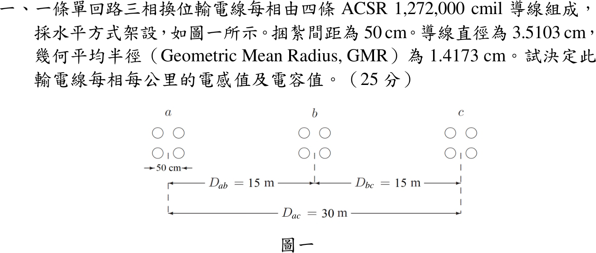
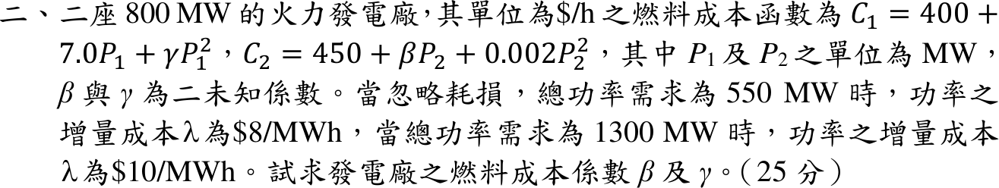
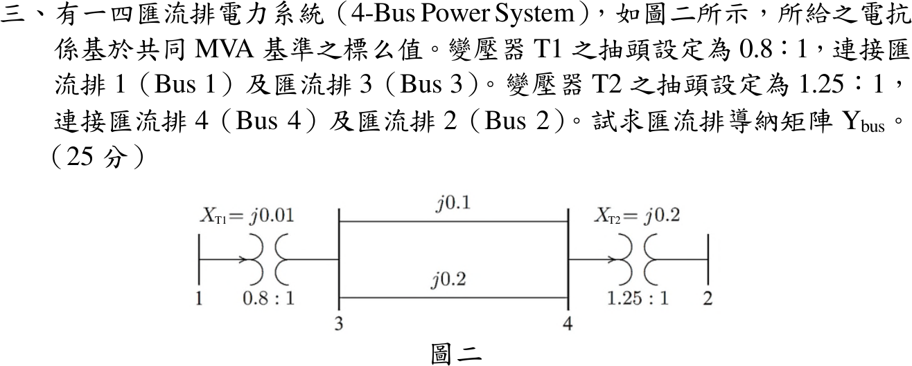
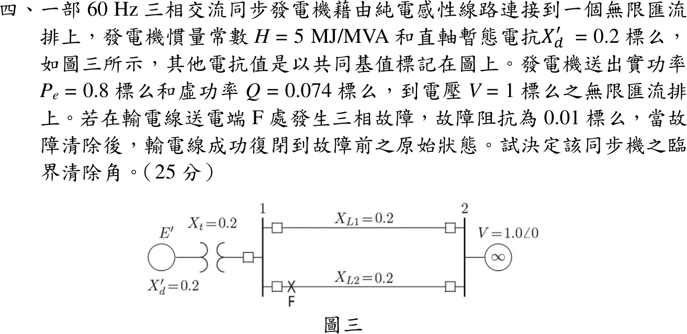

# 📝 112 年電機工程技師｜電力系統逐題詳解

> 本頁由題級 canonical 筆記組合；每題保留官方裁切圖、校驗狀態與可追溯的推導。

## 題目導覽
- [[#一、112 年第 1 題｜四分裂換位輸電線的每公里電感與電容|第 1 題：四分裂換位輸電線的每公里電感與電容]]
- [[#二、112 年電力系統第 2 題｜經濟調度係數與容量約束 KKT 校驗|第 2 題：經濟調度係數與容量約束 KKT 校驗]]
- [[#三、112 年電力系統第 3 題｜含分接頭變壓器之四匯流排 Ybus|第 3 題：含分接頭變壓器之四匯流排 Ybus]]
- [[#四、112 年電力系統第 4 題｜三相故障之臨界清除角|第 4 題：三相故障之臨界清除角]]

---

## 一、112 年第 1 題｜四分裂換位輸電線的每公里電感與電容

> 題級識別：EE-112-05-1
> canonical 來源：[[canonical/EE-112-05-1.md]]
> 題級校驗狀態：verified

### 已知與所求

單回路三相換位線，每相四分裂正方形束線，間距 \(d=50\) cm；導線直徑 3.5103 cm（\(r=1.75515\) cm）、GMR \(=1.4173\) cm；水平排列 \(D_{ab}=D_{bc}=15\) m、\(D_{ac}=30\) m。求每相每公里電感與電容。

### 考場標準作答

\[
\mathrm{GMD}=\sqrt[3]{15\times15\times30}=18.899\ \mathrm m
\]
四分裂束線（間距 \(d,d,\sqrt2d\)）：
\[
D_{sL}=\left(\mathrm{GMR}\cdot d^3\sqrt2\right)^{1/4}=\left(0.014173\times0.5^3\times\sqrt2\right)^{1/4}=0.22373\ \mathrm m
\]
\[
D_{sC}=\left(r\cdot d^3\sqrt2\right)^{1/4}=\left(0.0175515\times0.5^3\times\sqrt2\right)^{1/4}=0.23601\ \mathrm m
\]
\[
L=2\times10^{-7}\ln\frac{18.899}{0.22373}\ \mathrm{H/m}\Rightarrow\boxed{L=0.8873\ \mathrm{mH/km}}
\]
\[
C=\frac{2\pi\varepsilon_0}{\ln(18.899/0.23601)}\ \mathrm{F/m}\Rightarrow\boxed{C=0.01269\ \mu\mathrm{F/km}}
\]

### 驗算

- 以 12 條子導線逐對距離直接求幾何平均（含束線內偏移），所得 \(L,C\) 與上式差異小於 0.5%。
- 量級：\(\omega L=0.3345\ \Omega\)/km、\(1/\sqrt{LC}=2.98\times10^5\) km/s，接近光速，符合架空線。

### 失分點

- 電容須用實際半徑 \(r\)，不可用 GMR；混用會使電容偏小。
- 水平排列 \(D_{ac}=30\) m，GMD 為 18.899 m，不是 15 m。
- 正方形四分裂的對角距離是 \(\sqrt2d\)，漏乘 \(\sqrt2\) 會使 \(D_s\) 偏小。

---

## 二、112 年電力系統第 2 題｜經濟調度係數與容量約束 KKT 校驗

> 題級識別：EE-112-05-2
> canonical 來源：[[canonical/EE-112-05-2.md]]
> 題級校驗狀態：needs_manual_review
> [!WARNING] 本題仍有官方資料缺口或事件定義歧義；請以 canonical 條件式解答為準。

### 已知與所求

兩座 800 MW 火力廠，\(C_1=400+7.0P_1+\gamma P_1^2\)、\(C_2=450+\beta P_2+0.002P_2^2\)（\$/h，\(P\) 以 MW 計），忽略耗損。需求 550 MW 時 \(\lambda=8\)，1300 MW 時 \(\lambda=10\) \$/MWh。求 \(\beta,\gamma\)。

### 考場標準作答

增量成本 \(\mathrm{IC}_1=7+2\gamma P_1\)、\(\mathrm{IC}_2=\beta+0.004P_2\)。

**步驟 1：兩機皆為內點（先不計容量）。**
\[
P_{1a}=\frac{1}{2\gamma},\ P_{1b}=\frac{3}{2\gamma};\qquad P_{2a}=250(8-\beta),\ P_{2b}=250(10-\beta)
\]
兩個功率平衡式相減：\(\dfrac1\gamma+500=750\Rightarrow\gamma=0.004\)，再得 \(P_{1a}=125\)、\(P_{2a}=425\)，\(\beta=8-0.004(425)=6.3\)：
\[
\boxed{(\beta,\gamma)_{\text{無約束}}=(6.3,\ 0.004)}
\]
但第二點 \(P_{1b}=375\)、\(P_{2b}=925\ \mathrm{MW}>800\)，違反題目所給容量。

**步驟 2：機組 2 在 1300 MW 時達上限 \(P_2=800\)。** 自由機組 1：\(P_{1b}=500\)，\(7+2\gamma(500)=10\Rightarrow\gamma=0.003\)；第一點兩機內點 \(P_{1a}=166.67\)、\(P_{2a}=383.33\)，\(\beta=8-0.004(383.33)=6.4667\)。KKT：\(\mathrm{IC}_2(800)=9.667\le\lambda=10\)，成立。
\[
\boxed{(\beta,\gamma)_{P_2=800}=(6.4667,\ 0.003)}
\]

**步驟 3：機組 1 在 1300 MW 時達上限 \(P_{1b}=800\)。** 自由機組 2：\(P_{2b}=500\)，\(\beta+0.004(500)=10\Rightarrow\beta=8\)；第一點 \(\mathrm{IC}_2(0)=8=\lambda\)，故 \(P_{2a}=0\)、\(P_{1a}=550\)，\(7+2\gamma(550)=8\Rightarrow\gamma=\frac{1}{1100}=0.00090909\)。KKT：\(\mathrm{IC}_1(800)=8.4545\le10\)，成立。
\[
\boxed{(\beta,\gamma)_{P_1=800}=(8,\ 0.00090909)}
\]

### 驗算

以各組係數在 \(0\le P_i\le800\) 內直接網格搜尋總成本最小的調度：

- \((6.4667,0.003)\)：550 MW → \(P_1=166.67\)，\(\lambda=8\)；1300 MW → \(P_1=500\)、\(P_2=800\)，\(\lambda=\mathrm{IC}_1=10\)。
- \((8,1/1100)\)：550 MW → \(P_1=550\)、\(P_2=0\)，\(\lambda=8\)；1300 MW → \(P_1=800\)、\(P_2=500\)，\(\lambda=\mathrm{IC}_2=10\)。
- \((6.3,0.004)\)：1300 MW 時 \(P_2\) 被截在 800、\(P_1=500\)，\(\lambda=\mathrm{IC}_1=11\neq10\)，硬上限下不成立。

### 失分點

- 未回代容量，直接以 \(\beta=6.3,\ \gamma=0.004\) 作唯一答案，忽略 \(P_2=925\) MW 超限。
- 機組達上限時其增量成本不等於 \(\lambda\)，只須 \(\mathrm{IC}_i\le\lambda\)；把受限機組的 \(\mathrm{IC}\) 設為 \(\lambda\) 會得錯誤係數。

### 條件與疑義

題面未說明 800 MW 是否為硬上限、也未指定哪台機組受限；三組結果分別對應無約束、\(P_2=800\)、\(P_1=800\)，不得把其中一組當成唯一答案。

---

## 三、112 年電力系統第 3 題｜含分接頭變壓器之四匯流排 Ybus

> 題級識別：EE-112-05-3
> canonical 來源：[[canonical/EE-112-05-3.md]]
> 題級校驗狀態：verified

### 已知與所求

T1：Bus 1–Bus 3，\(X_{T1}=j0.01\)，抽頭 \(0.8:1\)（箭頭在 Bus 1 側）；Bus 3–Bus 4 兩條並聯線 \(j0.1\)、\(j0.2\)；T2：Bus 4–Bus 2，\(X_{T2}=j0.2\)，抽頭 \(1.25:1\)（箭頭在 Bus 4 側）。電抗為共同基準標么值。求 \(Y_{bus}\)。

### 考場標準作答

支路導納：\(y_{T1}=-j100\)、\(y_{T2}=-j5\)、\(y_{34}=-j10-j5=-j15\)。

分接頭 \(a:1\) 在節點 \(i\) 側、串聯導納 \(y\) 在節點 \(k\) 側時：
\[
Y_{ii}\mathrel{+}=\frac{y}{a^2},\qquad Y_{ik}=Y_{ki}=-\frac{y}{a},\qquad Y_{kk}\mathrel{+}=y
\]
T1（\(a=0.8\)）：\(Y_{11}=-j100/0.64=-j156.25\)，\(Y_{13}=+j125\)，Bus 3 加 \(-j100\)。
T2（\(a=1.25\)，\(i=4\)）：Bus 4 加 \(-j5/1.5625=-j3.2\)，\(Y_{24}=+j4\)，\(Y_{22}=-j5\)。
\(Y_{33}=-j100-j15=-j115\)，\(Y_{44}=-j15-j3.2=-j18.2\)，\(Y_{34}=+j15\)：
\[
\boxed{Y_{bus}=\begin{bmatrix}
-j156.25&0&+j125&0\\
0&-j5&0&+j4\\
+j125&0&-j115&+j15\\
0&+j4&+j15&-j18.2
\end{bmatrix}\ \mathrm{pu}}
\]

### 驗算

由理想變壓器關係直接推導 T1：抽頭側電壓折算 \(V_1/a\)，串聯電流 \(I=y(V_1/a-V_3)\)，Bus 1 注入 \(I/a\)、Bus 3 注入 \(-I\)。展開得 \(I_1=\frac{y}{a^2}V_1-\frac{y}{a}V_3\)、\(I_3=-\frac{y}{a}V_1+yV_3\)，與上式係數相同。理想變壓器無損：\(V_1(I/a)^*=(V_1/a)I^*\)，兩側複功率相等，故矩陣對稱。

π 等效分路檢查：Bus 1 列和 \(-j156.25+j125=-j31.25=y_{T1}\left(\frac{1}{a^2}-\frac1a\right)=-j100(1.5625-1.25)\)；Bus 2 列和 \(-j5+j4=-j1=y_{T2}\left(1-\frac1a\right)=-j5(0.2)\)。

### 失分點

- 把 T2 的 \(1.25\) 放到 Bus 2 側，會得 \(Y_{22}=-j3.2\)、\(Y_{44}=-j20\)。
- 兩條 3–4 線路應先並聯成 \(-j15\)，不是串聯。
- 有分接頭時列和不為零，不能用「每列和為零」檢查。

---

## 四、112 年電力系統第 4 題｜三相故障之臨界清除角

> 題級識別：EE-112-05-4
> canonical 來源：[[canonical/EE-112-05-4.md]]
> 題級校驗狀態：verified

### 已知與所求

60 Hz，\(H=5\) MJ/MVA，\(X_d'=0.2\)、\(X_t=0.2\)，兩條並聯線 \(X_{L1}=X_{L2}=0.2\) pu；送至無限匯流排 \(V=1\angle0^\circ\) 的 \(P_e=0.8\)、\(Q=0.074\) pu。線路 2 送電端 F 經 0.01 pu 三相故障，清除後線路復閉回原狀態。求臨界清除角 \(\delta_{cr}\)。

### 考場標準作答

**故障前／復閉後**：\(X_1=X_3=0.2+0.2+0.2\parallel0.2=0.5\) pu。
\[
I=\frac{P-jQ}{V^*}=0.8-j0.074,\qquad E'=1+j0.5I=1.037+j0.4=1.11147\angle21.093^\circ
\]
\[
P_{\max}=\frac{|E'|V}{0.5}=2.22294\ \mathrm{pu},\qquad \delta_0=21.093^\circ=0.36814\ \mathrm{rad}
\]

**故障期間**（取 \(Z_f=j0.01\)，F 視為 Bus 1 對地）：以 Bus 1 為中心的 Y 形 \(j0.4\)（至 \(E'\)）、\(j0.1\)（兩線並聯至 \(V\)）、\(j0.01\)（對地）轉 \(\Delta\)，轉移電抗
\[
X_2=\frac{0.4(0.1)+0.1(0.01)+0.01(0.4)}{0.01}=4.5\ \mathrm{pu},\qquad P_{2\max}=\frac{1.11147}{4.5}=0.24699\ \mathrm{pu}
\]

**等面積準則**：\(\delta_{\max}=\pi-\delta_0=2.77345\) rad，
\[
\cos\delta_{cr}=\frac{P_m(\delta_{\max}-\delta_0)+P_{\max}\cos\delta_{\max}-P_{2\max}\cos\delta_0}{P_{\max}-P_{2\max}}
=\frac{0.8(2.40531)-2.07400-0.23044}{1.97595}=-0.19241
\]
\[
\boxed{\delta_{cr}=1.764417\ \mathrm{rad}=101.0936492^\circ}
\]

### 驗算

以 Bus 1 節點 KCL 直接求故障期間輸出 \(P_e(\delta)=\mathrm{Re}\{E'I_g^*\}\)（不經 Y–Δ），再以數值積分令加速面積 \(\int_{\delta_0}^{\delta_{cr}}(P_m-P_e)\,d\delta\) 等於減速面積 \(\int_{\delta_{cr}}^{\delta_{\max}}(P_{\max}\sin\delta-P_m)\,d\delta\)，二分法求根得 \(101.09^\circ\)；且 \(\delta_0<\delta_{cr}<\delta_{\max}\)。

### 失分點

- 故障期間把 \(P_e\) 設為 0；有限故障阻抗與健全線路使 \(P_{2\max}=0.247\) pu。
- 兩條 0.2 pu 線路在故障前後是並聯（0.1 pu），不是只算一條。
- 等面積式中的 \(\delta_{\max}-\delta_0\) 必須用弧度。

### 條件與疑義

題面只寫「故障阻抗為 0.01 標么」未標 \(j\)。主解：等效接地電抗 \(Z_f=j0.01\) pu（與公開更正解答一致），得 \(\delta_{cr}=101.0936492^\circ\)。若依字面視為純電阻 0.01 pu，故障期間曲線含電阻損耗項，數值等面積求得 \(\delta_{cr}=102.0837294^\circ\)，僅作敏感度對照。

---
