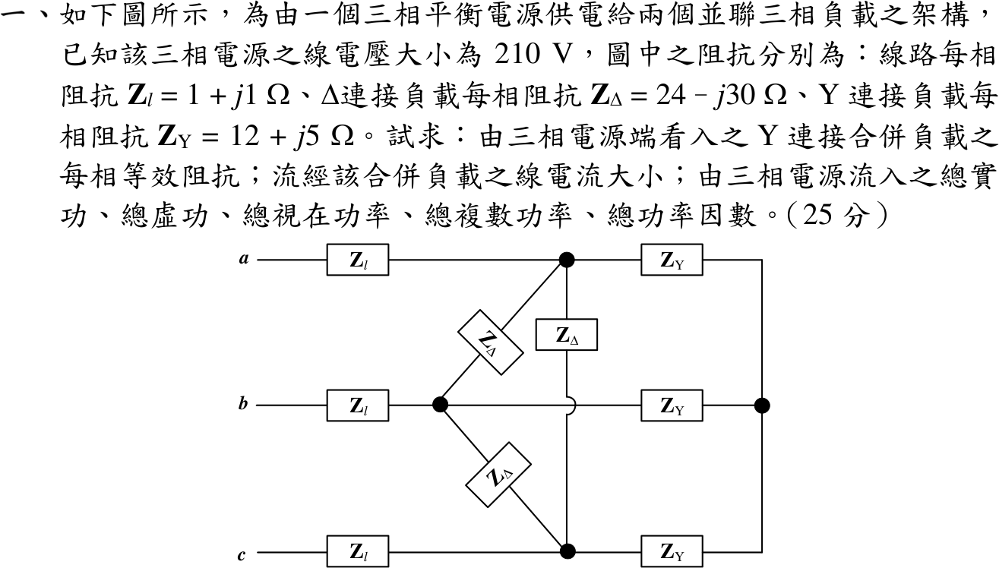

# 📝 113 年電機工程技師｜電力系統逐題詳解

> 本頁由題級 canonical 筆記組合；每題保留官方裁切圖、校驗狀態與可追溯的推導。

## 題目導覽
- [[#一、113 年第 1 題｜三相並聯負載與複數功率|第 1 題：三相並聯負載與複數功率]]
- [[#二、113 年第 2 題｜同步機與輸電線三相短路暫態電流|第 2 題：同步機與輸電線三相短路暫態電流]]
- [[#三、113 年電力系統第 3 題｜經濟調度增量成本係數|第 3 題：經濟調度增量成本係數]]
- [[#四、113 年第 4 題｜獨立驗證|第 4 題：獨立驗證]]

---

## 一、113 年第 1 題｜三相並聯負載與複數功率

> 題級識別：EE-113-05-1
> canonical 來源：[[canonical/EE-113-05-1.md]]
> 題級校驗狀態：verified

### 已知與所求

平衡三相電源線電壓 210 V；線路每相 \(Z_l=1+j1\ \Omega\)；\(\Delta\) 負載每相 \(Z_\Delta=24-j30\ \Omega\)；Y 負載每相 \(Z_Y=12+j5\ \Omega\)。求由電源端看入的 Y 等效每相阻抗、線電流大小，以及電源送出的總 \(P\)、\(Q\)、\(|S|\)、\(S\)、功率因數。

### 考場標準作答

**等效阻抗**：\(\Delta\to\mathrm Y\)：\(Z_\Delta/3=8-j10\ \Omega\)，與 \(Z_Y\) 並聯：
\[
Z_{L}=\frac{(8-j10)(12+j5)}{20-j5}=\frac{146-j80}{20-j5}=\boxed{Z_L=7.8118-j2.0471\ \Omega}
\]
由電源端看入再串線路阻抗：
\[
\boxed{Z_{in}=Z_l+Z_L=8.8118-j1.0471\ \Omega}=8.8738\angle-6.776^\circ\ \Omega
\]

**線電流**：\(V_\phi=210/\sqrt3=121.24\) V，
\[
\boxed{|I_L|=\frac{121.24}{8.8738}=13.663\ \mathrm A}
\]

**電源總功率**：\(S=3|I_L|^2Z_{in}=3(186.68)(8.8118-j1.0471)\)
\[
\boxed{P=4935.0\ \mathrm W},\quad \boxed{Q=-586.4\ \mathrm{var}},\quad \boxed{|S|=4969.7\ \mathrm{VA}}
\]
\[
\boxed{S=4935.0-j586.4\ \mathrm{VA}},\qquad \boxed{\mathrm{pf}=\frac{4935.0}{4969.7}=0.9930\ \text{超前}}
\]

### 驗算

- 分項功率守恆：負載 \(3|I_L|^2Z_L=4374.9-j1146.4\) VA，線路 \(3|I_L|^2Z_l=560.0+j560.0\) VA，相加 \(4935.0-j586.4\) VA。
- 完整三相節點分析（A、B、C 三節點加 Y 中性點，\(\Delta\) 負載不轉換）解得線電流 13.663 A、\(S\) 相同。

### 失分點

- \(\Delta\) 負載忘記除以 3，直接以 \(24-j30\) 與 \(12+j5\) 並聯。
- 求電源送出功率時漏掉線路阻抗，只算負載 \(4374.9\) W。
- \(Q<0\) 為容性，功率因數應標「超前」。

### 條件與疑義

「由電源端看入之 Y 連接合併負載每相等效阻抗」可讀為只含負載（\(Z_L\)）或含線路（\(Z_{in}\)）；兩者都列出。線電流與電源功率均以含線路的 \(Z_{in}\) 計算，不受此讀法影響。

---

## 二、113 年第 2 題｜同步機與輸電線三相短路暫態電流

> 題級識別：EE-113-05-2
> canonical 來源：[[canonical/EE-113-05-2.md]]
> 題級校驗狀態：verified

### 已知與所求

基準 100 MVA、24 kV。發電機 \(X_g'=0.25\)，線路 \(X_l=0.1\)，電動機 \(X_m'=0.2\) pu。電動機端電壓 20 kV、吸收 50 MW、pf 0.8 超前。發電機端點三相短路，求兩機暫態電流與故障點暫態電流。

### 考場標準作答

**故障前狀態**（以電動機端電壓為參考）：
\[
V_m=\frac{20}{24}=0.8333\angle0^\circ,\quad S_m=0.5-j0.375\ \mathrm{pu},\quad
I=\frac{S_m^*}{V_m^*}=0.6+j0.45=0.75\angle36.87^\circ\ \mathrm{pu}
\]
\[
E_g'=V_m+j(0.1+0.25)I=0.6758+j0.21,\qquad E_m'=V_m-j0.2I=0.9233-j0.12\ \mathrm{pu}
\]

**故障後**（發電機端電壓為 0，各電勢分別經自身支路送入故障點）：
\[
\boxed{I_g'=\frac{E_g'}{j0.25}=0.84-j2.7033=2.8308\angle-72.74^\circ\ \mathrm{pu}}
\]
\[
\boxed{I_m'=\frac{E_m'}{j(0.2+0.1)}=-0.4-j3.0778=3.1037\angle-97.40^\circ\ \mathrm{pu}}
\]
\[
\boxed{I_f'=I_g'+I_m'=0.44-j5.7811=5.7978\angle-85.65^\circ\ \mathrm{pu}}
\]
基準電流 \(I_B=\dfrac{100\times10^6}{\sqrt3(24\times10^3)}=2405.6\) A，換算：
\[
\boxed{|I_g'|=6.810\ \mathrm{kA}},\qquad \boxed{|I_m'|=7.466\ \mathrm{kA}},\qquad \boxed{|I_f'|=13.947\ \mathrm{kA}}
\]

### 驗算

戴維寧疊加：故障前發電機端電壓 \(V_f=V_m+j0.1I=0.7883+j0.06\)，\(Z_{th}=j0.25\parallel j0.3=j0.13636\)，\(I_f'=V_f/Z_{th}=0.44-j5.7811\)；依電抗分流再疊加負載電流：\(I_g'=I+I_f'\frac{0.3}{0.55}=0.84-j2.7033\)、\(I_m'=-I+I_f'\frac{0.25}{0.55}=-0.4-j3.0778\)，與上相同。

### 失分點

- 超前功率因數表示電動機吸收 \(Q<0\)，\(S_m=0.5-j0.375\)；符號弄反則兩個電勢都錯。
- 電動機端電壓是 20 kV（0.8333 pu），不可當 1.0 pu。
- 故障電流為相量和 \(5.7978\) pu，不是幅值和 \(2.8308+3.1037\)。

---

## 三、113 年電力系統第 3 題｜經濟調度增量成本係數

> 題級識別：EE-113-05-3
> canonical 來源：[[canonical/EE-113-05-3.md]]
> 題級校驗狀態：verified

### 已知與所求

兩機各 1300 MW，\(C_1=500+8P_1+0.005P_1^2\)、\(C_2=700+\alpha P_2+\beta P_2^2\)（\$/h）。需求 800 MW 時 \(\lambda=10\)，1500 MW 時 \(\lambda=12\) \$/MWh，忽略損失。求 \(\alpha,\beta\)。

### 考場標準作答

增量成本 \(\mathrm{IC}_1=8+0.01P_1\)、\(\mathrm{IC}_2=\alpha+2\beta P_2\)，等增量成本 \(\mathrm{IC}_1=\mathrm{IC}_2=\lambda\)。

由機組 1 求各點出力：
\[
\lambda=10:\ P_1=200,\ P_2=600\ \mathrm{MW};\qquad
\lambda=12:\ P_1=400,\ P_2=1100\ \mathrm{MW}
\]
皆在 0–1300 MW 內，兩機均為內點。代入機組 2：
\[
\alpha+1200\beta=10,\qquad \alpha+2200\beta=12
\]
\[
\boxed{\beta=0.002\ \$/\mathrm{MW^2h}},\qquad \boxed{\alpha=7.6\ \$/\mathrm{MWh}}
\]

### 驗算

以求得係數重新調度：800 MW 時 \(8+0.01P_1=7.6+0.004(800-P_1)\Rightarrow P_1=200\)，\(\lambda=10\)；1500 MW 時 \(P_1=400\)，\(\lambda=12\)，兩點均重現題給增量成本。

### 失分點

- \(0.005P_1^2\) 微分為 \(0.01P_1\)；誤寫 \(0.005P_1\) 會得 \(P_1=400,800\) MW，係數全錯。
- 未檢查第二點 \(P_2=1100\) MW 是否超過 1300 MW 容量就直接作答。

---

## 四、113 年第 4 題｜獨立驗證

> 題級識別：EE-113-05-4
> canonical 來源：[[canonical/EE-113-05-4.md]]
> 題級校驗狀態：verified

### 考場標準作答

\(\Delta\omega/\omega=(59-60)/60=-1/60\)，代入 \(\Delta\omega/\omega=-0.05\Delta P_M\)：
\[
\boxed{\Delta P_M=\frac{1/60}{0.05}=0.3333\ \mathrm{pu}}\ (=166.7\ \mathrm{MW})
\]
無載至滿載 \(\Delta P_M=1\)：\(\Delta f=0.05(60)\)，
\[
\boxed{\Delta f=3\ \mathrm{Hz}}
\]
若無載運轉於 60 Hz，滿載降至 57 Hz。

### 驗算

下垂斜率 \(Rf_0=3\) Hz/pu，降 1 Hz 對應 \(1/3=0.3333\) pu。

---
