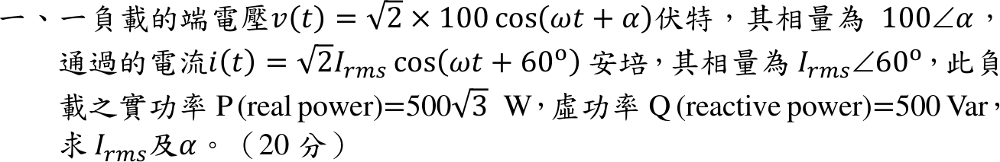
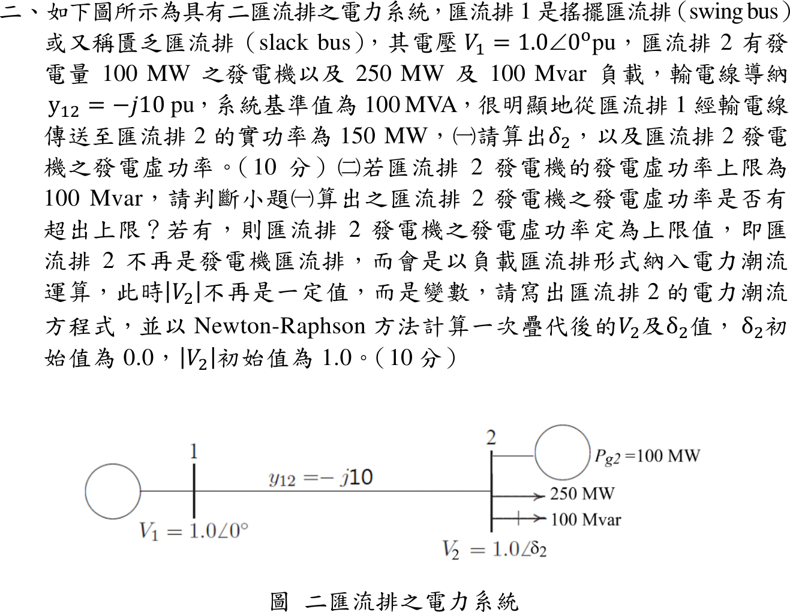
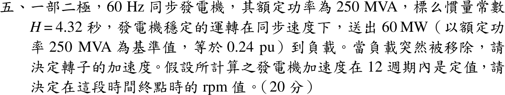

# 114 年電機工程技師｜電力系統逐題詳解

> 本頁由題級 canonical 筆記組合；每題保留 QID、官方裁切、校驗狀態與完整得分型解答。

## 題目導覽
- [[#一、114 年電力系統第 1 題｜負載相量與複功率|第 1 題：負載相量與複功率]]
- [[#二、114 年電力系統第 2 題｜二匯流排潮流|第 2 題：二匯流排潮流]]
- [[#三、114 年電力系統第 3 題｜經濟調度|第 3 題：經濟調度]]
- [[#四、114 年電力系統第 4 題｜經故障阻抗之三相短路|第 4 題：經故障阻抗之三相短路]]
- [[#五、114 年電力系統第 5 題｜甩負載後的轉子加速|第 5 題：甩負載後的轉子加速]]

---

## 一、114 年電力系統第 1 題｜負載相量與複功率

> 題級識別：`EE-114-05-1`
> canonical 來源：`canonical/EE-114-05-1.md`
> 題級校驗狀態：`verified`

![[01_原始試題/依考科/05_電力系統/images/questions/PE_114年_電力系統_Q01.png]]

> 官方裁切來源：`01_原始試題/依考科/05_電力系統/images/questions/PE_114年_電力系統_Q01.png`

### 已知與所求

\(v(t)=\sqrt2\times100\cos(\omega t+\alpha)\) V，相量 \(100\angle\alpha\)；\(i(t)=\sqrt2I_{rms}\cos(\omega t+60^\circ)\) A，相量 \(I_{rms}\angle60^\circ\)；\(P=500\sqrt3\) W、\(Q=500\) var。求 \(I_{rms}\) 與 \(\alpha\)。

### 考場標準作答

負載吸收複功率 \(S=VI^*=P+jQ\)：
\[
|S|=\sqrt{(500\sqrt3)^2+500^2}=1000\ \mathrm{VA},\qquad
\boxed{I_{rms}=|S|/|V|=1000/100=10\ \mathrm A}
\]
\[
\angle S=\tan^{-1}\frac{500}{500\sqrt3}=30^\circ=\angle V-\angle I=\alpha-60^\circ
\Rightarrow\boxed{\alpha=90^\circ}
\]

### 驗算

回代相量：\((100\angle90^\circ)(10\angle-60^\circ)=1000\angle30^\circ=866.0+j500\ \mathrm{VA}\)，\(500\sqrt3=866.0\)，與題給 \(P,Q\) 相符；\(Q>0\) 對應電流落後電壓 \(30^\circ\)。

### 失分點

- 漏取電流共軛，寫成 \(\angle S=\alpha+60^\circ\) 會得 \(\alpha=-30^\circ\)。
- 題目已寫 \(\sqrt2\times100\)，100 V 即有效值；再除以 \(\sqrt2\) 會得 \(I_{rms}=14.14\ \mathrm A\)。

---

## 二、114 年電力系統第 2 題｜二匯流排潮流

> 題級識別：`EE-114-05-2`
> canonical 來源：`canonical/EE-114-05-2.md`
> 題級校驗狀態：`verified`

![[01_原始試題/依考科/05_電力系統/images/questions/PE_114年_電力系統_Q02.png]]

> 官方裁切來源：`01_原始試題/依考科/05_電力系統/images/questions/PE_114年_電力系統_Q02.png`

### 已知與所求

\(V_1=1.0\angle0^\circ\) pu（搖擺匯流排），\(y_{12}=-j10\) pu，基準 100 MVA；匯流排 2：發電 100 MW，負載 250 MW＋100 Mvar，\(|V_2|=1.0\)。求（一）\(\delta_2\) 與發電機虛功率；（二）\(Q_{g2,\max}=100\) Mvar 時是否超限，若超限改為 PQ 匯流排，寫出潮流方程並由 \(\delta_2=0,\ |V_2|=1\) 作一次 Newton–Raphson 疊代。

### 考場標準作答

由 \(Y_{22}=-j10\)、\(Y_{21}=j10\)，匯流排 2 淨注入：
\[
P_2=10|V_2|\sin\delta_2,\qquad Q_2=10|V_2|^2-10|V_2|\cos\delta_2
\]

#### （一）功角與發電虛功率

\(P_2=(100-250)/100=-1.5\) pu。\(\sin\delta_2=-0.15\) 另有大角度根，僅由正弦方程不能宣稱這是數學上的唯一根；取正常運轉的低功角分支 \(|\delta_2|<90^\circ\)：
\[
10\sin\delta_2=-1.5\Rightarrow\boxed{\delta_2=-8.627^\circ}
\]
\[
Q_2=10(1-\cos\delta_2)=0.11314\ \mathrm{pu},\qquad
Q_{g2}=0.11314+Q_{L2}=0.11314+1.0\Rightarrow\boxed{Q_{g2}=111.31\ \mathrm{Mvar}}
\]

#### （二）超限判斷與一次疊代

\(111.31>100\) Mvar，超限；令 \(Q_{g2}=100\) Mvar，匯流排 2 改為 PQ，指定 \(P_2=-1.5\)、\(Q_2=1.0-1.0=0\) pu：
\[
10|V_2|\sin\delta_2=-1.5,\qquad 10|V_2|^2-10|V_2|\cos\delta_2=0
\]
平坦起始 \(\delta_2^{(0)}=0,\ |V_2|^{(0)}=1\)：計算值 \(P_2=Q_2=0\)，不平衡量 \([\Delta P_2,\Delta Q_2]=[-1.5,\ 0]\)。Jacobian
\[
J=\begin{bmatrix}10|V_2|\cos\delta_2 & 10\sin\delta_2\\ 10|V_2|\sin\delta_2 & 20|V_2|-10\cos\delta_2\end{bmatrix}
=\begin{bmatrix}10&0\\0&10\end{bmatrix}
\]
\[
\begin{bmatrix}\Delta\delta_2\\ \Delta|V_2|\end{bmatrix}=J^{-1}\begin{bmatrix}-1.5\\0\end{bmatrix}=\begin{bmatrix}-0.15\\0\end{bmatrix}
\Rightarrow
\boxed{\delta_2^{(1)}=-0.15\ \mathrm{rad}=-8.594^\circ},\quad \boxed{|V_2|^{(1)}=1.000\ \mathrm{pu}}
\]

### 驗算

- 線路潮流法：\(S_{12}=V_1\,[y_{12}(V_1-V_2)]^*\) 以 \(V_2=1\angle-8.627^\circ\) 代入得 \(P_{12}=150\) MW，與題述「由匯流排 1 送 150 MW」一致。
- 無功守恆：線路吸收 \(|I|^2X=|V_1-V_2|^2/X=10(2-2\cos\delta_2)=0.2263\) pu，兩端各供一半（對稱），匯流排 2 供 11.31 Mvar，加負載 100 Mvar 即 111.31 Mvar。

### 失分點

- 由潮流式得到的是淨注入 \(Q_2=11.31\) Mvar，漏加 100 Mvar 負載會誤判「未超限」。
- 超限後仍固定 \(|V_2|=1\)（仍當 PV 匯流排）就不需要 \(Q_2\) 方程，與題意不符。
- \(\Delta\delta_2=-0.15\) 是弧度；誤當度數會寫成 \(-0.15^\circ\)。

---

## 三、114 年電力系統第 3 題｜經濟調度

> 題級識別：`EE-114-05-3`
> canonical 來源：`canonical/EE-114-05-3.md`
> 題級校驗狀態：`verified`

![[01_原始試題/依考科/05_電力系統/images/questions/PE_114年_電力系統_Q03.png]]

> 官方裁切來源：`01_原始試題/依考科/05_電力系統/images/questions/PE_114年_電力系統_Q03.png`

### 已知與所求

\(C_1=400+6.0P_1+0.004P_1^2\)、\(C_2=400+6.8P_2+0.002P_2^2\)（\(\$/\mathrm h\)，\(P\) 以 MW 計），兩廠各 800 MW，總需求 550 MW，忽略耗損。求兩廠最佳發電量。

### 考場標準作答

等增量成本與功率平衡：
\[
6+0.008P_1=6.8+0.004P_2,\qquad P_1+P_2=550
\]
代入 \(P_2=550-P_1\) 得 \(6+0.008P_1=9-0.004P_1\)：
\[
\boxed{P_1=250\ \mathrm{MW}},\qquad \boxed{P_2=300\ \mathrm{MW}}
\]
共同增量成本 \(\lambda=6+0.008(250)=8\ \$/\mathrm{MWh}\)；成本函數凸且兩解均在 0–800 MW 內，故為全域最小。

### 驗算

\(6.8+0.004(300)=8=\lambda\)，\(250+300=550\)。

### 失分點

- 兩個二次項都漏乘 2（寫成 \(6+0.004P_1=6.8+0.002P_2\)）會得 \(P_1=316.7,\ P_2=233.3\ \mathrm{MW}\)。
- 平均分配 275／275 MW 時 \(\lambda_1=8.2\neq\lambda_2=7.9\)，不是最佳解。

---

## 四、114 年電力系統第 4 題｜經故障阻抗之三相短路

> 題級識別：`EE-114-05-4`
> canonical 來源：`canonical/EE-114-05-4.md`
> 題級校驗狀態：`verified`

![[01_原始試題/依考科/05_電力系統/images/questions/PE_114年_電力系統_Q04.png]]

> 官方裁切來源：`01_原始試題/依考科/05_電力系統/images/questions/PE_114年_電力系統_Q04.png`

### 已知與所求

匯流排 3 發電機 \(X_d''=j0.1\)，經變壓器 \(jX_t=j0.4\) 至匯流排 1；匯流排 1–2 線路 \(jX_L=j0.2\)；匯流排 2 發電機 \(X_d''=j0.1\)。無載、電勢均為 \(1\angle0^\circ\) pu。匯流排 1 經 \(Z_f=j0.0125\) pu 三相短路。求（一）戴維寧阻抗與故障電流；（二）故障期間匯流排電壓與線路電流。

### 考場標準作答

#### （一）戴維寧阻抗與故障電流

\[
Z_{左}=j(0.1+0.4)=j0.5,\qquad Z_{右}=j(0.2+0.1)=j0.3
\]
\[
\boxed{Z_{th}=j0.5\parallel j0.3=j0.1875\ \mathrm{pu}},\qquad
\boxed{I_f=\frac{1\angle0^\circ}{Z_{th}+Z_f}=\frac{1}{j0.2}=-j5.0\ \mathrm{pu}}
\]

#### （二）匯流排電壓與線路電流

\[
\boxed{V_1=I_fZ_f=(-j5)(j0.0125)=0.0625\ \mathrm{pu}}
\]
題圖未指定線路電流正方向；以下定義 \(I_{31}\) 為匯流排 3 經變壓器流向故障匯流排 1，\(I_{21}\) 為匯流排 2 經線路流向匯流排 1：
\[
\boxed{I_{31}=\frac{1-V_1}{j0.5}=-j1.875\ \mathrm{pu}},\qquad
\boxed{I_{21}=\frac{1-V_1}{j0.3}=-j3.125\ \mathrm{pu}}
\]
若採由故障點向外為正方向，則 \(I_{13}=+j1.875\) pu、\(I_{12}=+j3.125\) pu，只是參考方向反轉。發電機端匯流排電壓：
\[
\boxed{V_3=1-(j0.1)(-j1.875)=0.8125\ \mathrm{pu}},\qquad
\boxed{V_2=1-(j0.1)(-j3.125)=0.6875\ \mathrm{pu}}
\]

### 驗算

- KCL：\(I_{31}+I_{21}=-j1.875-j3.125=-j5.0=I_f\)。
- 沿支路 KVL：\(V_3-V_1=(j0.4)(-j1.875)=0.75=0.8125-0.0625\)；\(V_2-V_1=(j0.2)(-j3.125)=0.625=0.6875-0.0625\)。
- 疊加法：\(\Delta V_i=-Z_{i1}I_f\)，\(Z_{11}=j0.1875\) 給出 \(V_1=1-0.9375=0.0625\)，與上同。

### 失分點

- 漏掉左側變壓器 \(j0.4\)，左支路誤用 \(j0.1\)，\(Z_{th}\) 與 \(I_f\) 全部錯誤。
- 有 \(Z_f\) 時 \(V_1\neq0\)；直接令 \(V_1=0\) 會使兩支路電流都偏大。
- 未先宣告方向就混用 \(I_{31}\) 與 \(I_{13}\)，答案會差一個負號。

---

## 五、114 年電力系統第 5 題｜甩負載後的轉子加速

> 題級識別：`EE-114-05-5`
> canonical 來源：`canonical/EE-114-05-5.md`
> 題級校驗狀態：`verified`

![[01_原始試題/依考科/05_電力系統/images/questions/PE_114年_電力系統_Q05.png]]

> 官方裁切來源：`01_原始試題/依考科/05_電力系統/images/questions/PE_114年_電力系統_Q05.png`

### 已知與所求

二極、60 Hz、250 MVA，\(H=4.32\) s，穩態送出 60 MW（0.24 pu）後負載突然移除；加速度在 12 週期內視為定值。求轉子加速度與 12 週期終點的 rpm。

### 考場標準作答

負載移除瞬間 \(P_e=0\)，機械輸入仍為 \(P_m=0.24\) pu，故 \(P_a=0.24\) pu。搖擺方程 \(\dfrac{2H}{\omega_s}\dfrac{d^2\delta}{dt^2}=P_a\)，\(\omega_s=120\pi\) rad/s：
\[
\boxed{\alpha=\frac{\omega_sP_a}{2H}=\frac{120\pi(0.24)}{8.64}=\frac{10\pi}{3}=10.472\ \mathrm{rad/s^2}}
\]
（等同 \(600\) 電機度/s²；二極機電機角即機械角。）換成轉速：\(\alpha\cdot\dfrac{60}{2\pi}=100\ \mathrm{rpm/s}\)。同步轉速 \(N_s=120f/P=3600\) rpm，12 週期 \(t=12/60=0.2\) s：
\[
\boxed{N=3600+100(0.2)=3620\ \mathrm{rpm}}
\]

### 驗算

動能法：同步轉速時儲能 \(W_0=HS=4.32(250)=1080\) MJ，0.2 s 內多吸收 \(60(0.2)=12\) MJ；\(N=3600\sqrt{1092/1080}=3619.9\) rpm，與 3620 rpm 一致。

### 失分點

- 甩負載後誤令 \(P_m=0\)，得到零加速度；調速機在 0.2 s 內來不及動作。
- 12 週期是 0.2 s，不是 12 s；誤用會得 4800 rpm。
