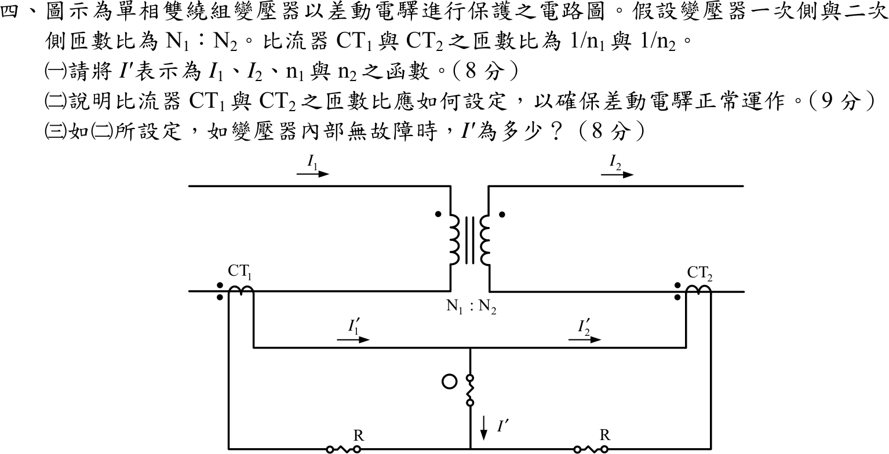

# 106 年電力系統第 4 題｜單相變壓器差動電驛 CT 匝比

## 已知與所求

單相雙繞組變壓器一次側、二次側匝數比 \(N_1:N_2\)，一次電流 \(I_1\) 流入、二次電流 \(I_2\) 流出；CT\(_1\)、CT\(_2\) 匝數比為 \(1/n_1\)、\(1/n_2\)，二次電流 \(I_1'\)、\(I_2'\) 如圖，差動電驛電流 \(I'\)。求（一）\(I'\) 以 \(I_1,I_2,n_1,n_2\) 表示；（二）CT 匝數比應如何設定；（三）依（二）設定，變壓器內部無故障時的 \(I'\)。

## 考場標準作答

### （一）差動電流

CT 電流與匝比成反比：\(I_1'=I_1/n_1\)、\(I_2'=I_2/n_2\)。圖中 \(I_1'\) 流入、\(I_2'\) 流出電驛中點，對該節點 KCL：
\[
\boxed{I'=I_1'-I_2'=\frac{I_1}{n_1}-\frac{I_2}{n_2}}
\]

### （二）CT 匝比設定

理想變壓器安匝平衡 \(N_1I_1=N_2I_2\)，即 \(I_2=\dfrac{N_1}{N_2}I_1\)。為使無故障時 \(I'=0\)，兩側 CT 二次電流必須相等：
\[
\frac{I_1}{n_1}=\frac{N_1}{N_2}\frac{I_1}{n_2}\ \Rightarrow\ \boxed{\frac{n_1}{n_2}=\frac{N_2}{N_1}\ \ (n_1N_1=n_2N_2)}
\]
即 CT 匝比須與變壓器電流比互相補償：高壓（匝數多）側電流小，其 CT 的 \(n\) 取較小值；並使兩 CT 極性使穿越電流在電驛節點相減。

### （三）內部無故障時

\[
I'=\frac{I_1}{n_1}-\frac{N_1}{N_2}\frac{I_1}{n_2}=0\ \Rightarrow\ \boxed{I'=0\ \mathrm A}
\]
電驛不動作；內部故障時 \(I_1\)、\(I_2\) 不再滿足安匝平衡，\(I'\neq0\)，電驛動作。

## 驗算

代入假設數值（非題目所給）：\(N_1/N_2=2\)（如 22 kV/11 kV）、\(n_2=200\)，則 \(n_1=n_2N_2/N_1=100\)。若 \(I_1=50\) A，則 \(I_2=100\) A，\(I_1'=0.5\) A、\(I_2'=0.5\) A，\(I'=0\)。若內部故障使 \(I_2\) 只有 80 A，則 \(I'=0.5-0.4=0.1\) A\(\neq0\)，電驛動作。

## 失分點

- 圖中 \(I_1'\)、\(I_2'\) 在同一導線上皆指向右，電驛節點電流是兩者相減 \(I_1'-I_2'\)，不是相加。
- 電流比 \(I_1/I_2=N_2/N_1\)（與匝數比相反）；把它寫成 \(N_1/N_2\) 會使 \(n_1/n_2\) 條件顛倒。
- \(I'=0\) 在忽略激磁電流與 CT 誤差時成立；實務上以抽頭或輔助 CT 補償標準匝比的差異，並用百分比制動避免誤動作。
