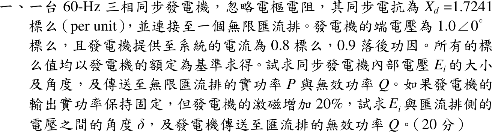

# 108 年電力系統第 1 題｜同步發電機相量圖與激磁控制

## 已知與所求

圓柱形轉子、忽略電樞電阻，\(X_d=1.7241\) pu，端電壓 \(V=1.0\angle0^\circ\) pu，電流 \(0.8\) pu、功因 0.9 落後（標么值均以機組額定為基準）。
（一）求內部電壓 \(E_i\) 的大小與角度，及送至匯流排的 \(P\)、\(Q\)。
（二）\(P\) 不變、激磁增加 20%（磁路線性，\(E_i\) 增 20%），求 \(E_i\) 與匯流排電壓的夾角 \(\delta\) 及 \(Q\)。

## 考場標準作答

### （一）內部電壓與 \(P\)、\(Q\)

落後功因 \(\phi=\cos^{-1}0.9=25.84^\circ\)，\(I=0.8\angle-25.84^\circ=0.72-j0.3487\) pu：
\[
E_i=V+jX_dI=1+j1.7241(0.72-j0.3487)=1.6012+j1.2414
\]
\[
\boxed{|E_i|=2.026\ \mathrm{pu}},\qquad \boxed{\delta=37.78^\circ}
\]
\[
S=VI^*=0.72+j0.3487\Rightarrow \boxed{P=0.720\ \mathrm{pu}},\quad \boxed{Q=0.3487\ \mathrm{pu}}\ (\text{發電機送出，落後})
\]

### （二）激磁增加 20%

\(E_i'=1.2(2.026)=2.431\) pu。原動機輸入不變，\(P=0.72\) 不變：
\[
\sin\delta'=\frac{PX_d}{E_i'V}=\frac{0.72(1.7241)}{2.431}=0.5106
\Rightarrow \boxed{\delta'=30.70^\circ}
\]
\[
Q'=\frac{E_i'V\cos\delta'-V^2}{X_d}=\frac{2.431(0.8598)-1}{1.7241}=\boxed{0.6325\ \mathrm{pu}}
\]

## 驗算

改用電流相量：\(E_i'\angle\delta'=2.0905+j1.2414\)，
\[
I'=\frac{E_i'\angle\delta'-V}{jX_d}=\frac{1.0905+j1.2414}{j1.7241}=0.7200-j0.6325\ \mathrm{pu}
\]
\(S'=VI'^*=0.7200+j0.6325\)，實功與原值相同，\(Q'\) 與上式一致；電流增為 0.958 pu、功因降為 0.751 落後。

## 失分點

- 落後功因的電流角為 \(-25.84^\circ\)；寫成 \(+25.84^\circ\) 會使 \(E_i\) 的角度與大小皆錯。
- 激磁增 20% 是 \(E_i\) 乘 1.2，不是 \(X_d\) 或 \(\delta\) 增加；固定的是 \(P\)（即 \(E_i\sin\delta\) 乘積），不是 \(\delta\)。
- 取 \(\sin\delta'=0.5106\) 的銳角解 \(30.70^\circ\)，鈍角解 \(149.3^\circ\) 屬不穩定區。
